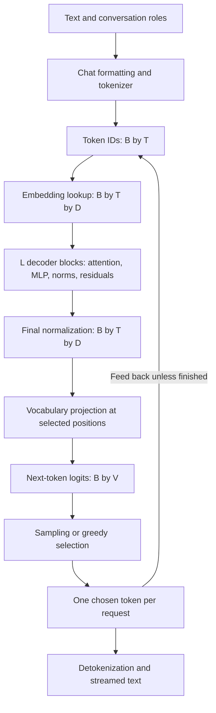
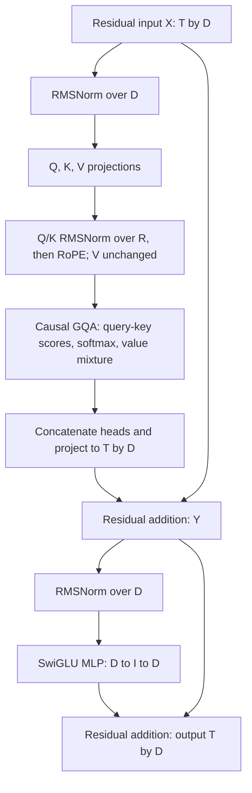

# Transformer architecture: from symbols to a next-token distribution

## 1. What a language model computes

A language model assigns probabilities to token sequences. For tokens
\(x_1,\ldots,x_n\), the probability chain rule gives

\[
p(x_1,\ldots,x_n)=\prod_{t=1}^{n}p(x_t\mid x_1,\ldots,x_{t-1}).
\]

An autoregressive model learns these conditional distributions. During inference,
its learned parameters stay fixed while the input sequence and request state
change. It processes the current context, produces scores for the next token,
and a selection rule chooses that token. Appending the choice creates the next
input. A model invocation and a complete response therefore have different
boundaries: one response normally needs many invocations.

During training, the entire example is available, so a causal mask allows many
next-token predictions to be evaluated in parallel without revealing future
tokens to earlier positions. During ordinary generation, future chosen tokens
are unknown. This dependency makes successive generation steps sequential even
though the matrix operations within each step are highly parallel.

The original Transformer combines an encoder and a decoder. An encoder can mix
information in both directions across its input; an encoder–decoder model lets
the decoder also attend to encoder outputs. The dense Qwen3 models studied here
use a causal decoder stack over a single token sequence. They have no separate
encoder or encoder cross-attention path. [Original Transformer architecture](https://arxiv.org/html/1706.03762v7),
[Qwen3 architecture documentation](https://huggingface.co/docs/transformers/model_doc/qwen3).

The feedback arrow denotes the next generation step. Cached execution feeds only
new tokens to the model and supplies saved state for the earlier context, as the
[next reading](inference.md) explains.

## 2. A small vocabulary of dimensions

| Symbol | Meaning |
|---|---|
| \(B\) | Number of requests in a dense batch |
| \(T\) | New tokens per request processed in this call |
| \(S\) | Total context visible to attention, including new tokens |
| \(L\) | Number of decoder blocks |
| \(D\) | Hidden width of the residual stream |
| \(I\) | Intermediate width of the MLP |
| \(H_q,H_{kv}\) | Query heads and key/value heads |
| \(R\) | Channels per attention head |
| \(V\) | Vocabulary size; bold \(\mathbf V\) below means attention values |

For clarity, most equations below describe one request and omit the batch axis.
Learned matrices use the mathematical input-by-output convention: a row vector
\(x\) becomes \(xW\). Chapter 1 also explains the transposed storage convention
used by PyTorch. The [Chapter 1 dimension table](../01_reconstruct_qwen3/background.md)
provides the real 8B and 32B values.

## 3. Tokenization chooses the unit of computation

A tokenizer maps text to a sequence of integer IDs in a fixed vocabulary. An ID
is a category label: token 400 is not twice the meaning of token 200. A token can
represent a word, part of a word, punctuation, whitespace, or bytes. Conversation
formatting also contributes tokens for roles and boundaries.

Subword tokenizers balance vocabulary size against sequence length. Byte-pair
encoding learns merges of frequent adjacent symbols. Byte-level variants start
from byte representations, making unusual text representable without adding a
whole vocabulary entry for every possible word. The checkpoint's tokenizer and
chat template define the actual segmentation. [Hugging Face tokenizer explanation](https://huggingface.co/docs/transformers/main/tokenizer_summary).

The mathematical tradeoff is between \(V\) and \(T\). Larger vocabularies increase
embedding storage, proportional to \(VD\), and the vocabulary projection's work,
proportional to \(DV\) per predicted position. Shorter token sequences reduce
the number of decoder positions and persistent cache entries. For fixed-width
full attention, the prompt's pairwise interactions grow quadratically with its
token count.

For example, if two hypothetical tokenizations encode the same passage in 100
and 150 tokens, the second has 1.5 times as many positions and about 2.25 times as
many full-attention pairs. This arithmetic isolates token count; it does not
establish that one tokenizer produces better models. Token counts across models
also need not represent equal amounts of text, which matters when comparing
reported tokens per second.

## 4. Embeddings give discrete IDs continuous coordinates

An embedding table \(E\in\mathbb R^{V\times D}\) associates each ID with a learned
row vector. If \(e_i\) is a one-hot row vector, then

\[
x_i=e_iE=E[i,:]\in\mathbb R^D.
\]

The one-hot multiplication is a mathematical description; a lookup needs only
the selected row. The result places symbols in a space where learned linear
maps, dot products, and nonlinear functions can operate. Coordinates need not
correspond to human labels such as “noun” or “positive.”

The same token starts with the same embedding wherever it appears. Its later
hidden representation depends on context. The token “bank” can start from one
row and develop different representations after attending to a river description
or a financial conversation. Learned weights are shared across requests; these
contextual activations are specific to each request.

An output matrix maps final hidden states back to vocabulary scores. Some
architectures tie this matrix to the embedding table. Qwen3-8B and Qwen3-32B use
untied input and output weights, so both vocabulary matrices occupy storage.
[8B checkpoint configuration](https://huggingface.co/Qwen/Qwen3-8B/raw/main/config.json),
[32B checkpoint configuration](https://huggingface.co/Qwen/Qwen3-32B/raw/main/config.json).

## 5. Residual connections and normalization preserve a working representation

The hidden vector passed between blocks is the residual stream. A sublayer
produces an update to this vector:

\[
y=x+f(\operatorname{Norm}(x)).
\]

Addition requires matching output widths. It lets a block preserve information
already present while adding a learned transformation. Depth can therefore
compose successive refinements without requiring every sublayer to rebuild the
whole representation. Residual connections also provide a direct gradient path
during training; at inference they remain part of the learned computation.

RMSNorm controls vector scale with a learned per-channel multiplier:

\[
\operatorname{RMSNorm}(x)_j
=\gamma_j\frac{x_j}{\sqrt{D^{-1}\sum_{k=1}^{D}x_k^2+\epsilon}}.
\]

Ignoring \(\epsilon\), multiplying \(x\) by a positive constant leaves its
normalized direction unchanged. \(\gamma\) lets the model learn channel scales;
\(\epsilon\) prevents division by a vanishing denominator. RMSNorm does not
subtract the mean. [RMSNorm paper](https://arxiv.org/abs/1910.07467).

Qwen3 applies normalization before its attention and MLP sublayers. It also
normalizes Q and K separately over their head channels before positional rotation.
These are different normalization sites with different learned weights.

## 6. Self-attention makes context-dependent mixtures

For a sequence representation \(X\), learned projections produce queries, keys,
and values. For one head, write them as \(Q=XW_Q\), \(K=XW_K\), and
\(\mathbf V=XW_V\). A query defines what the current position seeks; keys define
how positions can match it; values supply the information combined by the match.

For query position \(t\),

\[
s_{tj}=\frac{q_t\cdot k_j}{\sqrt R}+m_{tj},\qquad
a_{tj}=\frac{e^{s_{tj}}}{\sum_u e^{s_{tu}}},\qquad
o_t=\sum_j a_{tj}v_j.
\]

The causal mask \(m_{tj}\) is zero for visible positions and negative infinity
for future positions. Its softmax therefore assigns future positions zero weight.
Attention mixes positions using input-dependent weights; each row of those
weights sums to one. [Scaled dot-product attention](https://arxiv.org/html/1706.03762v7#S3.SS2).

Why divide by \(\sqrt R\)? Under a simplifying assumption of independent,
zero-mean, unit-variance query and key coordinates, the variance of their dot
product is \(R\). Dividing by \(\sqrt R\) keeps its variance near one. Without
scale control, larger head widths could produce increasingly extreme softmax
scores. This is a design intuition, not a claim that trained coordinates satisfy
the independence assumption.

For a concrete softmax example, scores \((0,\log 2)\) produce weights
\((1/3,2/3)\), so the output is \(v_1/3+2v_2/3\). Masking the second position
changes the output to \(v_1\). The mask changes what information is available,
not merely the amount of work.

Multiple query heads learn different mixtures. Their outputs concatenate into
width \(H_qR\); the output projection returns them to residual width \(D\).
These widths need not be equal. In 32B, \(H_qR=64\times128=8192\), while
\(D=5120\).

Grouped-query attention (GQA) shares each key/value head among several query
heads. With \(G=H_q/H_{kv}\), each KV head serves \(G\) queries. This reduces
KV projection width and persistent cache storage while retaining multiple query
mixtures. Query-head attention work still scales with \(H_q\). Ordinary
multi-head attention has \(H_{kv}=H_q\); multi-query attention has one KV head.
[GQA paper](https://arxiv.org/abs/2305.13245).

## 7. Rotary embedding puts relative displacement into the score

Content matching alone does not explicitly encode how far apart two positions
are. Rotary position embedding (RoPE) rotates pairs of Q and K coordinates by
position-dependent angles. For one coordinate pair and frequency \(\omega\),

\[
\mathcal R(m\omega)=
\begin{bmatrix}
\cos(m\omega)&-\sin(m\omega)\\
\sin(m\omega)&\cos(m\omega)
\end{bmatrix}.
\]

The key identity is

\[
(\mathcal R(m\omega)q)^\top(\mathcal R(n\omega)k)
=q^\top\mathcal R((n-m)\omega)k.
\]

Absolute rotations make the dot product depend explicitly on relative displacement
\(n-m\). Different coordinate pairs use different frequencies, analogous to
clocks turning at different rates. Rotation preserves vector norm. In this
course's Qwen3 path, RoPE acts on Q and K; V remains unrotated. Cached keys retain
their positional rotation, so a new query must use its correct continuing
position. RoPE by itself does not guarantee reliable generation at arbitrary
unseen context lengths. [RoFormer paper](https://arxiv.org/html/2104.09864v5).

## 8. The MLP transforms features at each position

Attention brings contextual information into each position. The feed-forward
network, also called the MLP or FFN, transforms that position's feature vector.
Its weights are shared across positions; it does not directly mix token positions.

For Qwen3's SwiGLU MLP, let \(u\) be a normalized row vector of width \(D\):

\[
g=uW_g,\qquad h=uW_u,\qquad
\operatorname{MLP}(u)=(\operatorname{SiLU}(g)\odot h)W_d,
\]

\[
\operatorname{SiLU}(z)=z\,\sigma(z),\qquad
\sigma(z)=\frac{1}{1+e^{-z}}.
\]

Both \(W_g,W_u\) map \(D\) to \(I\); \(W_d\) maps \(I\) back to \(D\).
Expansion creates more intermediate features; the elementwise gate modulates
them based on the input. SiLU is not a probability gate constrained to \([0,1]\).
The nonlinearity and multiplication allow transformations that a sequence of
linear maps alone could not express. [GLU variants paper](https://arxiv.org/abs/2002.05202).

A bias-free SwiGLU layer has \(3DI\) matrix parameters and approximately
\(6DI\) matrix FLOPs per token, counting multiplication and addition separately.
The arithmetic follows from its three matrix-vector products. Thus the MLP can
dominate weight storage and substantial compute even though attention gives the
Transformer its name. For 8B, \(I=3D\); for 32B, \(I=5D\). Actual checkpoint
dimensions determine the expansion, not one universal Transformer ratio.

The complete block puts these pieces in order:

The blocks share this structure but have distinct learned parameters. Repeating
them \(L\) times is a sequential dependency across depth.

## 9. The sampler turns scores into a decision

After final normalization, the last relevant hidden vector produces vocabulary
logits \(z=hW_{\mathrm{out}}\in\mathbb R^V\). Logits are unconstrained scores.
For temperature \(\tau>0\),

\[
p_i=\frac{\exp((z_i-z_{\max})/\tau)}
{\sum_j\exp((z_j-z_{\max})/\tau)}.
\]

Subtracting the maximum preserves probabilities while avoiding unnecessarily
large exponentials. A lower temperature sharpens the distribution. Greedy
selection chooses an argmax directly; it does not evaluate a division by zero.
Top-k keeps a fixed number of candidates; top-p keeps a smallest sorted prefix
whose cumulative probability reaches a threshold. Sampling renormalizes over
the retained candidates. These policies change the output distribution.
[Generation parameter definitions](https://huggingface.co/docs/transformers/main/main_classes/text_generation).

For logits \((\log 4,\log 2,0)\) at temperature one, the probabilities are
\((4/7,2/7,1/7)\). Greedy always selects the first candidate. Sampling can select
any of them. After top-k with \(k=2\), the probabilities become \((2/3,1/3,0)\).

The sampler can stop at an end token or a generation limit. Detokenization then
maps chosen IDs back to text; a token boundary need not coincide with a complete
word or a streamable Unicode character. The output policy affects response length
and thus inference work, so performance comparisons need matched generation
settings as well as matched prompts.

[Chapter guide](README.md) · [Next: From generation to serving](inference.md)
