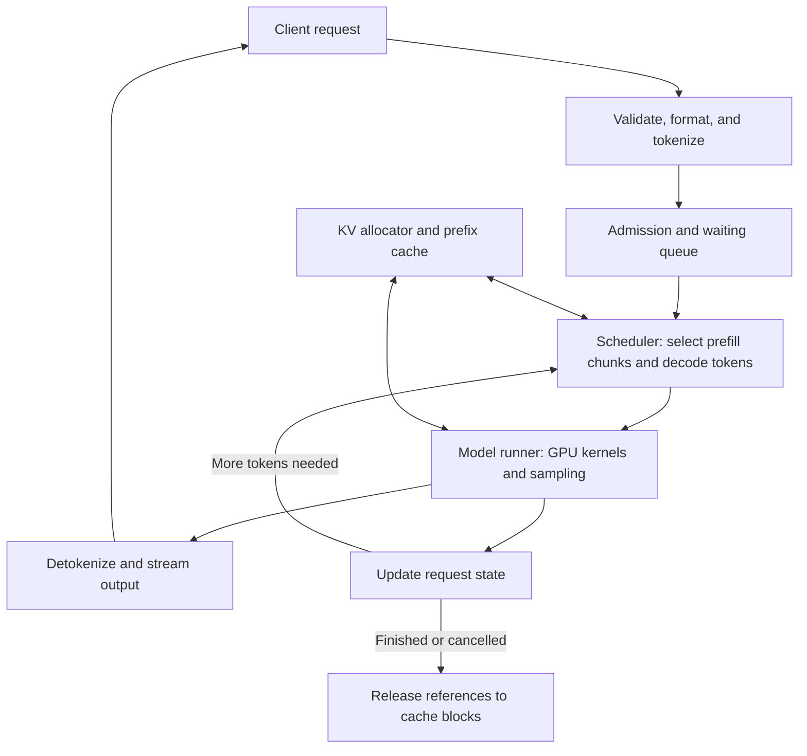

# From generation to serving

## 1. Prefill and decode do different amounts of work

Suppose a request contains \(P\) prompt tokens and ultimately generates \(N\)
output tokens. **Prefill** processes the known prompt, building per-layer state.
The logits at the final prompt position predict the first output token. Ordinary
**decode** then processes one newly selected token per request per step, producing
the next token's logits. Generating \(N\geq1\) output tokens therefore normally
requires prefill followed by \(N-1\) decode calls.

The distinction comes from what is already known. All prompt tokens are available
at once; future generated tokens depend on prior sampling decisions. Both phases
use the same learned model and the same causal semantics. Their tensor shapes
and opportunities to reuse weights are different.

| Property | Prefill without an existing prefix cache | Ordinary one-token decode |
|---|---|---|
| New positions per request | \(T=P\), possibly split into chunks | \(T=1\) |
| Attention queries | Many known positions | One new position per query head |
| Visible keys and values | Prompt positions allowed by the mask | Cached context plus the new position |
| Matrix projection shape | Many input rows reuse the same weights | Few rows unless many requests are batched |
| User experience | Waiting for the first output token | Waiting between subsequent tokens |

Large prefills often make matrix multiplication efficient by reusing weights
across many rows. Small-batch decode often spends substantial time moving weights
and cache data relative to its arithmetic. These are tendencies, not fixed
classifications: long-context attention, batch size, implementation, and hardware
can change the limiting resource.

## 2. Why the KV cache is valid

For causal attention, an old position cannot attend to a future token. Once its
representation has been computed for a fixed prefix, adding a later token does
not change that old representation. This holds through the stack: each layer's
old keys and values can be reused by new queries.

The **KV cache** stores these keys and values separately for every layer and
request. It is temporary inference state, not learned weights or a database of
past answers. Old queries are unnecessary for a new position's attention; the
new query compares with old keys and combines old values. Keys in this Qwen3
path are stored after their positional rotation.

Consider a three-token prompt \(a,b,c\). Prefill processes all three and samples
\(d\). At this moment the cache contains positions \(a,b,c\), while \(d\) is a
chosen but **unprocessed** token. The next call consumes \(d\), appends its K/V,
and samples \(e\). Confusing chosen tokens with processed positions creates an
off-by-one error in cache length, position IDs, and distributed handoff.

Caching avoids recomputing the prefix projections and MLPs. It does not make
attention independent of context length. A new query still uses the cached keys
and values. For fixed head dimensions, one decode step's attention arithmetic
grows with visible context length \(S\).

If each cached element occupies \(b_{kv}\) bytes, logical unsharded KV storage is

\[
M_{KV}=2LH_{kv}R\,b_{kv}\sum_{i=1}^{B}S_i.
\]

Each token contributes one key and one value vector per KV head per layer. That
explains every factor, including why the formula uses \(H_{kv}\) rather than
\(H_q\). Request lengths \(S_i\) can differ.

For Qwen3-32B in BF16, the per-token amount is
\(2\times64\times8\times128\times2=262144\) bytes, or 256 KiB. One request
with 8192 processed tokens therefore holds 2 GiB of logical KV state. This is a
calculation from the [32B dimensions](https://huggingface.co/Qwen/Qwen3-32B/raw/main/config.json),
not a device-memory measurement. Weights, workspaces, temporary activations,
allocator reservation, and request metadata need additional memory.

The full-attention score array is a different object from the KV cache. A
prefill can logically have a score matrix quadratic in prompt length while
persistent KV grows linearly. Tiled attention can compute the same mathematical
result without writing the full score matrix to device memory.
[FlashAttention paper](https://arxiv.org/abs/2205.14135).

## 3. A server manages a population of unfinished sequences

An inference engine executes model operations and manages their state. An
inference server surrounds this with request handling, admission, scheduling,
resource management, cancellation, and response streaming. A fast single-request
model loop is only one part of this system.

Batching shares weight accesses across requests. A static batch can leave slots
idle as short requests finish. **Continuous batching** revisits the active set
between execution iterations, allowing newly admitted requests to replace
completed ones. The number of requests and the number of token rows scheduled
in an iteration are different quantities.

A long prefill can delay ongoing decode requests. **Chunked prefill** splits its
work across iterations so the scheduler can interleave decode work. Smaller
chunks offer finer scheduling opportunities but may lose matrix efficiency or
add overhead. Both batch composition and chunk size affect the kernel shapes
seen by the GPU.

## 4. Where vLLM and SGLang fit

vLLM and SGLang are serving systems that combine optimized model execution with
batching, cache management, and request-facing APIs. They are useful reference
implementations for understanding how these mechanisms cooperate.

| System | Useful architectural idea to recognize |
|---|---|
| vLLM | PagedAttention separates a request's logical token order from physical KV blocks, allowing flexible allocation and sharing |
| SGLang | RadixAttention organizes reusable prefix state using a radix tree, allowing related requests to reuse computed prefixes |

These are characteristic ideas rather than an exclusive feature comparison;
both systems evolve. Consult their current documentation for supported models,
backends, and deployment options. [vLLM documentation](https://docs.vllm.ai/en/latest/),
[SGLang documentation](https://docs.sglang.io/),
[PagedAttention paper](https://arxiv.org/abs/2309.06180),
[SGLang paper](https://arxiv.org/html/2312.07104v2).

For intuition about paging, let a cache block hold \(C\) token positions. A
request with \(S\) positions uses \(\lceil S/C\rceil\) blocks, giving capacity
for \(C\lceil S/C\rceil\) positions. With \(S=17,C=16\), 32 positions are
allocated and 15 remain unused. Smaller blocks reduce this tail waste but need
more block metadata. Logical contiguity no longer requires one physically
contiguous reservation for the request's maximum possible length.

Prefix reuse has a separate benefit: identical computed prefixes can share
state. Reuse requires compatible model weights, token IDs, positions, and cache
semantics. Similar wording alone is insufficient. Shared blocks also require
ownership tracking so one completed request does not release storage still in
use by another. Paging concerns placement; prefix caching concerns reuse. Neither
removes the new token's need to attend to its visible history.

## 5. Latency, throughput, and goodput describe different outcomes

**Time to first token (TTFT)** runs from a declared request-start boundary to
the first output token. At the client, it includes transport, frontend work,
queueing, prefill, sampling, and delivery. **Inter-token latency (ITL)** is the
gap between adjacent output tokens. **Time per output token (TPOT)** often means
the average of the post-first-token gaps; report the convention explicitly.

For one response, if \(t_j\) is the observed arrival time of output token \(j\),

\[
\mathrm{E2E}=\mathrm{TTFT}+\sum_{j=2}^{N}(t_j-t_{j-1}).
\]

This identity uses one observation boundary throughout and ends at the final
token; any later completion acknowledgement is a separate interval. An average
gap can hide occasional long stalls, so distributions and tail percentiles matter.

**Throughput** counts work completed per second, such as output tokens or requests.
**Goodput** counts useful completions meeting declared service-level objectives
(SLOs). Here, a request contributes to request goodput only if it meets the chosen
latency and validity conditions. A larger batch may increase aggregate tokens
per second while making each user's token gaps worse. Increasing utilization is
therefore not by itself the course's objective.

## 6. Speculative decoding trades extra work for fewer target steps

A cheaper draft can propose several tokens sequentially. The target evaluates
the proposed positions together under a causal mask, then accepts a prefix and
corrects at the first rejection. For this course the draft is Qwen3-8B and the
target is Qwen3-32B. Their actual acceptance and costs determine whether this helps.

In exact stochastic speculation, let \(q(x)\) and \(p(x)\) be draft and target
probabilities at the same history. A token drawn from \(q\) is accepted with
probability \(\min(1,p(x)/q(x))\). Upon rejection, a replacement is drawn from
the normalized positive residual \([p(x)-q(x)]_+\). This correction recovers
the target distribution under the algorithm's assumptions. Greedy verification
instead checks agreement with target choices. [Speculative decoding paper](https://arxiv.org/abs/2211.17192).

Let \(k\) be the proposed length, \(A\) the accepted prefix length, \(t_d\) the
cost of one draft step, \(t_v(k)\) the target verification cost, and \(t_r\) the
remaining reconciliation cost. Away from stopping boundaries, a cycle emits
\(A+1\) tokens, including a replacement or bonus token. A first cost model is

\[
\text{time per emitted token}\approx
\frac{k t_d+t_v(k)+t_r}{\mathbb E[A+1]}.
\]

Compare this with ordinary target decode time at the same workload. For an
illustrative cycle costing 6 ms and emitting three tokens on average, the result
is 2 ms/token. That helps against a 3 ms/token baseline but loses against a
1.5 ms/token baseline. These are invented numbers explaining the inequality,
not measurements or expected Qwen performance.

The target still verifies the result, and rejected speculative cache positions
must be discarded or reconciled. Draft weights, a draft cache, and temporary
verification state also consume memory. Higher acceptance alone cannot guarantee
lower latency or higher server goodput.

[Previous: Transformer architecture](architecture.md) · [Next: Distributed inference and performance modeling](systems.md)
