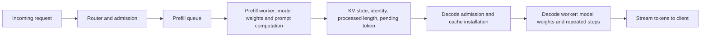

# Distributed inference and performance modeling

## 1. Placement determines what must move

A model may use multiple devices to fit its weights, reduce execution time, or
serve more requests. These objectives lead to different placements.

| Placement | How work is divided | Main communication consequence |
|---|---|---|
| Replicas / inference data parallelism | Each model replica serves different requests | Routing; optional prefix-state migration; no required per-layer collective between independent replicas |
| Tensor parallelism (TP) | Devices hold different pieces of a layer's matrices and heads | Partial results require collectives within model execution |
| Pipeline parallelism (PP) | Devices hold different groups of layers | Activations cross stage boundaries; requests traverse stages in order |
| Prefill/decode disaggregation (P/D) | Different workers execute the two phases | Computed KV state and request metadata move from prefill to decode |

Tensor parallelism can reduce local matrix work and weight storage while adding
communication on each step's critical path. Pipeline stages can overlap work
from different requests, but one request must still traverse its layer sequence.
Replication increases concurrent capacity without necessarily accelerating an
individual request. These mechanisms can be combined; a prefill worker or decode
worker can itself be a tensor-parallel group.

The column/row partitioning used later in the course follows the forward-pass
structure described in [Megatron-LM](https://arxiv.org/abs/1909.08053). Its training
results are not inference performance predictions.

## 2. Why separate prefill from decode?

Prefill benefits from processing many token rows together, while interactive
decode needs frequent progress for existing requests. Colocating them couples
their scheduling and resource allocation. P/D disaggregation gives each phase
its own workers, making separate batching and capacity choices possible. It
also creates a state-transfer boundary and two queues to manage.
[DistServe](https://arxiv.org/html/2401.09670v2) studies this tradeoff;
[SGLang's P/D documentation](https://docs.sglang.io/docs/advanced_features/pd_disaggregation)
describes a concrete serving implementation.

Both sides need the model weights required for their assigned execution. Moving
KV does not move the weights or make the decode worker's model unnecessary.
Different parallel layouts can also require cache rearrangement during transfer.

A correct handoff specifies the model revision, cache layout and dtype, positional
convention, processed length, and any already selected but unprocessed token.
The destination needs an unambiguous continuation point. The source can release
state only after the transfer protocol establishes destination ownership. Copying
the right byte count is insufficient if those bytes describe the wrong state.

Where the first token is sampled and delivered is a protocol choice. If the
prefill worker delivers it before transfer, transfer may appear mainly in the
first subsequent token gap. If delivery waits for decode admission, it can
increase TTFT. User-visible timing therefore depends on the handoff boundary,
not just on the raw network duration.

## 3. The transfer bill comes from architecture

For a full uncompressed cache transfer without prefix reuse or offloading,

\[
M_{\mathrm{transfer}}=2LH_{kv}R b_{kv}S.
\]

With effective path bandwidth \(BW_{\mathrm{net}}\) in bytes/second, a simple
serialization estimate is

\[
t_{\mathrm{handoff}}\approx
t_{\mathrm{setup}}+t_{\mathrm{pack}}+
\frac{M_{\mathrm{transfer}}}{BW_{\mathrm{net}}}
+t_{\mathrm{install}}.
\]

This estimate assumes those phases serialize. Overlap, multiple links, contention,
and queueing require a more detailed dependency model.

The preceding reading derived 2 GiB of BF16 KV for an 8192-token 32B request.
At an **illustrative effective** bandwidth of 25 GB/s, serialization alone is
\(2\times2^{30}/(25\times10^9)\approx0.086\) seconds, or 86 ms. GB/s here
uses decimal bytes, while GiB uses binary bytes. This is not a DGX Spark network
measurement; it excludes packing, protocol overhead, contention, and admission.

P/D is attractive only when the scheduling and resource-allocation benefits
justify transfer and any extra queueing under the intended workload. A short
response may offer little opportunity to recover handoff overhead. A long
response under heavy prefill interference may have a different outcome. Comparing
one colocated GPU with two disaggregated GPUs confounds placement with hardware
budget; the meaningful alternative includes replicas on the same total resources.

## 4. Model a kernel: arithmetic and data movement

Performance modeling begins with units. For an operator requiring \(F\) FLOPs
and moving \(M\) bytes across a specified memory boundary, define arithmetic
intensity \(\mathcal I=F/M\), measured in FLOPs/byte. If compute capacity is
\(C\) FLOPs/second and memory bandwidth is \(BW\) bytes/second, the ideal
resource bound is

\[
t\geq\max\left(\frac{F}{C},\frac{M}{BW}\right),\qquad
\text{FLOPs/second}\leq\min(C,\mathcal I BW).
\]

This is the Roofline intuition: computation and memory each impose a limit.
The bound assumes an attainable degree of overlap; it is not an exact latency
formula. Shape, dtype, tiling, reductions, synchronization, and launch overhead
can keep execution far below either ceiling. [Berkeley Lab Roofline explanation](https://cs-newsarchive.lbl.gov/news/2017/roofline-model-boosts-manycore-code-optimization-efforts/).

For matrix multiplication \([m,k]\times[k,n]\),

\[
F=2mkn,\qquad M_{\mathrm{ideal}}=b(mk+kn+mn).
\]

The ideal byte count reads both inputs once and writes the output once at the
chosen boundary. Actual movement depends on caching and the implementation.
When weight bytes \(bkn\) dominate, \(\mathcal I\approx2m/b\). Increasing
token rows \(m\) raises weight reuse: this explains why a single decode row
and a large prefill can behave differently despite using the same matrix.

For the 8B query projection, \(k=n=4096\). In BF16, \(b=2\), so the
weight-dominated estimate is about one FLOP/byte for \(m=1\). At \(m=128\),
the complete ideal-byte formula gives about 120 FLOPs/byte. These are analytical
intensities; neither states an achieved hardware rate.

## 5. Model one forward pass: follow dependencies

A forward pass is a graph of operators and transfers. Its duration follows the
critical path through that graph. Summing measured operator durations is a useful
starting approximation for strictly sequential execution. Overlapped operations
must not be counted twice, and gaps between kernels need an explanation.

Weights, activations, and KV state have different lifetimes. Weight memory is
approximately fixed for a loaded model; cache memory grows with active processed
tokens; workspace peaks depend on scheduled shapes. A capacity model must account
for all three. Quantization changes bytes per stored element, but speed also
depends on the kernel that consumes the representation and its conversion costs.

An improvement to one operator is limited by how much of the original critical
path it occupies. If a fraction \(f\) of execution becomes \(s\) times faster
and everything else stays unchanged, the total speedup is

\[
\mathrm{speedup}=\frac{1}{(1-f)+f/s}.
\]

For \(f=0.2,s=2\), doubling that part gives only \(1/0.9\approx1.11\) times
overall speed. Fusion may change several terms together, so it needs a revised
graph rather than blindly reusing this fixed-fraction assumption.

## 6. Model a server: include arrivals and waiting

An isolated model execution time says how quickly one scheduled batch can run.
A server model also needs prompt and output length distributions, arrival rate,
prefix reuse, batch policy, memory capacity, and latency objectives. A queue can
dominate request latency even when every kernel runs efficiently.

For a stable system in steady state, Little's law relates long-run averages:

\[
\overline N=\lambda\overline W,
\]

where \(\overline N\) is the number of requests in the chosen system boundary,
\(\lambda\) is its throughput in requests/second, and \(\overline W\) is mean
time inside it. At 10 completed requests/second and a mean residence time of
2 seconds, that boundary contains 20 requests on average. This is not a claim
that all 20 are in the active GPU batch. [MIT queueing lecture](https://web.mit.edu/1.041/spring2023/lectures/L8-queuing-models-2023sp.pdf).

Offered load above sustainable capacity makes an unbounded queue grow rather
than produce a useful steady-state latency. Admission control, backpressure, or
rejection determines what happens next. Even below saturation, burstiness and
variable request lengths affect tail latency. A fixed-concurrency benchmark and
an independently arriving workload can therefore reveal different behavior.

## 7. Model the whole system: balance stages and account for communication

For a simplified P/D pipeline with capacities \(\mu_P\) and \(\mu_D\) in
requests/second for the same workload, network bandwidth supplies a third bound:

\[
\lambda_{\mathrm{sustainable}}\leq
\min\left(\mu_P,\mu_D,
\frac{BW_{\mathrm{net}}}{\mathbb E[M_{\mathrm{transfer}}]}\right).
\]

This is a capacity bound, not a tail-latency prediction. It assumes all requests
traverse those stages and counts transfer bytes against the same shared network
resource. Faster prefill cannot increase completed throughput when decode is
already limiting; it can instead fill a queue and retain more cache state.

A kernel improvement can alter the best batch size, which changes cache demand,
which changes admissible concurrency, which changes queueing and goodput. A
network improvement can change whether P/D is worthwhile. This is why the course
connects levels rather than treating a kernel benchmark as the final result.

| Level | Boundary being modeled | Useful quantities | A conclusion that needs the next level |
|---|---|---|---|
| Kernel | One operator or fused region | FLOPs, bytes, shape, dtype, execution interval | A faster attention kernel will materially accelerate the model |
| Model / engine | One prefill chunk or decode step | Critical path, weight traffic, KV reads, workspace, sampling | A faster step will reduce request latency under load |
| Server | Requests sharing a worker or replica | Queueing, batch mix, memory admission, TTFT, ITL, goodput | Better local goodput will improve the distributed deployment |
| System | Routing, workers, links, and shared resources | Stage balance, collective/transfer cost, aggregate capacity, cost per useful completion | The design will remain preferable for a different workload or topology |

The unifying habit is to state the boundary, count the work and state inside it,
and identify the dependencies crossing it. Then distinguish a mathematical bound,
an estimated time, and a measured result. The rest of the course develops the
evidence needed to connect those statements from individual operators to the
complete serving system.

[Previous: From generation to serving](inference.md) · [References](references.md) · [Next chapter: Reconstruct Qwen3](../01_reconstruct_qwen3/background.md)
