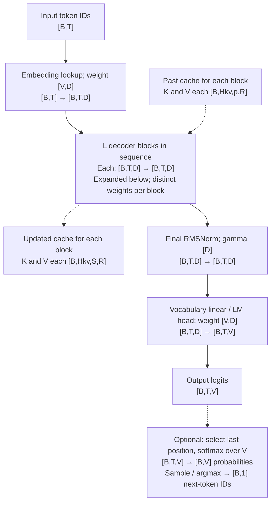
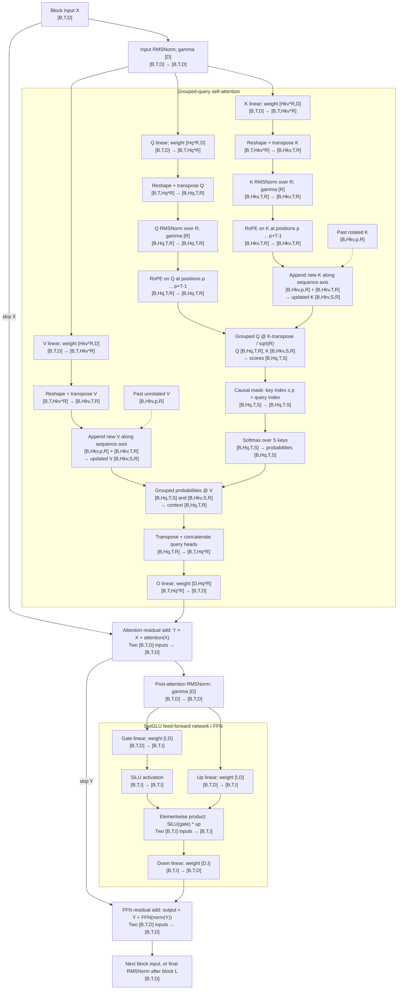

# Background: a token's computation and state

## Dimension symbols and concrete configurations

**Qwen3 tiny** below means this course's randomly initialized teaching model:
the default `Config` in [code/lab.py](code/lab.py), also used by the
[offline checkpoint fixture](code/make_fixture.py). It is not an official
pretrained Qwen release. The 8B and 32B columns use the published checkpoint
configurations, rather than the defaults of the `Qwen3Config` Python class.
[Qwen3-8B config](https://huggingface.co/Qwen/Qwen3-8B/raw/main/config.json),
[Qwen3-32B config](https://huggingface.co/Qwen/Qwen3-32B/raw/main/config.json).

| Symbol | Description / configuration field | Qwen3 tiny (course) | Qwen3-8B | Qwen3-32B |
| --- | --- | ---: | ---: | ---: |
| `L` | Number of decoder blocks; `num_hidden_layers` | 2 | 36 | 64 |
| `D` | Residual-stream / embedding width; `hidden_size` | 48 | 4,096 | 5,120 |
| `I` | FFN intermediate width; `intermediate_size` | 96 | 12,288 | 25,600 |
| `Hq` | Query heads; `num_attention_heads` | 8 | 32 | 64 |
| `Hkv` | Key heads and value heads; `num_key_value_heads` | 2 | 8 | 8 |
| `R` | Channels per head; explicit `head_dim` | 8 | 128 | 128 |
| `V` | Vocabulary size; `vocab_size` | 101 | 151,936 | 151,936 |
| `G = Hq/Hkv` | Query heads sharing each KV head (GQA group size) | 4 | 4 | 8 |
| `Hq*R` | Q projection width / concatenated attention-output width | 64 | 4,096 | 8,192 |
| `Hkv*R` | Width of each K or V projection | 16 | 1,024 | 1,024 |
| `I/D` | FFN expansion ratio | 2 | 3 | 5 |
| `eps` | RMSNorm numerical stabilizer; `rms_norm_eps` | 0.000001 | 0.000001 | 0.000001 |
| `theta` | Base for RoPE frequencies; `rope_theta` | 1,000,000 | 1,000,000 | 1,000,000 |
| `B` | Requests in this dense batch | Workload choice | Workload choice | Workload choice |
| `T` | New input tokens per request in this call | Workload choice | Workload choice | Workload choice |
| `p` | Already processed tokens per request before this call | Runtime state | Runtime state | Runtime state |
| `S = p+T` | Total visible cache length after appending this call's K/V | Runtime state | Runtime state | Runtime state |
| `b` | Bytes per stored element, used for memory accounting | 4 for FP32 labs | 2 for BF16 | 2 for BF16 |

Derived rows follow directly from the dimensions above. `b` is a storage choice,
not an architectural constant: the tiny model can also be accounted for at BF16,
and a full-model FP32 reference uses 4 bytes per element. `B`, `T`, `p`, and `S`
have no fixed checkpoint values. Full prefill has `p=0, S=T`; one-token cached
decode has `T=1, S=p+1`. These diagrams assume equal lengths within a batch;
ragged serving tracks a separate `p` and `S` for each request.

The Spark timing experiment deliberately uses a larger random fixture:
`(L,D,I,Hq,Hkv,R,V)=(2,512,1536,8,2,128,4096)` in
[code/experiment.py](code/experiment.py). Use those values when interpreting its
measurements; the table's tiny column describes the smaller correctness fixture.

Shapes below count elements, not bytes. Stored linear weights are
`[out_features,in_features]`: a linear layer computes `Y = X @ W.T`.
For example, 32B's `q_proj` stores `[8192,5120]` and transforms
`[B,T,5120]` into `[B,T,8192]`; its `o_proj` stores `[5120,8192]`
and returns to `[B,T,5120]`.

## Architecture with operator input and output shapes

The first diagram shows the whole causal language model. The second expands
one decoder block in the [course reference](code/lab.py). Each of the `L` blocks
has its own weights and KV cache. Embedding and vocabulary-head weights are
separate (untied) in all three configurations.



For next-token generation, the head can operate on only the final hidden state,
`[B,1,D] → [B,1,V]`, avoiding logits for other positions. The tiny reference's
`last_only=True` also applies final RMSNorm only at that position; this is valid
because RMSNorm acts independently on each token. Sampling is outside the
decoder, and the sampled token gets its KV entries when processed on a later call.



In the first residual label, `attention(X)` includes the input RMSNorm shown
above it. Q/K normalization has one learned vector `[R]` per projection per
block, shared across that projection's heads; V is neither normalized nor
rotated. Normalizing before or after the head transpose gives the same result
because both layouts keep `R` as the last axis. RoPE uses position IDs `[B,T]`
(the tiny equal-length fixture broadcasts one `[T]` vector); its cosine/sine
tables broadcast across heads.

“Grouped” multiplication means query head `h` reads KV head `floor(h/G)`.
The KV cache remains `[B,Hkv,S,R]`. Expanding it to `[B,Hq,S,R]` is a dense
oracle implementation choice, not additional architectural cache storage.
The score and probability shapes are logical: a fused attention kernel can
compute the result in tiles without materializing either full `[B,Hq,T,S]`
tensor. Cache append likewise describes state growth, not a requirement to
copy the whole prefix on every call.

For a concrete 32B decode call with `B=1, p=2047, T=1`, a block consumes
`[1,1,5120]`; Q is `[1,64,1,128]`; updated K and V are each
`[1,8,2048,128]`; logical scores are `[1,64,1,2048]`; concatenated attention
is `[1,1,8192]`; the FFN intermediate is `[1,1,25600]`; and the block returns
`[1,1,5120]`. The LM head ultimately returns `[1,1,151936]` logits.

## Derive the decoder block

For each token, RMSNorm computes `x / sqrt(mean(x²) + eps) * gamma` over its last
dimension. Accumulate the mean square in FP32. Normalization rescales a vector;
it does not subtract its mean. In a pre-norm residual block, attention receives
normalized input while the skip connection retains the original residual.

Starting from `X[B,T,D]`, Q has shape `[B,T,Hq*R]`, K/V `[B,T,Hkv*R]`.
Reshape to heads; normalize Q and K over R with learned weights. Apply RoPE to Q/K
using absolute token positions. RoPE rotates pairs of coordinates, allowing dot
products to depend on relative position. Use the checkpoint's split-half pairing
and frequency convention. Cache rotated K and unrotated V. These details are
specified by the [Qwen3 implementation](https://github.com/huggingface/transformers/blob/main/src/transformers/models/qwen3/modeling_qwen3.py).

Each group of `Hq/Hkv` query heads shares K/V. A dense oracle repeats KV heads;
an efficient kernel accesses shared storage directly. Scores are `Q Kᵀ / sqrt(R)`.
Mask future keys before softmax, then multiply probabilities by V. Concatenate
query-head outputs and project `[Hq*R,D]` back into the residual stream.

The MLP is `down(silu(gate(z)) * up(z))` with two `[D,I]` projections and one
`[I,D]` projection. Both attention and MLP add their result to a residual. A final
RMSNorm and vocabulary projection produce logits; softmax converts logits to a
distribution only when needed for sampling or evaluation.

## The architecture trap

8B uses `(L,D,I,Hq,Hkv,R)=(36,4096,12288,32,8,128)`; 32B uses
`(64,5120,25600,64,8,128)`. Both have V=151936 and untied embeddings. In 32B,
Q's width is 8192 while D is 5120. Never infer R as D/Hq.
[8B config](https://huggingface.co/Qwen/Qwen3-8B/raw/main/config.json),
[32B config](https://huggingface.co/Qwen/Qwen3-32B/raw/main/config.json).

For the bias-free dense structure, count parameters:

```text
P = L(2 D Hq R + 2 D Hkv R + 3 D I + 2 D + 2 R) + 2 V D + D
```

The first two terms count Q/O and K/V matrices; then MLP, two block norms, Q/K
norms, two vocabulary matrices, and final norm. The tiny sample intentionally
uses `D != Hq*R` and verifies the formula against actual parameter tensors.

## Cache semantics before speed

After processing p tokens, the cache represents exactly positions `0..p-1`.
For a new chunk of t tokens, query j has absolute position `p+j`; key k is visible
iff `k <= p+j`. For p=3 and t=2 the rows of the allowed mask are:

```text
1 1 1 1 0
1 1 1 1 1
```

A top-left triangular mask would hide valid prefix keys. A sampled next token
is pending: it is in the output history but has no KV until processed.
That distinction will govern speculation and P/D handoff later.

For element size b bytes and request lengths Si,
`M_KV = 2 L Hkv R b sum(Si)`. BF16 yields 147456 bytes/token for 8B and
262144 for 32B. At 2048 tokens these are 0.28125 and 0.5 GiB per request.
Weights are constant in context length; live KV grows linearly. Cached decode
avoids prefix projections but still reads growing attention state.

## Numerical reasoning

A readable continuation is weak evidence of correctness. Compare full-vocabulary
logits and locate the first divergent layer. Report maximum absolute error and
relative L2 error; inspect near-tied top logits separately. Start tiny FP32 at
`rtol=1e-4, atol=1e-5`. Establish BF16 tolerance empirically against the chosen
reference/backend, rather than widening it until a comparison passes.
