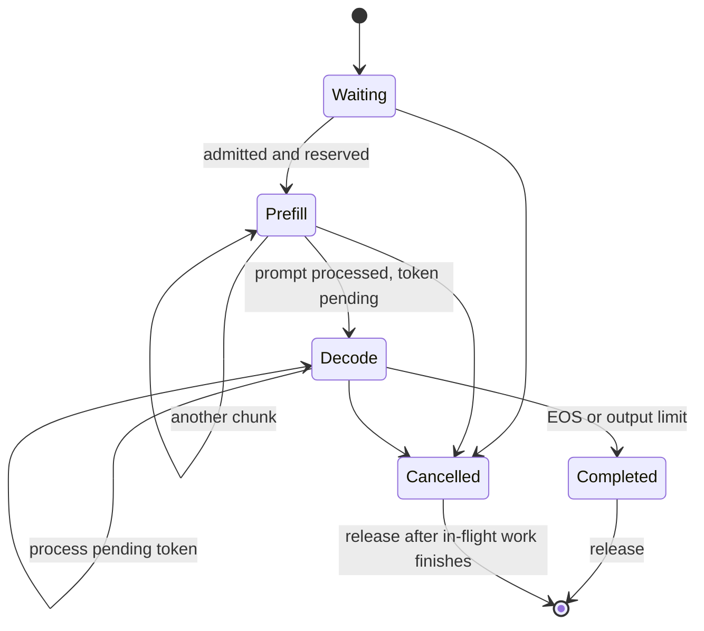

# Background: scheduling work under a memory constraint

A model forward function accepts tensors. A server must decide which requests
own those tensors and when they run. Request-level batching holds a batch together
until completion; iteration-level scheduling can replace finished requests after
each model step. Study that distinction in [Orca](https://www.usenix.org/conference/osdi22/presentation/yu).

## State and ownership

Track request ID, history, pending token, processed length, generated count, state,
block table, and timestamps. Cancellation does not authorize reclaiming memory
while a GPU operation still reads it. Defer reuse until the relevant stream/event
completes. Treat admission/reservation as a transaction before dispatch.

## Logical versus physical cache

With P tokens/page, token position t maps to logical page `t//P` and slot `t%P`.
A per-request table maps logical page to a physical pool slot. Physical pages may
be nonadjacent. Efficient attention follows this mapping rather than assuming a
contiguous tensor. [PagedAttention](https://arxiv.org/abs/2309.06180) provides the
memory-management foundation for this lab.

For cache cost c bytes/token, logical storage is `c sum(Si)`. Without sharing,
allocated storage is `c sum(P ceil(Si/P))`. Their difference is internal
fragmentation, bounded by fewer than P unused tokens per nonempty request.
Smaller P reduces this waste but increases table size and management overhead.

Example: P=16 and lengths 17 and 31 use 64 allocated slots for 48 tokens. If the
first 16 tokens are an identical, shareable prefix, one physical page can be shared,
reducing physical slots to 48. Count shared blocks once, not once per owner.
Prefix identity must include exact IDs, model revision, positions, and cache format.

Reference counts record ownership; shared full blocks are immutable. Appending
after a full shared page allocates a private page. Extending a shared partial page
requires copy-on-write, so the initial lab supports sharing only complete pages.

## Batching, interference, and capacity

Suppose the iteration budget is 512 token positions and 32 requests need decode.
A decode-first policy reserves 32 positions, leaving 480 for prefill. Chunking a
long prompt lets decode work run between chunks. Each chunk may be less efficient
than a large prefill GEMM, so lower token gaps can coexist with lower throughput.

The token budget alone cannot prevent OOM: reservation must also include newly
needed KV pages, temporary buffers, and graph/backend workspace. Every live request
must either make progress, wait with a declared bound, or receive a declared
rejection. Continuous admission can starve an old prefill without a fairness rule.

In a stable system, Little's law relates mean in-system requests N, completed
throughput lambda, and mean residence time W: `N = lambda W`. It is an accounting
relation over consistent boundaries, not a tail-latency predictor. Near saturation,
variable request costs and bursty arrivals can create queues even when average
compute capacity appears sufficient.

## Predict the tradeoff

Before changing page size or prefill chunk size, predict memory waste, TTFT, and
decode gaps separately. Gather-to-contiguous attention can prove correctness but
adds copy traffic. Record its time so allocation improvements are not mistakenly
credited with an efficient attention implementation.
