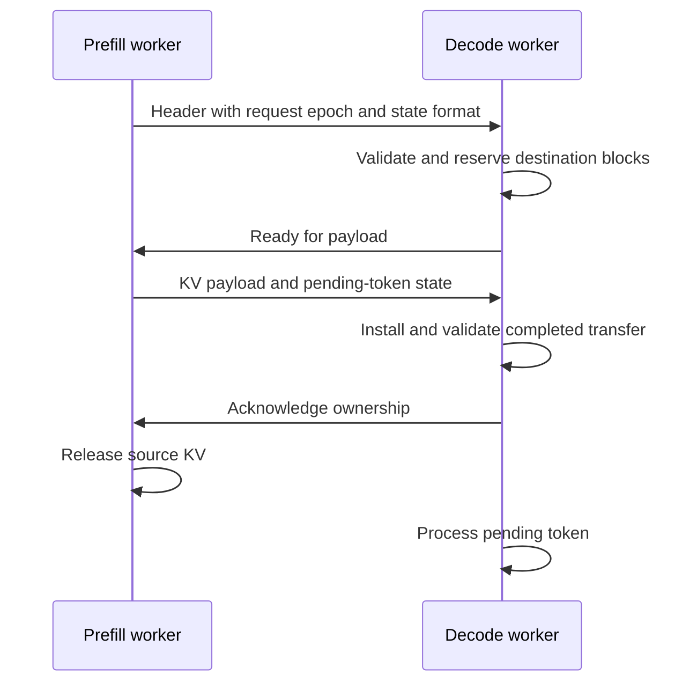

# Background: removing interference by moving state

Prefill processes many prompt tokens together; decode repeatedly processes one
token per active request. Separate workers can isolate their competing service
needs, but they must move the request's state and divide a fixed hardware budget.
[DistServe](https://arxiv.org/abs/2401.09670) is the systems reading. Its reported
benefits are hypotheses to test under this course's models, hardware, and load.

## Define a handoff boundary

Use the convention: prefill processes S prompt tokens, samples/emits one pending
token, and exports KV for the S processed positions. Decode consumes that pending
token at position S, appends its KV, and produces the next token's logits. Choose
which worker emits token one and keep the convention fixed during comparisons.

Transfer model/checkpoint identity, cache dtype/layout/sharding identity, request
ID/epoch, history, processed length, positions, pending token, and sampler state
needed for stochastic continuation. Raw pointers and physical source block IDs
have no destination meaning. For pages, transfer populated payloads and logical
order; allocate new physical blocks on the destination.



During transfer, source and destination copies coexist. Include this duplication
in admission accounting. For cancellation and retries, use request epochs and
idempotent terminal transitions: a duplicate acknowledgment must not double-free,
and a late payload must not revive a cancelled request. The required first path
is synchronous, with equal layout/TP degree; resharding is a separate extension.

## Derive the transfer model

Logical KV bytes are `2 L Hkv R b S`. For BF16 32B at S=8192, payload is 2 GiB.
With an invented 200 Gbit/s payload link (25 GB/s), serialization alone is
`2*2**30/(25*10**9) = 85.9 ms`. Gbit/s and GB/s differ by eight; GiB and GB
also differ. This is a sensitivity example, not a network benchmark.

```text
t_handoff = t_setup + bytes/BW_eff + t_pack + t_coord
```

If a fitted end-to-end intercept already includes packing/coordination, do not add
those terms twice. Separate host staging, registration, layout conversion, link
contention, and queueing using measured boundaries. Weight-only quantization does
not shrink a BF16 KV payload.

## Queueing and stage balance

For a fixed workload mix, stable arrival rate requires
`lambda < min(mu_prefill, mu_decode)`, where stage capacities are measured under
their actual batching policy. Decode service demand depends strongly on output
length, so request/s is meaningful only for the fixed mix. Transfer can be another
bottleneck: required payload bandwidth is arrival rate times mean bytes/request.

A two-GPU 1P/1D split can strand capacity when one stage is lightly loaded. Two
colocated replicas can use both GPUs for whichever request phase is needed. P/D
may remove interference yet lose from transfer, extra queueing, or imbalance.
One 1P/1D experiment cannot establish the best allocation ratio for a large fleet.

TTFT can look favorable when the prefill worker emits the first token before a
slow handoff. The first-to-second-token gap reveals the pause. Compare completion
latency, token-gap distributions, and goodput alongside TTFT. The
[Dynamo design](https://docs.dynamo.nvidia.com/dynamo/v-0-9-0/design-docs/disaggregated-serving)
is the production-protocol comparison after the mechanism is understood.
