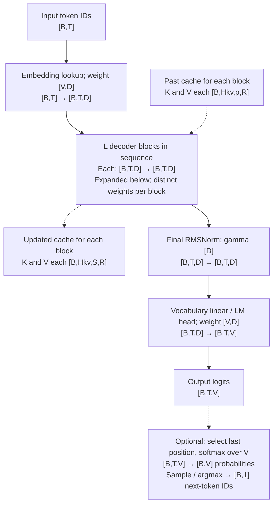
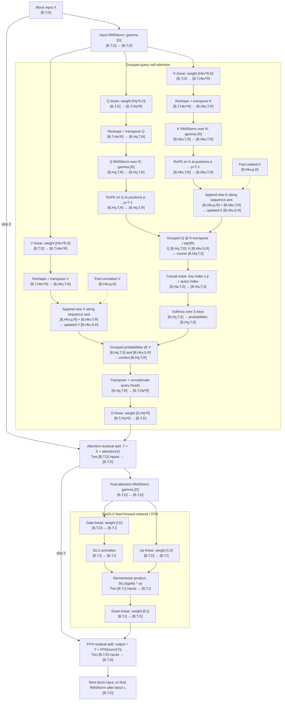

# Chapter 1: Reconstruct Qwen3 — background theory

**P1 · Weeks 1–2 · 30–36 hours · DGX Spark**

Can one configuration-driven implementation reproduce Qwen3-8B and Qwen3-32B,
including cached generation? This chapter separates theory from practice:

- **Background theory (this page):** dimensions, operator equations, cache semantics,
  numerical reasoning, and annotated readings.
- **[Interactive project lab](code/lab.ipynb):** prepare and inspect the real two-layer
  practice checkpoint, implement the model, compare logits,
  and measure cache behavior. The submission checklist is there too.
- **[Full-model lab](code/lab2.ipynb):** download and inspect full 8B/32B weights,
  load the custom blocks, generate logits, and extend validation and measurements.

You will derive projection shapes, parameter counts, and KV bytes; implement Q/K
normalization, RoPE, GQA, and SwiGLU; and validate full, incremental, chunked, and
mixed-batch execution. Start with [Chapter 0](../00_introduction/README.md), then
complete the [Spark setup](../../shared/SETUP.md). Prerequisites are tensor algebra,
PyTorch, and stable softmax. Use the shared [experiment protocol](../../shared/PROTOCOL.md).

Read the sections below in order, then work through the notebook. Keep the operator
equations open while implementing the decoder.

## Dimension symbols and concrete configurations

**Qwen3 tiny** is the first two decoder layers (0 and 1) of the real Qwen3-8B
checkpoint, with its original embeddings, final norm, vocabulary head, and tokenizer.
Only the layer count changes; tensor values and all other dimensions are preserved.
[Checkpoint preparation](code/make_fixture.py) records the pinned source revision
and selected tensors. The same local checkpoint supplies Chapter 1 correctness
checks and [Spark timing](code/lab.ipynb). This truncated model is for
implementation practice; it is not a separately trained release and does not
reproduce the full 8B model's output quality. The other columns describe the full
published checkpoints.
[Qwen3-8B config](https://huggingface.co/Qwen/Qwen3-8B/raw/main/config.json),
[Qwen3-32B config](https://huggingface.co/Qwen/Qwen3-32B/raw/main/config.json).

| Symbol | Description / configuration field | Qwen3 tiny (course) | Qwen3-8B | Qwen3-32B |
| --- | --- | ---: | ---: | ---: |
| `L` | Number of decoder blocks; `num_hidden_layers` | 2 | 36 | 64 |
| `D` | Residual-stream / embedding width; `hidden_size` | 4,096 | 4,096 | 5,120 |
| `I` | FFN intermediate width; `intermediate_size` | 12,288 | 12,288 | 25,600 |
| `Hq` | Query heads; `num_attention_heads` | 32 | 32 | 64 |
| `Hkv` | Key heads and value heads; `num_key_value_heads` | 8 | 8 | 8 |
| `R` | Head dimension; explicit `head_dim` | 128 | 128 | 128 |
| `V` | Vocabulary size; `vocab_size` | 151,936 | 151,936 | 151,936 |
| `G = Hq/Hkv` | Query heads sharing each KV head (GQA group size) | 4 | 4 | 8 |
| `Hq*R` | Q projection width / concatenated attention-output width | 4,096 | 4,096 | 8,192 |
| `Hkv*R` | Width of each K or V projection | 1,024 | 1,024 | 1,024 |
| `I/D` | FFN expansion ratio | 3 | 3 | 5 |
| `eps` | RMSNorm numerical stabilizer; `rms_norm_eps` | 0.000001 | 0.000001 | 0.000001 |
| `theta` | Base for RoPE frequencies; `rope_theta` | 1,000,000 | 1,000,000 | 1,000,000 |
| `B` | Requests in this dense batch | Workload choice | Workload choice | Workload choice |
| `T` | New input tokens per request in this call | Workload choice | Workload choice | Workload choice |
| `p` | Already processed tokens per request before this call | Runtime state | Runtime state | Runtime state |
| `S = p+T` | Total visible cache length after appending this call's K/V | Runtime state | Runtime state | Runtime state |
| `b` | Bytes per stored element, used for memory accounting | 4 for FP32 labs | 2 for BF16 | 2 for BF16 |

Derived rows follow directly from the dimensions above. `b` is a storage choice,
not an architectural constant: the tiny model can also be accounted for at BF16,
and a full-model FP32 reference uses 4 bytes per element. `B`, `T`, `p`, and `S`
have no fixed checkpoint values. Full prefill has `p=0, S=T`; one-token cached
decode has `T=1, S=p+1`. These diagrams assume equal lengths within a batch;
ragged serving tracks a separate `p` and `S` for each request.

Use the same Qwen3 tiny dimensions for all Chapter 1 introductory checks and
timings: `(L,D,I,Hq,Hkv,R,V)=(2,4096,12288,32,8,128,151936)`. Its FP32 KV cache grows by
`2*2*8*128*4 = 16384` bytes per processed token per request. Keep these dimensions
fixed while varying the input workload. Tiny is used only in Chapter 1; after
the introductory lab, load the real Qwen3-8B and Qwen3-32B checkpoints for
Chapter 1's full-model validation and subsequent chapters' model experiments.

Shapes below count elements, not bytes. Stored linear weights are
`[out_features,in_features]`: a linear layer computes `Y = X @ W.T`.
For example, 32B's `q_proj` stores `[8192,5120]` and transforms
`[B,T,5120]` into `[B,T,8192]`; its `o_proj` stores `[5120,8192]`
and returns to `[B,T,5120]`.

## Architecture with operator input and output shapes

The first diagram shows the whole causal language model. The second expands
one decoder block in the [course reference](code/lab.ipynb). Each of the `L` blocks
has its own weights and KV cache. Embedding and vocabulary-head weights are
separate (untied) in all three configurations.



For next-token generation, the head can operate on only the final hidden state,
`[B,1,D] → [B,1,V]`, avoiding logits for other positions. The tiny reference's
`decode=True` also applies final RMSNorm only at that position; this is valid
because RMSNorm acts independently on each token. Sampling is outside the
decoder, and the sampled token gets its KV entries when processed on a later call.



In the first residual label, `attention(X)` includes the input RMSNorm shown
above it. Q/K normalization has one learned vector `[R]` per projection per
block, shared across that projection's heads; V is neither normalized nor
rotated. Normalizing before or after the head transpose gives the same result
because both layouts keep `R` as the last axis. RoPE uses position IDs `[B,T]`
(the tiny equal-length fixture broadcasts one `[T]` vector); its cosine/sine
tables broadcast across heads.

“Grouped” multiplication means query head `h` reads KV head `floor(h/G)`.
The KV cache remains `[B,Hkv,S,R]`. Expanding it to `[B,Hq,S,R]` is a dense
oracle implementation choice, not additional architectural cache storage.
The score and probability shapes are logical: a fused attention kernel can
compute the result in tiles without materializing either full `[B,Hq,T,S]`
tensor. Cache append likewise describes state growth, not a requirement to
copy the whole prefix on every call.

For a concrete 32B decode call with `B=1, p=2047, T=1`, a block consumes
`[1,1,5120]`; Q is `[1,64,1,128]`; updated K and V are each
`[1,8,2048,128]`; logical scores are `[1,64,1,2048]`; concatenated attention
is `[1,1,8192]`; the FFN intermediate is `[1,1,25600]`; and the block returns
`[1,1,5120]`. The LM head ultimately returns `[1,1,151936]` logits.

## Derive the decoder block

The equations below are an implementation specification for one block in
[code/lab.ipynb](code/lab.ipynb). They use the dimensions in the table above and the
**stored-weight convention**: a linear layer with weight
$W\in\mathbb R^{d_{\mathrm{out}}\times d_{\mathrm{in}}}$ computes
$UW^\top$ on the last axis. All projections here are bias-free. This is the
course's dense, unscaled-RoPE inference path, with attention dropout disabled.
The [Qwen3 implementation](https://github.com/huggingface/transformers/blob/main/src/transformers/models/qwen3/modeling_qwen3.py)
is the checkpoint reference for operator ordering and learned weights.

Let $X\in\mathbb R^{B\times T\times D}$ be the block input. The cache already
contains $p$ processed positions, so new token index $t\in\{0,\ldots,T-1\}$
has absolute position $m_t=p+t$, and the updated cache length is $S=p+T$.
All indices below are zero-based. We assume equal prefix and chunk lengths across
the batch; ragged batches require per-request positions and validity masks.

### 1. RMSNorm: normalize only the feature axis

For any tensor $U$ whose last dimension has width $J$, define

$$
\operatorname{RMSNorm}_{\gamma,\epsilon}(U)_{\ldots,j}
=\gamma_j\,
\frac{U_{\ldots,j}}
{\sqrt{\frac{1}{J}\sum_{r=0}^{J-1}U_{\ldots,r}^{\,2}+\epsilon}},
\qquad \gamma\in\mathbb R^J.
$$

The ellipsis identifies one independent feature vector. For input
$[B,T,D]$, compute one mean square per batch item and token, producing a
$[B,T,1]$ denominator that broadcasts over $D$. Do not reduce over tokens
or batch items. The output retains the input shape.

The denominator controls vector magnitude; the learned $\gamma$ restores
per-channel scale. $\epsilon$ belongs inside the square root.

For the first normalization in the block,

$$
Z=\operatorname{RMSNorm}_{\gamma_{\mathrm{in}},\epsilon}(X)
\in\mathbb R^{B\times T\times D}.
$$

**Implementation translation:** `RMSNorm.forward` casts its input to FP32 before
squaring, uses `mean(-1, keepdim=True)`, and multiplies by the reciprocal square
root. It casts the normalized vector back to the input dtype before multiplying
by the learned weight, matching this reference's rounding order. Save the
original $X$ for the residual addition; normalization does not replace the skip
connection.

### 2. Q/K/V projections: split features into heads, then normalize Q and K

Use the following stored weights:

$$
W_Q\in\mathbb R^{H_qR\times D},\qquad
W_K,W_V\in\mathbb R^{H_{kv}R\times D}.
$$

The linear outputs are

$$
Q^{\mathrm{flat}}=ZW_Q^\top\in\mathbb R^{B\times T\times H_qR},
\qquad
K^{\mathrm{flat}}=ZW_K^\top,\quad
\mathbf V^{\mathrm{flat}}=ZW_V^\top
\in\mathbb R^{B\times T\times H_{kv}R}.
$$

Bold $\mathbf V$ denotes attention values; the scalar $V$ in the symbol table
is vocabulary size. Reshape and transpose so that head and sequence are distinct
axes. Explicitly, for batch index $n$,

$$
Q^0_{n,h,t,r}=Q^{\mathrm{flat}}_{n,t,hR+r},\qquad
K^0_{n,g,t,r}=K^{\mathrm{flat}}_{n,t,gR+r},\qquad
\mathbf V^0_{n,g,t,r}=\mathbf V^{\mathrm{flat}}_{n,t,gR+r}.
$$

Thus $Q^0$ has shape $[B,H_q,T,R]$, and $K^0,\mathbf V^0$ have shape
$[B,H_{kv},T,R]$. Apply separate learned RMSNorms over the last axis:

$$
\widehat Q=\operatorname{RMSNorm}_{\gamma_Q,\epsilon}(Q^0),\qquad
\widehat K=\operatorname{RMSNorm}_{\gamma_K,\epsilon}(K^0),\qquad
\gamma_Q,\gamma_K\in\mathbb R^R.
$$

Each normalization has one width-$R$ weight vector shared across its heads,
positions, and batch items. Q and K have different learned vectors; neither is
shared with the width-$D$ input norm. Values receive no head normalization.

**Implementation translation:** the Q path is `q(z)` → reshape to
`[B,T,Hq,R]` → `q_norm` → transpose token/head axes. `Block.forward` normalizes
before the transpose, which is equivalent because the reduced last axis is
still $R$. Never normalize across flattened $H_qR$, and never infer
$R=D/H_q$. The tiny model maps 4096 features to 4096 Q features, arranged as
32 heads of width 128; the full 32B model demonstrates unequal residual and Q widths.

### 3. RoPE: rotate split-half coordinate pairs at absolute positions

#### RoPE intuition

Content-only self-attention has no explicit representation of token order or
distance. A causal mask tells a query which tokens are in its past, but does not
directly encode how many positions separate them. Positional embeddings supply
this missing information.

Two useful design goals motivate relative positional information:

1. **Make distance available to attention.** Nearby tokens often have strong
   relationships, so a model should be able to favor local context. It must also
   be able to attend strongly to a distant token when its content is relevant.
   “Closer always gets higher attention” is not a requirement or a guarantee of
   RoPE; its rotations do not produce a strictly decreasing attention weight
   with distance.
2. **Preserve a relationship when both positions shift together.** A query at
   position 12 attending to a key at position 10 has the same relative offset as
   a query at 1002 attending to a key at 1000. Holding their Q/K content vectors
   fixed, the positional contribution to their match should be the same.

**Key insight:** attention benefits from knowing where a key is relative to its
query. Relative position describes that relationship directly; absolute position
alone describes where each token sits in the sequence. This motivates RoPE's
relative-position structure, rather than a claim that absolute positions are
never useful.

By isolating the position information into the attention mechanism, it preserves
the hidden state and keeps it focused on semantics. RoPE primarily tried to
cleverly modify Q and K so their dot products would reflect proximity.

Imagine each Q/K coordinate pair as an arrow. RoPE turns each arrow by an angle
determined by its token's absolute position. One of the nicest properties of
rotation is that it preserves vector modules (size), which potentially carries
semantic information. When two arrows are compared by a dot product, their
**difference in rotation** matters. Shifting both positions equally leaves that
difference unchanged. Different coordinate pairs turn at different rates, giving
attention several scales for representing displacement.


The equations below show how absolute rotations produce relative-position
dependence. [RoPE formulation and properties](https://arxiv.org/html/2104.09864v5).

More reference: [RoPE, Clearly Explained](https://towardsdatascience.com/rope-clearly-explained/)

#### From intuition to the rotation equations

**Start with a 2D vector.** Rotating $\vec{a}=(a_1,a_2)$ counterclockwise by an angle
$\alpha$ in radians gives

$$
\begin{aligned}
a_1' &= a_1\cos\alpha-a_2\sin\alpha,\\
a_2' &= a_2\cos\alpha+a_1\sin\alpha.
\end{aligned}
$$

Equivalently, multiply the column vector by a rotation matrix:

$$
\begin{bmatrix}a_1'\\a_2'\end{bmatrix}
=\underbrace{\begin{bmatrix}
\cos\alpha&-\sin\alpha\\
\sin\alpha&\cos\alpha
\end{bmatrix}}_{\mathcal R(\alpha)}
\begin{bmatrix}a_1\\a_2\end{bmatrix}.
$$

The angle changes the vector's direction while preserving its length:
$(a_1')^2+(a_2')^2=a_1^2+a_2^2$. At $\alpha=0$ the vector is unchanged;
at $\alpha=\pi/2$, $(1,0)$ becomes $(0,1)$.

**Turn one head into 2D pairs.** For even head width $R$, one head vector
$u\in\mathbb R^R$ contains $R/2$ coordinate pairs. In Qwen's split-half layout,
pair $j$ is

$$
a^{(j)}=(u_j,u_{j+R/2}),\qquad j=0,\ldots,R/2-1.
$$

For example, the tiny model's width-128 head forms pairs $(u_0,u_{64})$,
$(u_1,u_{65})$, continuing through $(u_{63},u_{127})$. These are pairs of channels
**within each head**, not pairs of heads or tokens. Each pair undergoes its own
2D rotation, with the results placed back in the same channel positions.

**Choose an angle for each pair and token.** Pair $j$ uses inverse frequency
$\omega_j$. At absolute token position $m=p+t$, its angle is
$\alpha=m\omega_j$. The unscaled inverse frequencies and new-token angles are

$$
\omega_j=\theta^{-2j/R},\qquad
\phi_{t,j}=(p+t)\omega_j.
$$

Substitute $a_1=u_j$, $a_2=u_{j+R/2}$, and $\alpha=m\omega_j$ into the
2D rotation formula. Applying it independently to every pair gives

$$
\begin{aligned}
[\operatorname{RoPE}_m(u)]_j
&=u_j\cos(m\omega_j)-u_{j+R/2}\sin(m\omega_j),\\
[\operatorname{RoPE}_m(u)]_{j+R/2}
&=u_{j+R/2}\cos(m\omega_j)+u_j\sin(m\omega_j).
\end{aligned}
$$

Apply these equations to $\widehat Q$ and $\widehat K$ independently,
producing $Q^{\mathrm{rot}}$ and $K^{\mathrm{rot}}$ with unchanged shapes.
The values $\mathbf V^0$ remain unrotated. This is a rotation rather than an
additive positional vector. For each pair it preserves squared length, and
$\mathcal R(m\omega)^\top\mathcal R(n\omega)=\mathcal R((n-m)\omega)$:
rotated dot products explicitly depend on relative displacement.
[RoPE derivation](https://arxiv.org/html/2104.09864v5).

**Implementation translation:** `rope` builds FP32 angles of shape `[T,R/2]`,
concatenates those angles with themselves to obtain `[T,R]`, and broadcasts
cosine/sine as `[1,1,T,R]`. Splitting `u` into halves `(a,b)` gives
`rotate_half(u)=(-b,a)`, so the vector expression is

$$
\operatorname{RoPE}(u)
=u\odot\cos(\phi_{\mathrm{duplicated}})
+\operatorname{rotate\_half}(u)\odot\sin(\phi_{\mathrm{duplicated}}).
$$

Compute angles and trigonometric functions in FP32, then cast cosine/sine to the
input dtype for the reference multiplication. For the tiny model's $R=128$,
the pairs are $(0,64),(1,65),\ldots,(63,127)$, not adjacent coordinates. At position
zero the rotation is the identity. For cached decode, the new position is $p$,
not zero; resetting positions on every call breaks full-versus-cached equivalence.

### 4. Cached self-attention: append state, select heads, mask, and mix values

Append the new keys and values along the sequence axis:

$$
K^+=\operatorname{concat}_{\mathrm{sequence}}
(K^{\mathrm{past}},K^{\mathrm{rot}}),\qquad
\mathbf V^+=\operatorname{concat}_{\mathrm{sequence}}
(\mathbf V^{\mathrm{past}},\mathbf V^0),
$$

with $K^+,\mathbf V^+\in\mathbb R^{B\times H_{kv}\times S\times R}$.
With no past cache, these are just the new tensors. Past keys are already rotated;
do not rotate them again. Return this unexpanded pair as the block's new cache.
Concatenation describes logical append; a paged implementation need not copy
all prior state.

Let $G=H_q/H_{kv}$, which must be an integer. Query head $h$ uses KV head
$g(h)=\lfloor h/G\rfloor$. For each key index $k\in\{0,\ldots,S-1\}$,

$$
E_{n,h,t,k}
=\frac{1}{\sqrt R}\sum_{r=0}^{R-1}
Q^{\mathrm{rot}}_{n,h,t,r}K^+_{n,g(h),k,r}
+\mathcal M_{t,k},
\qquad
\mathcal M_{t,k}=
\begin{cases}
0,&k\leq p+t,\\
-\infty,&k>p+t.
\end{cases}
$$

Scores $E$ have shape $[B,H_q,T,S]$. The dot product sums only over head
channels $R$; scaling by $1/\sqrt R$ controls how score magnitudes grow with
head width. The mask permits a token to attend to itself and all earlier tokens.
For $p=3,T=2$, query 0 sees keys 0–3 and query 1 sees keys 0–4. For $T=1$,
all $p+1$ available keys are visible. A triangular mask aligned to the top-left
of a rectangular `[T,S]` matrix would be wrong when $p>0$.

Normalize along the **key axis**, using a stable softmax:

$$
\mu_{n,h,t}=\max_{0\leq k<S}E_{n,h,t,k},\qquad
A_{n,h,t,k}=
\frac{\exp(E_{n,h,t,k}-\mu_{n,h,t})}
{\sum_{u=0}^{S-1}\exp(E_{n,h,t,u}-\mu_{n,h,t})}.
$$

Each valid row re-scale them so that the elements lie in the range [0, 1] and sums to one,
and masked entries have zero probability. These assumptions give every query at least one
valid key. A future padded-batch
implementation must explicitly handle invalid query rows rather than applying
softmax to an all-negative-infinity row.

The weighted value sum is

$$
O_{n,h,t,r}=\sum_{k=0}^{S-1}A_{n,h,t,k}\mathbf V^+_{n,g(h),k,r},
\qquad O\in\mathbb R^{B\times H_q\times T\times R}.
$$

**Implementation translation:** the dense oracle uses `repeat_interleave(G,
dim=1)` to expose K/V at query-head count, followed by matrix multiplication
against K transposed on its last two axes. For the tiny model, heads 0–3 use KV
head 0, heads 4–7 use KV head 1, and so on through heads 28–31 using KV head 7. Plain `repeat` would give a different ordering.
Save the cache before this expansion; persistent storage has $H_{kv}$ heads.
`Block.forward` evaluates scores, softmax, and the probability–value product in
FP32, then casts $O$ back to the residual dtype. This is the reference's
precision policy, not a requirement that every fused backend round identically.

Restore token-major layout and project back to the residual width:

$$
C_{n,t,hR+r}=O_{n,h,t,r},\qquad
C\in\mathbb R^{B\times T\times H_qR},\qquad
W_O\in\mathbb R^{D\times H_qR},
$$

$$
Y=X+CW_O^\top\in\mathbb R^{B\times T\times D}.
$$

Transpose `[B,Hq,T,R]` to `[B,T,Hq,R]` **before** flattening its last two axes.
A reshape alone does not exchange token and head axes. In the reference this is
`out.transpose(1,2).reshape(B,T,Hq*R)` followed by `o` and residual addition.
The skip term is the original $X$, not its normalized version $Z$.

### 5. SwiGLU MLP: two expansions, an elementwise gate, and a contraction

Normalize the updated residual using a separate width-$D$ learned norm:

$$
U=\operatorname{RMSNorm}_{\gamma_{\mathrm{post}},\epsilon}(Y)
\in\mathbb R^{B\times T\times D}.
$$

For stored weights $W_g,W_u\in\mathbb R^{I\times D}$ and
$W_d\in\mathbb R^{D\times I}$, compute

$$
G_{\mathrm{mlp}}=UW_g^\top,\qquad H_{\mathrm{mlp}}=UW_u^\top,
\qquad G_{\mathrm{mlp}},H_{\mathrm{mlp}}\in\mathbb R^{B\times T\times I},
$$

$$
\sigma(z)=\frac{1}{1+e^{-z}},\qquad
\operatorname{SiLU}(z)=z\sigma(z),\qquad
F=\operatorname{SiLU}(G_{\mathrm{mlp}})\odot H_{\mathrm{mlp}},
$$

$$
X_{\mathrm{out}}=Y+FW_d^\top\in\mathbb R^{B\times T\times D}.
$$

Here $G_{\mathrm{mlp}}$ is an activation tensor, distinct from the scalar GQA
ratio $G$. Both projections read the same normalized input $U$. The gate
nonlinearly modulates each of the up projection's $I$ features; down projection
mixes those features back to width $D$. The MLP acts independently at each
position and uses the same weights at every position. It does not mix tokens.

**Implementation translation:** `post_norm` → parallel `gate` and `up`
projections → `F.silu` on the gate branch only → elementwise multiplication →
`down` → addition to $Y$. The product is not matrix multiplication. Applying
SiLU after multiplying the branches, or replacing SiLU with sigmoid, changes the
function. This block's second skip connection retains $Y$, not the original
$X$ or normalized $U$. The tiny path is 4096 → two width-12288 branches → 4096;
no assumption about a universal MLP expansion ratio is needed.

### 6. Assemble the block and connect it to the vocabulary head

Let $\mathcal A$ include Q/K/V projection, Q/K normalization, RoPE, cached
attention, and the output projection. Let $\mathcal F$ be the SwiGLU MLP above.
The complete pre-norm block is

$$
\begin{aligned}
Y&=X+\mathcal A(\operatorname{RMSNorm}_{\gamma_{\mathrm{in}},\epsilon}(X);
K^{\mathrm{past}},\mathbf V^{\mathrm{past}},p),\\
X_{\mathrm{out}}&=Y+\mathcal F(\operatorname{RMSNorm}_{\gamma_{\mathrm{post}},\epsilon}(Y)).
\end{aligned}
$$

It returns $X_{\mathrm{out}}$ and $(K^+,\mathbf V^+)$. Each of the $L$
blocks has its own parameters and cache pair. For token IDs $i_{n,t}$, the
model begins with embedding rows $X^{(0)}_{n,t,:}=E_{\mathrm{embed}}[i_{n,t},:]$,
then passes the output of block $\ell$ into block $\ell+1$.

After the last block,

$$
\mathrm{logits}=
\operatorname{RMSNorm}_{\gamma_{\mathrm{final}},\epsilon}(X^{(L)})
W_{\mathrm{lm}}^\top
\in\mathbb R^{B\times T\times V},\qquad
W_{\mathrm{lm}}\in\mathbb R^{V\times D}.
$$

The output matrix is untied from the embedding matrix. Logits at position $t$
predict the token after that position. Applying vocabulary softmax is a sampling
or evaluation step; the decoder forward returns logits. For next-token generation,
`decode=True` selects the last residual position before final RMSNorm and the
LM head, yielding `[B,1,V]`. All new positions still traverse every decoder block
and populate their K/V entries.

Use this mapping to translate the equations into the supplied implementation:

| Mathematical object | Code location in `lab.ipynb` | Shape or invariant to preserve |
|---|---|---|
| RMS normalization | `RMSNorm.forward` | Reduce only the last axis; preserve rank |
| Q/K head normalization | `Block.q_norm`, `Block.k_norm` | Separate learned `[R]` vectors |
| Split-half rotation | `rope` | Absolute positions; rotate new Q/K only |
| GQA and offset mask | `Block.forward` | Query head `h` uses KV head `h // G`; key `k <= p+t` |
| Cache returned by a block | `new_cache` | Two `[B,Hkv,S,R]` tensors before head expansion |
| Attention projection and first skip | `Block.o` and residual addition | `[B,T,Hq*R]` → `[B,T,D]`; add original input |
| SwiGLU and second skip | `post_norm`, `gate`, `up`, `down` | `[B,T,D]` → `[B,T,I]` → `[B,T,D]`; add updated residual |
| Final normalization and logits | `TinyQwen3.norm`, `TinyQwen3.head` | Separate final norm; vocabulary is the last axis |

When comparing your implementation with the reference, inspect these intermediate
boundaries in order. A correct final shape alone cannot reveal a wrong head
ordering, positional offset, normalization axis, or residual operand.

## The architecture trap

8B uses `(L,D,I,Hq,Hkv,R)=(36,4096,12288,32,8,128)`; 32B uses
`(64,5120,25600,64,8,128)`. Both have V=151936 and untied embeddings. In 32B,
Q's width is 8192 while D is 5120. Never infer R as D/Hq.
[8B config](https://huggingface.co/Qwen/Qwen3-8B/raw/main/config.json),
[32B config](https://huggingface.co/Qwen/Qwen3-32B/raw/main/config.json).

For the bias-free dense structure, count parameters:

```text
P = L(2 D Hq R + 2 D Hkv R + 3 D I + 2 D + 2 R) + 2 V D + D
```

The first two terms count Q/O and K/V matrices; then MLP, two block norms, Q/K
norms, two vocabulary matrices, and final norm. The tiny sample verifies the formula against its real checkpoint tensors.
The full 32B case supplies the `D != Hq*R` architecture check.

## Cache semantics before speed

After processing p tokens, the cache represents exactly positions `0..p-1`.
For a new chunk of t tokens, query j has absolute position `p+j`; key k is visible
iff `k <= p+j`. For p=3 and t=2 the rows of the allowed mask are:

```text
1 1 1 1 0
1 1 1 1 1
```

A top-left triangular mask would hide valid prefix keys. A sampled next token
is pending: it is in the output history but has no KV until processed.
That distinction will govern speculation and P/D handoff later.

For element size b bytes and request lengths Si,
`M_KV = 2 L Hkv R b sum(Si)`. BF16 yields 147456 bytes/token for 8B and
262144 for 32B. At 2048 tokens these are 0.28125 and 0.5 GiB per request.
Weights are constant in context length; live KV grows linearly. Cached decode
avoids prefix projections but still reads growing attention state.

## Numerical reasoning

A readable continuation is weak evidence of correctness. Compare full-vocabulary
logits and locate the first divergent layer. Report maximum absolute error and
relative L2 error; inspect near-tied top logits separately. Start tiny FP32 at
`rtol=1e-4, atol=1e-5`. Establish BF16 tolerance empirically against the chosen
reference/backend, rather than widening it until a comparison passes.

For full-versus-cached calls on the real two-layer checkpoint, different GEMM
shapes introduce FP32 rounding differences near zero. The cache check separately
requires per-vocabulary-row relative L2 error ≤ 2e-6 and maximum absolute error
divided by that reference row's maximum magnitude ≤ 5e-6. This uses both vector
and worst-component error; it does not compare sampled token IDs alone. The
independent checkpoint comparison still uses its original elementwise tolerance.
[FP64 calibration and measured errors](../../shared/VALIDATION.md) document these
criteria and the tested workload boundaries.

## Annotated readings

Read the configurations and one forward path closely; use the others to resolve
specific questions. Source links were opened during preparation on 2026-09-11;
moving branches are reading targets, so pin commits for experiments.

| Priority | Primary source | What to extract |
|---|---|---|
| Required | [Qwen3-8B config](https://huggingface.co/Qwen/Qwen3-8B/raw/main/config.json) and [32B config](https://huggingface.co/Qwen/Qwen3-32B/raw/main/config.json) | Build the dimension and parameter table; inspect explicit head_dim |
| Required | [Transformers Qwen3 source](https://github.com/huggingface/transformers/blob/main/src/transformers/models/qwen3/modeling_qwen3.py) | Trace Q/K norm, rotary ordering, residuals, and the causal attention path |
| Companion | [Stanford CS336](https://cs336.stanford.edu/) | Architecture/resource-accounting lectures and Basics exercises |
| Tooling | [Hugging Face CLI](https://huggingface.co/docs/huggingface_hub/guides/cli) | Pin snapshots and avoid downloading multiple changing revisions |

Reading exercise: annotate every line of the attention forward pass with its
logical shape. Which values can be retained across tokens, and why?

For checkpoint loading and oracle behavior, consult the
[Transformers Qwen3 API](https://huggingface.co/docs/transformers/model_doc/qwen3)
and [safetensors tensor/header API](https://huggingface.co/docs/safetensors/main/en/api/torch).
Trace how a checkpoint tensor becomes a linear operator, and why auditing shapes
before allocation can catch a broken mapping without loading the model.

[Open the practical lab](code/lab.ipynb) · [Previous: Introduction](../00_introduction/README.md) · [Course home](../../README.md) · [Next: Performance modeling](../02_performance_model/background.md)


## Questions:
1. where and why Qwen3 use RMSNorm?
2. where and why use RoPE?