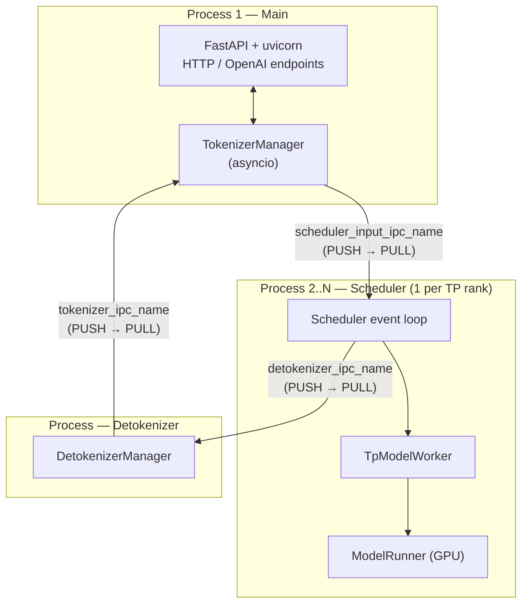
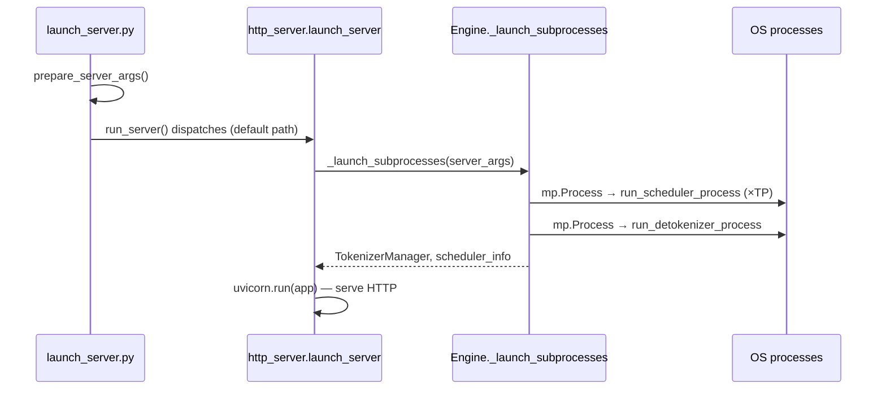

# Chapter 1 — Architecture Overview

> **You are here:** the 10,000-foot view. By the end of this chapter you'll know what
> processes exist, how they talk, how the server boots, and the three big ideas that
> justify the whole design. Every later chapter zooms into one box on the map.

## 1.1 What SGLang is

SGLang is a high-throughput serving engine for large language models. Its job is to take a
stream of concurrent generation requests and keep the GPU as busy as possible while
returning tokens with low latency. Two ideas dominate the design:

1. **Continuous batching** — never wait for a batch to "fill up." Requests join and leave the
   running batch every single decode step, so the GPU is always working on the maximum feasible
   set of sequences.
2. **Prefix sharing via RadixAttention** — KV-cache blocks are indexed by token prefix in a
   radix tree, so requests that share a prefix (a system prompt, a few-shot preamble, a
   multi-turn chat history) reuse each other's computed KV instead of recomputing it.

Everything else — the process split, the scheduler, the memory pools, the attention backends —
exists to serve those two goals efficiently.

## 1.2 The three-process design

SGLang runs an inference server as **three cooperating roles**, in separate OS processes,
communicating only over [ZeroMQ](https://zeromq.org/) sockets. The canonical description lives
in the docstring of `launch_server` at `python/sglang/srt/entrypoints/http_server.py:2597`.

### Why separate processes?

Python's GIL means CPU-bound work (tokenization, detokenization, HTTP/JSON handling) would
otherwise contend with the scheduler's tight control loop. By isolating each role in its own
process:

- The **TokenizerManager** can do async HTTP + tokenization without stealing cycles from the GPU loop.
- The **Scheduler** runs a lean, predictable loop with no HTTP or string-processing jitter.
- The **DetokenizerManager** does the surprisingly fiddly, stateful work of streaming
  UTF-8-safe text (handling multi-byte characters split across tokens) off the critical path.

The processes never share Python objects; they exchange **messages** (see §1.4).

## 1.3 The launch sequence

Booting a server walks through three layers. Follow the call chain:

- **`python/sglang/srt/launch_server.py:15`** — `run_server(server_args)` is the top-level
  dispatcher. It branches on mode flags (encoder-only, gRPC, Ray) and, on the default path
  (line 50), imports and calls `http_server.launch_server`.
- **`python/sglang/srt/entrypoints/http_server.py:2597`** — `launch_server(...)` calls
  `Engine._launch_subprocesses(...)` and then `_setup_and_run_http_server(...)`, which
  eventually calls `uvicorn.run(...)`.
- **`python/sglang/srt/entrypoints/engine.py:765`** — `Engine._launch_subprocesses(...)`
  (a classmethod) is the shared multi-process bootstrapper used by both the HTTP server and
  the in-process `Engine` API. It spawns the scheduler processes
  (`_launch_scheduler_processes`, via `mp.Process` targeting `run_scheduler_process` or, under
  data parallelism, `run_data_parallel_controller_process`) and the detokenizer subprocess
  (`_launch_detokenizer_subprocesses`, line 708).

### Two front doors, one core

The same subprocess core (`_launch_subprocesses`) serves two entry points:

- **HTTP server** — `python/sglang/srt/entrypoints/http_server.py`. A FastAPI app
  (`app = FastAPI(...)`, line 419) exposing native (`/generate`) and OpenAI-compatible
  (`/v1/chat/completions`, …) endpoints.
- **In-process `Engine`** — `python/sglang/srt/entrypoints/engine.py:183`, `class Engine`. Used
  for embedding SGLang directly into Python (no HTTP). `Engine.generate(...)` (line 318) builds
  the same request object and drives the same path.

Both implement the abstract API in `python/sglang/srt/entrypoints/EngineBase.py:7`
(`class EngineBase`): `generate`, `flush_cache`, `update_weights_from_tensor`, memory
release/resume, LoRA load/unload, `shutdown`.

## 1.4 How the processes talk — ZMQ topology & PortArgs

All inter-process channels are ZeroMQ sockets whose addresses are assigned by
**`class PortArgs`** (`python/sglang/srt/server_args.py:8011`), created via
`PortArgs.init_new` (line 8043). Locally these are `ipc://` sockets over temp files; for
multi-node they become TCP. The channels (matching the comments in `PortArgs`):

| Channel | Direction | Purpose |
|---------|-----------|---------|
| `scheduler_input_ipc_name` | TokenizerManager → Scheduler | Tokenized requests & control messages |
| `detokenizer_ipc_name` | Scheduler → Detokenizer | Generated token IDs (`BatchTokenIDOutput`) |
| `tokenizer_ipc_name` | Detokenizer → TokenizerManager | Detokenized text (`BatchStrOutput`) |
| `rpc_ipc_name` | control | Scheduler RPCs |
| `metrics_ipc_name` | control | Metrics |

The message envelope is a mix of [`msgspec`](https://jcristharif.com/msgspec/) structs (new
IPC types, e.g. `class BaseReq`/`BaseBatchReq` in `io_struct.py`) and dataclasses (older types).
Heavy payloads (multimodal tensors, embeddings) are shipped alongside via
`PickleWrapper`/`wrap_pickle_fields`/`wrap_shm_features`. Chapter 2 lists the concrete message
types that flow on each channel.

## 1.5 The three big ideas (previews)

These recur throughout the book; here's the one-paragraph version of each and where to read more.

### Continuous batching
The scheduler doesn't run "a batch to completion." Every step it re-decides the batch: newly
arrived requests are folded in (`merge_batch`), finished ones are dropped (`filter_batch`), and
under memory pressure in-flight requests can be preempted back to the queue (`retract_decode`).
→ [Chapter 4](04-scheduler.md).

### RadixAttention / prefix caching
KV-cache blocks are indexed in a radix tree keyed by token prefix (`class RadixCache`,
`python/sglang/srt/mem_cache/radix_cache.py`). When a new request arrives, `match_prefix` finds
the longest cached prefix and the request reuses that KV — no recomputation. This is
SGLang's signature optimization. → [Chapter 6](06-attention-kv-cache.md).

### Overlap scheduling
The scheduler has two loops: `event_loop_normal` and `event_loop_overlap`
(`python/sglang/srt/managers/scheduler.py:1503` and `:1537`). The overlap loop hides CPU
scheduling latency behind GPU compute: while step *N* runs on the GPU, the CPU is already
building step *N+1* and post-processing step *N−1*. → [Chapter 4](04-scheduler.md) and
[Chapter 5](05-model-runner-forward.md).

## 1.6 Map of the codebase

The core lives under `python/sglang/srt/` ("SGLang RunTime"):

| Directory | Role | Chapter |
|-----------|------|---------|
| `entrypoints/` | HTTP server, Engine, OpenAI API | 2, 3 |
| `managers/` | TokenizerManager, Scheduler, DetokenizerManager, batching | 3, 4 |
| `model_executor/` | ModelRunner, ForwardBatch, CUDA graphs | 5 |
| `mem_cache/` | KV pools, allocators, RadixCache | 6 |
| `layers/attention/` | Attention backends (FlashInfer, Triton, MLA) | 6 |
| `models/` | ~210 model definitions | 7 |
| `model_loader/` | Weight loading & architecture registry | 7 |
| `layers/`, `sampling/` | Linear/MoE layers, sampler, sampling params | 8, 10 |
| `speculative/` | EAGLE and other speculative decoders | 9 |
| `distributed/` | Process groups, communicators | 10 |
| `layers/quantization/`, `lora/`, `disaggregation/`, `constrained/` | Advanced features | 11 |
| `server_args.py` | The single configuration surface | 11 |

---

**Next:** [Chapter 2 — Request Lifecycle](02-request-lifecycle.md), where we follow one request
all the way around the loop.
