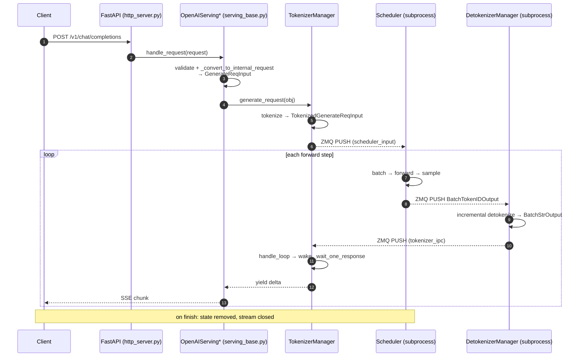
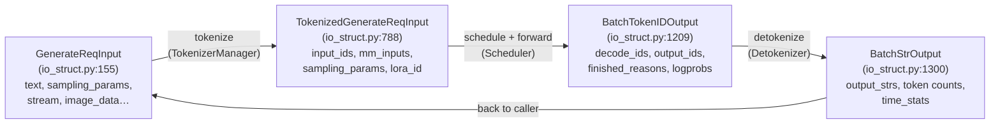
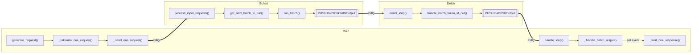

# Chapter 2 — Request Lifecycle

> **You are here:** the spine of the book. We follow a single `/v1/chat/completions` request
> from the moment it hits the socket to the moment the last token streams back. Every stage
> names the file and function that owns it, and later chapters expand each stage in depth.

## 2.1 The eight stages at a glance



The eight stages:

1. **HTTP arrival** — FastAPI routes the request.
2. **OpenAI adaptation** — validate and convert to an internal `GenerateReqInput`.
3. **TokenizerManager entry** — register request state, tokenize.
4. **Dispatch** — PUSH a `TokenizedGenerateReqInput` to the scheduler over ZMQ.
5. **Schedule & forward** — the scheduler batches, runs the model, samples tokens.
6. **Detokenize** — token IDs → incremental UTF-8 text.
7. **Return** — detokenized output PUSHed back to the TokenizerManager.
8. **Stream out** — the waiting coroutine wakes and yields SSE chunks to the client.

## 2.2 The data structures that flow

The request changes shape as it moves. All four core types live in
`python/sglang/srt/managers/io_struct.py`:



- **`GenerateReqInput`** (`:155`, a `@dataclass`) — the untokenized user request. Carries `text`
  or `input_ids`, `sampling_params`, `return_logprob`, `stream` (line 212), multimodal data,
  LoRA/session/priority fields. Its `normalize_batch_and_arguments()` reconciles single vs
  batch and fills defaults.
- **`TokenizedGenerateReqInput`** (`:788`, a `msgspec` `BaseReq`) — post-tokenization,
  scheduler-bound. Carries `input_ids: array`, pickled `mm_inputs`, the resolved
  `sampling_params: SamplingParams`, `logprob_start_len`, `stream`, `lora_id`.
- **`BatchTokenIDOutput`** (`:1209`) — Scheduler → Detokenizer. Generated token IDs plus
  finish reasons, token counts (`prompt_tokens`/`completion_tokens`/`cached_tokens`),
  logprobs, hidden states, and spec-decode stats.
- **`BatchStrOutput`** (`:1300`) — Detokenizer → TokenizerManager. The decoded `output_strs`
  and metadata that the HTTP layer formats into the response.

> **Embeddings** skip stages 6–8's detokenization: they use `EmbeddingReqInput` →
> `TokenizedEmbeddingReqInput` → `BatchEmbeddingOutput` (`io_struct.py:1382`), which the
> detokenizer passes straight through.

## 2.3 Stage by stage

### Stage 1–2: HTTP arrival and OpenAI adaptation

FastAPI routes `POST /v1/chat/completions` to `openai_v1_chat_completions`
(`http_server.py:1650`), which delegates to a per-endpoint serving object stored on
`app.state`:

```python
# http_server.py (endpoint body, ~line 1654)
return await raw_request.app.state.openai_serving_chat.handle_request(request, raw_request)
```

`OpenAIServingBase.handle_request` (`python/sglang/srt/entrypoints/openai/serving_base.py:73`)
is the shared pipeline: `_validate_request` → `_convert_to_internal_request` (abstract at
`:165`, implemented per endpoint in `serving_chat.py` etc.) → branch to streaming vs
non-streaming. The output of conversion is a `GenerateReqInput`.

> The **native** `/generate` endpoint (`http_server.py:823`) skips OpenAI adaptation entirely
> and constructs a `GenerateReqInput` directly — useful when you want SGLang's raw interface.

### Stage 3–4: TokenizerManager — tokenize and dispatch

`TokenizerManager` (`python/sglang/srt/managers/tokenizer_manager.py:265`) runs in the main
process. Its entry point is `generate_request` (`:624`):

1. Normalizes the request and creates a **`ReqState`** (`:172`) in `self.rid_to_state`
   (`:447`) — a per-request record holding the output buffer, an `asyncio.Event`, and timing.
2. Tokenizes via `_tokenize_one_request` (`:828`), producing a `TokenizedGenerateReqInput`.
3. Sends it with `_send_one_request` (`:1367`) → `_dispatch_to_scheduler` (`:435`), which
   PUSHes over the `send_to_scheduler` ZMQ socket (`:418`).

The coroutine then awaits `_wait_one_response` (`:1482`), which blocks on the request's
`asyncio.Event` until results arrive (stage 8).

### Stage 5: Scheduler — batch, forward, sample

The scheduler subprocess PULLs the request in its event loop
(`event_loop_normal`/`event_loop_overlap`), routes it through `process_input_requests`
(`scheduler.py:1646`) to `handle_generate_request`, and adds it to the waiting queue. Each
step, `get_next_batch_to_run` (`:2670`) forms a batch, `run_batch` (`:3272`) runs the model
forward + sampling, and the produced token IDs are PUSHed to the detokenizer. This is the
heart of the system — [Chapter 4](04-scheduler.md) and [Chapter 5](05-model-runner-forward.md)
cover it in full.

For a **streaming** request the scheduler emits a `BatchTokenIDOutput` after (nearly) every
decode step; for non-streaming it emits once at the end.

### Stage 6: DetokenizerManager — incremental decode

`DetokenizerManager` (`python/sglang/srt/managers/detokenizer_manager.py:91`) PULLs
`BatchTokenIDOutput` in its `event_loop` (`:161`) and calls `handle_batch_token_id_out`
(`:406`). The tricky part is **incremental, stateful** decoding: a `DecodeStatus` (`:64`)
per request tracks read offsets and buffered bytes so that a multi-byte UTF-8 character split
across two tokens isn't emitted as a broken glyph. The result is a `BatchStrOutput`, PUSHed
back to the TokenizerManager on the `send_to_tokenizer` socket (`:120`).

> With `--skip-tokenizer-init`, the scheduler bypasses the detokenizer and PUSHes
> `BatchTokenIDOutput` straight back to the TokenizerManager, whose `handle_loop` accepts it
> directly.

### Stage 7–8: Back to TokenizerManager and out to the client

`TokenizerManager.handle_loop` (`:1884`) is an asyncio task that PULLs from
`recv_from_detokenizer` (`:414`). For a `BatchStrOutput` it calls `_handle_batch_output`
(`:1899`), which:

1. Looks up `ReqState` by `rid`.
2. Appends the new text/metadata to `state.out_list` and updates `meta_info`.
3. Sets `state.event`, waking the `_wait_one_response` coroutine.

`_wait_one_response` then `yield`s each delta back through `generate_request` to the OpenAI
serving handler, which formats an SSE chunk (streaming) or the final JSON (non-streaming). On
finish (`finished_reasons[i]` set), the `rid_to_state` entry is deleted and the stream closes.

## 2.4 The full loop, annotated



Notice the asymmetry: **one** dispatch from the client's side, but **many** trips around the
Scheduler → Detokenizer → TokenizerManager loop — one per streamed chunk. Continuous batching
means the scheduler is interleaving this request's decode steps with dozens of others on every
pass.

---

**Next:** [Chapter 3 — Frontend & TokenizerManager](03-tokenizer-manager.md), where we open up
stages 1–4 and 7–8 in detail.
