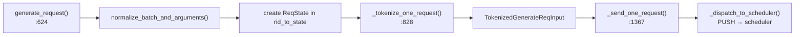

# Chapter 3 — Frontend & TokenizerManager

> **You are here:** the main process. This chapter covers everything that happens *outside* the
> scheduler: the HTTP surface, the OpenAI-compatibility layer, the `TokenizerManager` state
> machine, and the `DetokenizerManager` that turns tokens back into text.

## 3.1 The HTTP surface

`python/sglang/srt/entrypoints/http_server.py` is the FastAPI app (`app = FastAPI(...)`,
line 419). It exposes two families of endpoints:

- **Native**: `/generate` → `generate_request` (`:823`), plus `/health`, `/flush_cache`,
  weight-update and profiling endpoints.
- **OpenAI-compatible**: `/v1/completions` (`:1642`), `/v1/chat/completions` (`:1650`),
  `/v1/embeddings` (`:1664`), and classify/tokenize/score/rerank/responses/transcription.

Shared state lives in **`class _GlobalState`** (`:195`), fetched via `get_global_state()`. It
holds the `tokenizer_manager`, a `template_manager`, and `scheduler_info`. During FastAPI's
`lifespan` startup, per-endpoint serving objects are constructed and attached to `app.state`:

```python
# http_server.py lifespan (~line 301)
app.state.openai_serving_chat = tokenizer_manager.serving_chat_class(...)
```

Each OpenAI endpoint is a thin shim that forwards to its serving object:

```python
# http_server.py:1650
@app.post("/v1/chat/completions")
async def openai_v1_chat_completions(request: ChatCompletionRequest, raw_request: Request):
    return await raw_request.app.state.openai_serving_chat.handle_request(request, raw_request)
```

## 3.2 The OpenAI compatibility layer

Under `python/sglang/srt/entrypoints/openai/`:

- **`serving_base.py:26`** — `class OpenAIServingBase(ABC)`. The `handle_request` method
  (`:73`) is the common funnel:

  ```mermaid
  flowchart TB
      HR["handle_request()"] --> V["_validate_request()"]
      V --> CV["_convert_to_internal_request()<br/>(abstract → GenerateReqInput)"]
      CV --> B{stream?}
      B -->|yes| SR["_handle_streaming_request()"]
      B -->|no| NS["_handle_non_streaming_request()"]
      SR --> TM["tokenizer_manager.generate_request()"]
      NS --> TM
  ```

- **Concrete handlers**: `serving_chat.py` (`OpenAIServingChat`), `serving_completions.py`,
  `serving_embedding.py`, `serving_responses.py`, `serving_rerank.py`, etc. Each implements
  `_convert_to_internal_request` — mapping OpenAI request fields (messages, tools, `temperature`,
  `max_tokens`, …) onto a `GenerateReqInput` + `SamplingParams`, applying the chat template.
- **`protocol.py`** — the Pydantic request/response models (`ChatCompletionRequest`,
  `CompletionRequest`, `ErrorResponse`, streaming chunk shapes).

The value of this layer: SGLang is a drop-in replacement for the OpenAI API, so existing
clients work unchanged, while the internal `GenerateReqInput` stays clean and engine-focused.

## 3.3 TokenizerManager — the main-process brain

`python/sglang/srt/managers/tokenizer_manager.py:265`, `class TokenizerManager`. It owns the
Hugging Face tokenizer, the model config, the multimodal processor, per-request state, and
metrics. It is **asyncio-based** and runs in the main process alongside uvicorn.

### ZMQ wiring

Sockets are created on a `zmq.asyncio.Context` (`:413`):

| Attribute | Type | Bound to | Purpose |
|-----------|------|----------|---------|
| `recv_from_detokenizer` (`:414`) | `PULL` | `tokenizer_ipc_name` | receive detokenized results |
| `send_to_scheduler` (`:418`) | `PUSH` | `scheduler_input_ipc_name` | dispatch work |

`_dispatch_to_scheduler(obj)` (`:435`) stamps and sends; `_async_dispatch_to_scheduler` (`:440`)
is the async variant.

### Per-request state

**`class ReqState`** (`:172`, a dataclass) is the record for one in-flight request:

- `out_list` — accumulated output chunks awaiting delivery
- `finished` + an `asyncio.Event` — the wake mechanism
- `text` / `output_ids` — accumulated generation
- `time_stats` — latency instrumentation

They live in `self.rid_to_state: Dict[str, ReqState]` (`:447`), keyed by request id.

### The request path (outbound)



`generate_request` (`:624`) acquires `model_update_lock.reader_lock` (so weight updates don't
race with in-flight requests), then for a single request runs tokenize → send → iterate
`_wait_one_response` (`:667`); a batch goes through `_handle_batch_request` (`:670`).

`_tokenize_one_request` (`:828`) applies the tokenizer, resolves `SamplingParams`, handles
multimodal inputs, and sets `time_stats`.

`_send_one_request` (`:1367`) pickle-wraps heavy fields (`wrap_pickle_fields`,
`wrap_shm_features`) and dispatches.

### The result path (inbound)

`auto_create_handle_loop()` (`:1859`) launches `handle_loop()` (`:1884`) as an asyncio task:

```python
# tokenizer_manager.py:1884 (sketch)
async def handle_loop(self):
    while True:
        recv_obj = await async_sock_recv(self.recv_from_detokenizer)   # :1888
        if isinstance(recv_obj, (BatchStrOutput, BatchEmbeddingOutput, BatchTokenIDOutput)):
            self._handle_batch_output(recv_obj)                        # :1899
        else:
            self._result_dispatcher(recv_obj)   # control msgs (aborts, weight updates)
```

`_handle_batch_output` (`:1899`) fans results out to the right `ReqState`: it looks up each
`rid`, builds `meta_info`, appends to `state.out_list`, and **sets `state.event`** — which
wakes the corresponding `_wait_one_response` coroutine (`:1482`). That coroutine coalesces
queued streaming chunks (`_coalesce_streaming_chunks`, `:1401`), handles client-disconnect
aborts, and `yield`s deltas back up to the HTTP handler. On finish it deletes the `rid_to_state`
entry.

> **Why the Event/coroutine dance?** It decouples the single ZMQ receive loop (one per process)
> from the thousands of concurrent request coroutines. The loop never blocks on any one client;
> it just wakes whoever has new data.

## 3.4 DetokenizerManager — streaming text safely

`python/sglang/srt/managers/detokenizer_manager.py:91`, `class DetokenizerManager`. Runs in its
own process. `init_ipc_channels` (`:111`) sets up `recv_from_scheduler` (`PULL` on
`detokenizer_ipc_name`, `:113`) and `send_to_tokenizer` (`PUSH` on `tokenizer_ipc_name`, `:120`).

Its `event_loop` (`:161`) is a simple receive → dispatch → send loop. The interesting method is
`handle_batch_token_id_out` (`:406`), which converts a `BatchTokenIDOutput` into a
`BatchStrOutput`.

### The incremental-decode problem

You cannot just `tokenizer.decode(all_ids)` every step — that's O(n²) over the sequence and
would re-emit the whole string each time. And you cannot decode token-by-token, because one
Unicode character (an emoji, a CJK glyph) may span multiple tokens. SGLang keeps per-request
state in **`class DecodeStatus`** (`:64`): the decoded prefix, a `read_offset`, and a
`surr_offset` (surrogate offset). `_decode_batch_token_id_output` (`:271`) decodes a small
sliding window of recent tokens, detects incomplete UTF-8 at the tail (`:349`–`:369`), and only
emits the bytes it can prove are complete — buffering the rest for the next step.

> **Why it matters:** this is what makes SGLang's token streaming produce clean text instead of
> `�` replacement characters mid-word, at O(1) amortized cost per token.

`run_detokenizer_process` (`:488`) is the subprocess entry point.

---

**Next:** [Chapter 4 — The Scheduler](04-scheduler.md), the batching brain that stage 5 glossed over.
