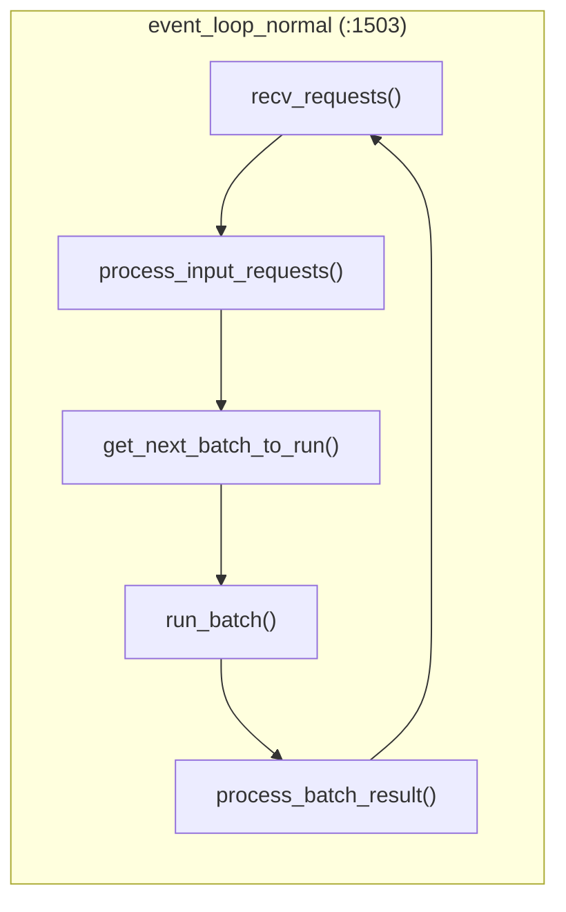
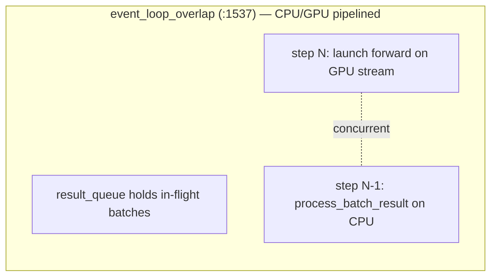
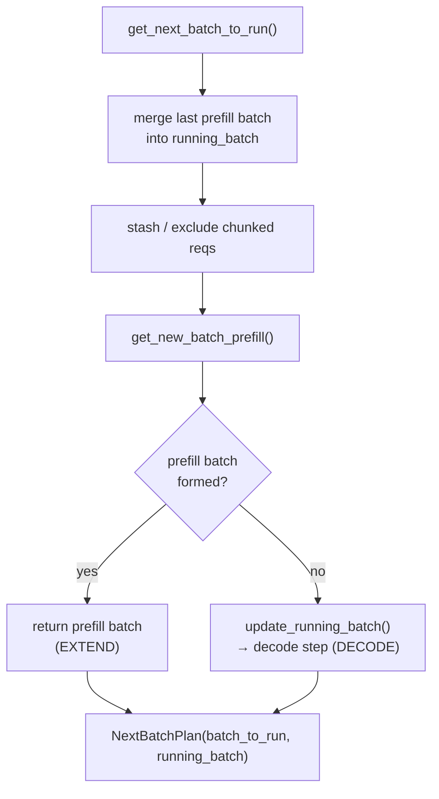
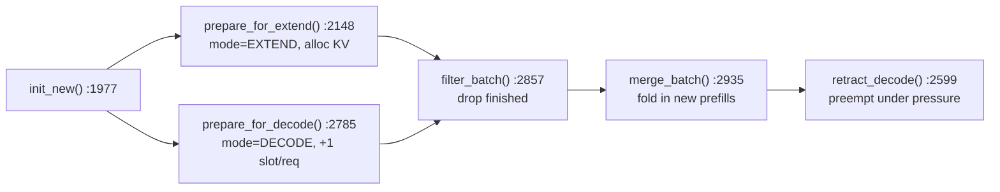

# Chapter 4 — The Scheduler

> **You are here:** the batching brain. The scheduler decides, every single step, *which*
> requests run and in *what mode* (prefill or decode). This is where continuous batching,
> chunked prefill, prefix-cache-aware ordering, and memory-pressure preemption all happen.

## 4.1 The role

`python/sglang/srt/managers/scheduler.py:303`, `class Scheduler`. One instance runs per
tensor-parallel rank, in its own process. It:

1. receives tokenized requests over ZMQ and queues them,
2. each step forms the best possible batch,
3. hands the batch to the model worker for a forward pass,
4. post-processes results (finish detection, KV-cache writeback, streaming out).

Three concepts you need up front:

- **Prefill (a.k.a. EXTEND)** — process the prompt tokens of new requests, filling their KV cache.
- **Decode** — generate one new token for each running request (the steady state).
- **Continuous batching** — the running set is re-formed every step; nothing waits for a fixed
  batch to drain.

## 4.2 The two event loops

`run_event_loop` picks one of two loops based on config:





- **`event_loop_normal`** (`:1503`) — the straightforward synchronous loop:
  `recv_requests → process_input_requests → get_next_batch_to_run → run_batch →
  process_batch_result`.
- **`event_loop_overlap`** (`:1537`) — hides CPU scheduling cost behind GPU compute. It keeps a
  `result_queue` deque; while the current batch runs on the GPU forward stream, the *previous*
  batch's results are processed on the CPU. `is_disable_overlap_for_batch` (`:1610`) turns
  overlap off for cases where it doesn't pay (back-to-back prefills, spec+grammar decode).

> **Why it matters:** launching a CUDA kernel and building the next `ForwardBatch` are both
> CPU work. Without overlap, the GPU idles during that CPU work every step. Overlap scheduling
> is one of the biggest throughput levers in the engine. See also
> [Chapter 5](05-model-runner-forward.md) for the forward/copy stream machinery.

## 4.3 Request intake

Requests arrive over ZMQ and are dispatched by type in `process_input_requests`
(`:1646`) — a `TypeBasedDispatcher` maps `TokenizedGenerateReqInput → handle_generate_request`
and the batch variant to `handle_batch_generate_request`. `handle_generate_request` (`:2055`)
builds a `Req`, then `_add_request_to_queue` (`:2374`) places it on the **waiting queue**.

## 4.4 The core decision: `get_next_batch_to_run`

`get_next_batch_to_run` (`:2670`) is the single most important method in the scheduler. Its
logic, in order:



**Prefill is prioritized over decode.** If a new prefill batch can be formed within the token
budget, it runs this step; otherwise the scheduler advances the running decode batch. The return
value is a `NextBatchPlan` (`schedule_batch.py:3105`, a `msgspec.Struct` bundling
`batch_to_run` + the surviving `running_batch`).

### Building a prefill batch: `get_new_batch_prefill`

`get_new_batch_prefill` (`:2811`, raw impl `_get_new_batch_prefill_raw` at `:2832`) uses a
**`PrefillAdder`** to greedily pack waiting requests into a batch under a token budget. This is
where two big optimizations live:

- **Prefix-cache matching** — each request's already-cached prefix is looked up (via the radix
  cache, [Chapter 6](06-attention-kv-cache.md)) and excluded from the tokens to compute.
- **Chunked prefill** — a prompt longer than the remaining chunk budget is split so only part
  of it is prefilled this step, keeping any single step's latency bounded.

### Advancing decode: `update_running_batch`

`update_running_batch` (`:3122`) is the decode path. It first checks
`batch.check_decode_mem()`; if the KV cache can't fit another token for every running request,
it calls `batch.retract_decode()` to **preempt** some in-flight requests back to the waiting
queue (and adjusts `new_token_ratio`, the estimate used to reserve decode headroom). Then
`batch.prepare_for_decode()` allocates one KV slot per surviving request.

## 4.5 The batch object: `ScheduleBatch` and `Req`

`python/sglang/srt/managers/schedule_batch.py`.

### `class Req` (`:714`)

One request as the scheduler sees it. Key fields and methods:

| Field / method | Meaning |
|----------------|---------|
| `origin_input_ids`, `output_ids`, `fill_ids` | prompt, generated tokens, and the tokens to feed next |
| `prefix_indices` | KV slots for the prefix already found in the cache |
| `req_pool_idx` | this request's row in `ReqToTokenPool` (Ch 6) |
| `sampling_params` | per-request sampling knobs |
| `init_next_round_input()` (`:1180`) | compute next tokens to feed; match the prefix cache |
| `update_finish_state()` (`:1476`) | detect stop conditions (`FINISH_MATCHED_TOKEN`, `FINISH_LENGTH`, `FINISH_ABORT`, …, defined `:152`–`:217`) |
| `reset_for_retract()` (`:1512`) | roll the request back when it is preempted |

### `class ScheduleBatch` (`:1803`)

A batch of `Req`s plus the tensors for one forward pass. The lifecycle methods:



- `prepare_for_extend` (`:2148`) sets `forward_mode = EXTEND`, gathers the input IDs beyond the
  cached prefix, and allocates KV slots (`alloc_for_extend`).
- `prepare_for_decode` (`:2785`) sets `forward_mode = DECODE`, allocates one slot per request,
  and increments `seq_lens`.
- **Continuous batching** is realized by `filter_batch` (`:2857`, drop finished reqs),
  `merge_batch` (`:2935`, fold new prefills into the running decode batch), `retract_decode`
  (`:2599`, preempt under memory pressure), and `check_decode_mem` (`:2594`).

> **A style rule worth knowing:** `ScheduleBatch` fields are mutated **out-of-place** (rebind,
> never in-place edit) because the overlap scheduler snapshots them via `copy()` (`:2995`). See
> the repo's `large-class-style` skill; if you edit this class, read it first.

## 4.6 Scheduling policy: ordering the waiting queue

`python/sglang/srt/managers/schedule_policy.py`.

`class SchedulePolicy` (`:163`) orders the waiting queue before the `PrefillAdder` packs it.
Two policy families:

- **`CacheAwarePolicy`** (`:147`) — `LPM` (longest-prefix-match, group requests that share a
  cached prefix so the cache is exploited) and `DFS_WEIGHT`.
- **`CacheAgnosticPolicy`** (`:154`) — `FCFS`, `LOF` (longest-output-first), `RANDOM`,
  `ROUTING_KEY`.

`calc_priority` (`:184`) picks and applies the sort. To bound overhead, it falls back to FCFS
when the queue exceeds 128 entries (`_determine_active_policy`, `:237`) or when the tree cache is
disabled.

### `class PrefillAdder` (`:441`)

Greedily fills a prefill batch under a token budget (`rem_total_tokens`, `rem_chunk_tokens`,
`rem_input_tokens`). The core method is `add_one_req` (`:976`): it computes the candidate extend
length (prompt minus cached prefix), checks the budgets, locks the matched radix node, and
returns an `AddReqResult` (`:435`: `CONTINUE`/`NO_TOKEN`/`OTHER`). **Chunked prefill** is
`add_chunked_req` (`:805`) — split a too-long prompt so only `rem_chunk_tokens` are prefilled
this step. `preempt_to_schedule` (`:1151`) supports priority-based preemption.

## 4.7 Running the batch: `run_batch`

`run_batch` (`:3272`) turns a `ScheduleBatch` into a forward call:

```python
# scheduler.py:3272 (essence)
model_worker_batch = batch.get_model_worker_batch()
result = self.model_worker.forward_batch_generation(model_worker_batch)
```

It also drives the overlap-stream machinery (`forward_stream`, `copy_stream`, and a
`future_map` that resolves the *next* step's input IDs before this step's sampling has even
finished on the CPU), plus the speculative-decoding and PD-disaggregation hooks. The forward
itself is [Chapter 5](05-model-runner-forward.md).

Afterward, `process_batch_result` updates each `Req` (`update_finish_state`), writes KV back to
the cache (`cache_unfinished_req`/`cache_finished_req`), streams tokens toward the detokenizer,
and drops finished requests via `filter_batch` — closing the continuous-batching loop.

---

**Next:** [Chapter 5 — ModelRunner & the Forward Pass](05-model-runner-forward.md).
