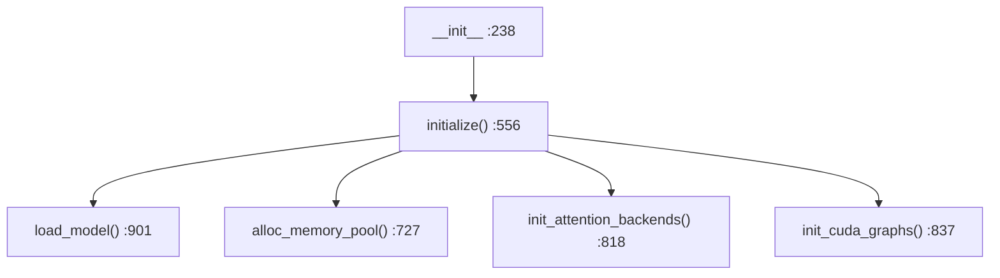
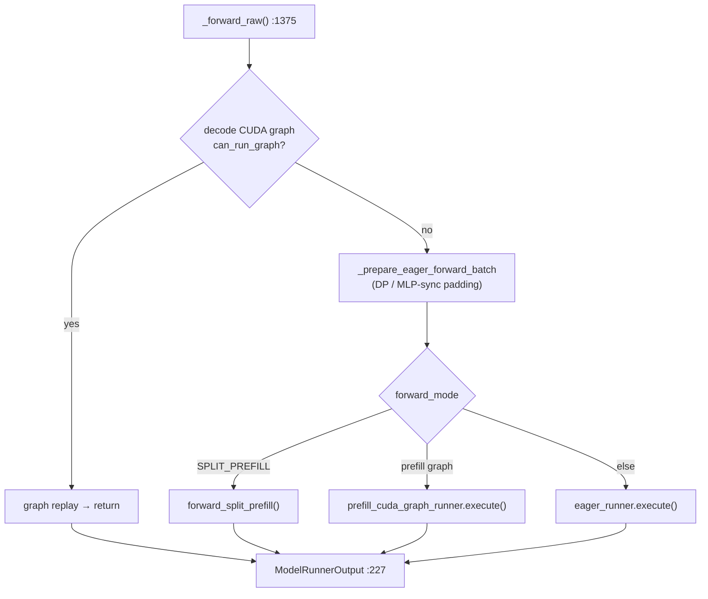
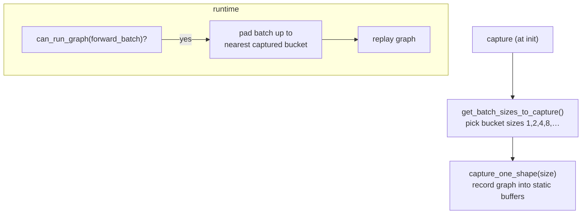

# Chapter 5 — ModelRunner & the Forward Pass

> **You are here:** the boundary between "scheduling" and "GPU compute." This chapter shows how
> a `ScheduleBatch` becomes an actual forward call, what `ForwardBatch`/`ForwardMode` describe,
> and how CUDA graphs make decode steps cheap.

## 5.1 From scheduler to runner

The scheduler's `run_batch` calls the model worker, which owns a `ModelRunner`:

`TpModelWorker` (`python/sglang/srt/managers/tp_worker.py`) is a thin adapter: it builds a
`ForwardBatch` from the scheduler's batch and calls into `ModelRunner`. Under tensor parallelism
there is one worker/runner per rank; the `is_draft_worker` flag distinguishes the speculative
draft path ([Chapter 9](09-speculative-decoding.md)).

## 5.2 ModelRunner

`python/sglang/srt/model_executor/model_runner.py:235`, `class ModelRunner`. It owns, for one
device: the model weights, the KV pools, the attention backend, and the captured CUDA graphs.

> This is a **frozen core file** in the repo's conventions — see the `large-class-style` and
> `sglang-runtime-context` skills before editing it. Its `__init__` is deliberately a thin
> orchestration of well-named setup steps.

Initialization walks a fixed sequence:

- `load_model` (`:901`) → the model loader ([Chapter 7](07-models-and-loading.md)).
- `alloc_memory_pool` (`:727`) → the KV pools ([Chapter 6](06-attention-kv-cache.md)).
- `init_attention_backends` (`:818`) → the attention backend ([Chapter 6](06-attention-kv-cache.md)).
- `init_cuda_graphs` (`:837`) → capture decode (and optionally prefill) graphs (§5.5).

## 5.3 The forward dispatch

The public entry is `forward` (`:1231`), which wraps profiling/expert-distribution context and
delegates to the real dispatcher **`_forward_raw` (`:1375`)**:

1. If a captured **decode CUDA graph** matches the batch, replay it and return early — the
   common, hot path.
2. Otherwise pad for DP/MLP-sync, then dispatch by `forward_mode`: split prefill, a piecewise
   prefill graph, or plain eager execution (decode/extend/idle).
3. Wrap the result in `ModelRunnerOutput` (`:227`, holding `logits_output` + `can_run_graph`).

`_forward_raw` establishes a `forward_context(attn_backend=...)` so that attention layers deep
inside the model can retrieve the active backend's metadata without it being threaded through
every function signature.

Sampling is a separate call: `sample` (`:1491`) runs the sampler
([Chapter 8](08-sampling.md)); `compute_logprobs_only` (`:1527`) handles logprob-only requests.

## 5.4 ForwardBatch and ForwardMode

`python/sglang/srt/model_executor/forward_batch_info.py`.

### `class ForwardMode(IntEnum)` (`:98`)

The mode drives every downstream dispatch (attention, CUDA graph eligibility, sampling):

| Mode | Meaning |
|------|---------|
| `EXTEND` | prefill — process prompt tokens |
| `DECODE` | steady-state — one new token per sequence |
| `MIXED` | chunked prefill + decode in the same batch |
| `IDLE` | padding batch for DP synchronization |
| `TARGET_VERIFY` / `DRAFT_EXTEND_V2` | speculative decoding phases (Ch 9) |
| `PREBUILT` | PD-disaggregation decode side (Ch 11) |
| `SPLIT_PREFILL`, `DLLM_EXTEND` | specialized prefill paths |

Predicates like `is_decode`/`is_extend`/`is_cuda_graph` (`:175`) are used everywhere instead of
raw comparisons.

### `class ForwardBatch` (`:353`)

The immutable, per-forward bundle handed to the model. Core fields:

- `forward_mode`, `batch_size`, `input_ids`, `positions`
- `req_pool_indices`, `seq_lens`, `out_cache_loc` (the target KV slots to write this step)
- extend-specific: `extend_seq_lens`, `extend_prefix_lens`, `extend_start_loc`
- `sampling_info` (Ch 8), `spec_info` (Ch 9), and attention-backend metadata

**`init_new` (`:643`)** builds a `ForwardBatch` from a `ScheduleBatch`: it computes `positions`,
the extend metadata, and calls the attention backend's metadata init (`init_forward_metadata`,
Ch 6). By convention `init_new` treats the incoming `ScheduleBatch` as **read-only** — the two
objects belong to different layers and the overlap scheduler depends on that separation.

## 5.5 CUDA graphs

Decode steps are tiny (one token per sequence) but launch hundreds of kernels; the per-launch
CPU overhead would dominate. CUDA graphs capture that launch sequence once and replay it as a
single operation.

Implementation lives under `python/sglang/srt/model_executor/runner/`:

- `base_cuda_graph_runner.py:106`, `class BaseCudaGraphRunner`
- `decode_cuda_graph_runner.py`, `prefill_cuda_graph_runner.py`
- backend mechanics in `runner_backend/` (`full_cuda_graph_backend.py`,
  `tc_piecewise_cuda_graph_backend.py`, `breakable_cuda_graph_backend.py`)

At capture time the runner records one graph per batch-size bucket into pre-allocated static
input/output buffers. At runtime, `can_run_graph` checks eligibility, the live batch is padded up
to the nearest captured bucket, the static inputs are filled, and the graph is replayed. Prefill
(variable-length) uses piecewise/"breakable" graph backends since a single static shape can't
cover arbitrary prompt lengths.

> **Why it matters:** for decode-heavy workloads, CUDA graph replay can cut per-step CPU
> overhead dramatically, which is exactly the regime continuous batching keeps the server in.

---

**Next:** [Chapter 6 — Attention & the KV Cache](06-attention-kv-cache.md), where `out_cache_loc`
and the attention backend metadata come from.
