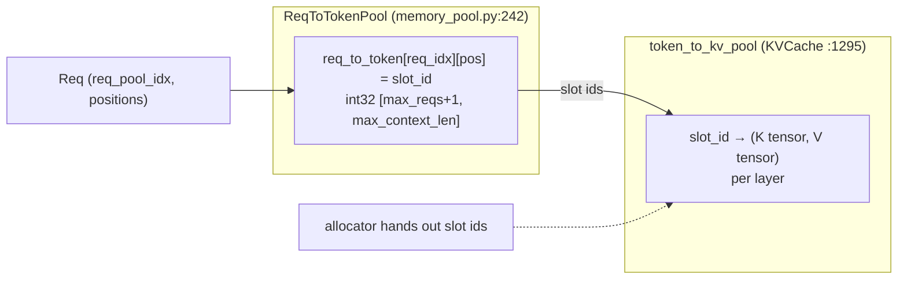
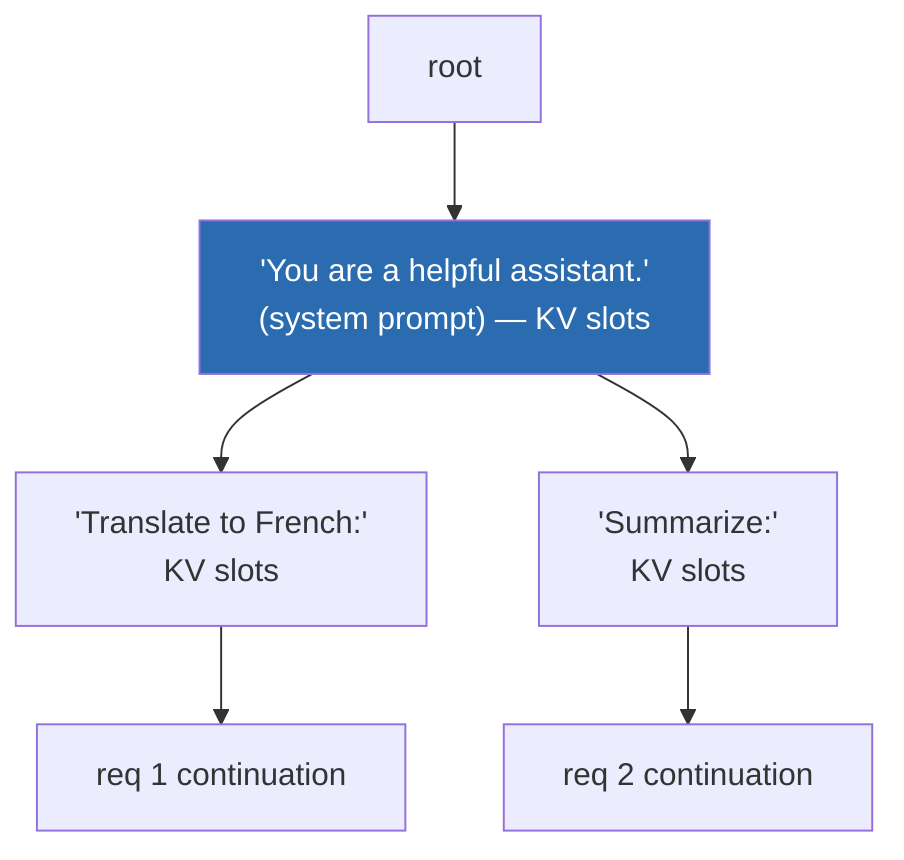
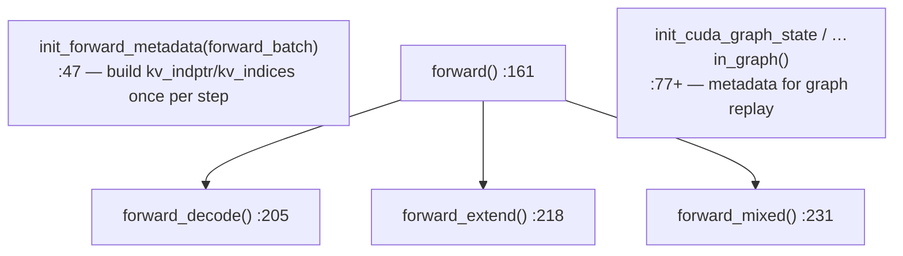

# Chapter 6 — Attention & the KV Cache

> **You are here:** the memory system. This is where SGLang's signature optimization,
> RadixAttention prefix sharing, lives. We cover the two-level KV indirection, the allocators,
> the radix prefix tree, and the pluggable attention backends that actually read/write KV.

## 6.1 The two-level indirection

KV cache is addressed through **two** tables, not one. This indirection is what lets many
requests share physical KV blocks.



- **`class ReqToTokenPool`** (`python/sglang/srt/mem_cache/memory_pool.py:242`) maps a request +
  token position to a **KV slot id**. `req_to_token` is an `int32` tensor of shape
  `[max_reqs+1, max_context_len]`; row `i` gives the slot id for each token position of request
  `i`. `alloc(reqs)` (`:277`) hands out request rows from `free_slots`; `write` (`:271`) fills
  the token→slot mapping. (Row 0 is a padding row for CUDA-graph dummy requests.)
- **`class KVCache`** (`:1295`, abstract) is the physical storage: slot id → the actual K/V
  tensors, per layer. The standard implementation is `MHATokenToKVPool` (`:1416`) with
  `get_key_buffer`/`get_value_buffer`/`set_kv_buffer`. Variants: `HybridReqToTokenPool` (`:880`)
  and `MambaPool` (`:315`) for hybrid/state-space models, plus MLA and sliding-window pools in
  sibling files.

> **Why two levels?** If two requests share a prefix, their `req_to_token` rows point at the
> **same** slot ids for the shared positions — one physical copy of the KV, referenced twice.
> That is prefix sharing, and it's impossible with a single flat table.

## 6.2 Allocators — handing out slots

`python/sglang/srt/mem_cache/allocator/`:

- `base.py:27`, `class BaseTokenToKVPoolAllocator` — the interface.
- `token.py:28`, `class TokenToKVPoolAllocator` — a simple free-list. `alloc(need_size)`,
  `alloc_extend`, `alloc_decode`, `free`.
- `paged.py:105`, `class PagedTokenToKVPoolAllocator` — page-granular allocation (`page_size`
  tokens per page), with `alloc_extend`/`alloc_decode` (`:172`/`:222`). Paged allocation reduces
  fragmentation and is required by paged attention backends.

The scheduler's `prepare_for_extend`/`prepare_for_decode` (Ch 4) call these to fill each
`ForwardBatch.out_cache_loc` — the exact slots the attention backend will write this step.

## 6.3 RadixCache — prefix sharing as a tree

`python/sglang/srt/mem_cache/radix_cache.py:280`, `class RadixCache`. This is the data structure
behind "RadixAttention." KV blocks are indexed by token prefix in a radix (compressed prefix)
tree; shared prefixes are shared nodes.



Two requests that both begin with the system prompt share node `A` — its KV is computed once.

Key methods:

| Method | Line | Purpose |
|--------|------|---------|
| `match_prefix(params)` | `:355` | longest cached prefix for a new request → `MatchResult` (reused KV) |
| `insert(params)` | `:415` | add new tokens to the tree |
| `cache_unfinished_req(req)` | `:490` | write an in-flight request's KV back into the tree |
| `cache_finished_req(req)` | `:437` | finalize a finished request's KV |
| `evict(params)` | `:565` | reclaim slots (LRU / priority) when memory is tight |
| `inc_lock_ref` / `dec_lock_ref` | | pin in-use nodes so eviction can't reclaim them |

The interface the scheduler codes against is `class BasePrefixCache`
(`mem_cache/base_prefix_cache.py:211`), with `MatchResult` (`:155`, a `NamedTuple`). This lets
the scheduler stay agnostic to *which* caching strategy is active.

### Variants and the fallback

- `chunk_cache.py:35`, `class ChunkCache` — the **no-reuse fallback** used when radix caching is
  disabled; it just tracks per-request chunks. `SWAChunkCache`/`PureSWAChunkCache` for
  sliding-window models.
- `hiradix_cache.py` — hierarchical caching that tiers KV between GPU and host/CPU memory.
- `swa_radix_cache.py` / `pure_swa_radix_cache.py` — sliding-window-attention aware trees.
- `radix_cache_cpp.py` (+ `cpp_radix_tree/`) — a C++ tree implementation for lower overhead.

> **Why it matters:** for workloads with heavy prefix reuse (shared system prompts, few-shot
> templates, multi-turn chat, agentic tool loops), RadixCache turns most of the prompt into a
> cache hit. The `LPM` scheduling policy (Ch 4) deliberately groups prefix-sharing requests so
> the cache is exploited before eviction can reclaim the shared node.

## 6.4 Attention backends

The model doesn't call a specific attention kernel directly. It calls a single layer that
dispatches to whatever backend is configured.

### The layer models see: `RadixAttention`

`python/sglang/srt/layers/radix_attention.py:70`, `class RadixAttention(nn.Module)`. Every model
instantiates this as its attention module (e.g. `LlamaAttention.attn`, Ch 7). Its `forward`
(`:122`) reads the active backend from the forward context and delegates:

```python
# radix_attention.py:122 (essence)
def forward(self, q, k, v, forward_batch, save_kv_cache=True, ...):
    return forward_batch.attn_backend.forward(
        q, k, v, self, forward_batch, save_kv_cache
    )   # self carries layer_id, head counts, sliding-window size, kv quant
```

Passing `self` (the layer) tells the backend which layer's KV buffer to read/write via
`layer_id`.

### The backend interface

`python/sglang/srt/layers/attention/base_attn_backend.py:18`, `class AttentionBackend(ABC)`:



- `init_forward_metadata` (`:47`) builds the per-step index tensors (`kv_indptr`, `kv_indices`,
  `qo_indptr`) that tell the kernel where each sequence's KV lives — this is where the
  `req_to_token` indirection is flattened into kernel-ready arrays.
- `forward` (`:161`) dispatches to `forward_decode`/`forward_extend`/`forward_mixed` by mode.
- The `..._cuda_graph...` hooks (`:77`+) provide the metadata variants needed for graph capture
  and replay.

### The registry

Backends register in `python/sglang/srt/layers/attention/attention_registry.py`
(`ATTENTION_BACKENDS` dict `:30`, `register_attention_backend` decorator `:33`):

| Name | Backend | File |
|------|---------|------|
| `flashinfer` | `FlashInferAttnBackend` / `FlashInferMLAAttnBackend` | `flashinfer_backend.py`, `flashinfer_mla_backend.py` |
| `triton` | `TritonAttnBackend` | `triton_backend.py` |
| `trtllm_mla`, `flashmla`, `cutlass_mla`, `dsa`/`nsa` | MLA / DeepSeek-style | various |
| `aiter`, `ascend`, `torch_native` | vendor / reference | various |

The MLA variants serve DeepSeek-style **compressed-KV** attention, where the KV cache stores a
low-rank latent instead of full K/V heads. The backend is chosen via `--attention-backend`
(Ch 11).

---

**Next:** [Chapter 7 — Models & Weight Loading](07-models-and-loading.md): how the model that
calls `RadixAttention` is defined and loaded.
