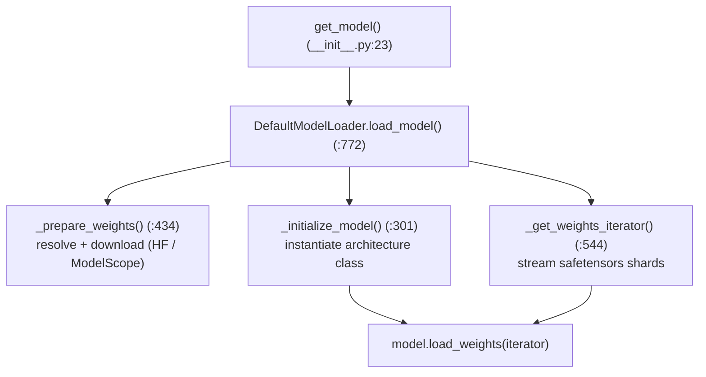
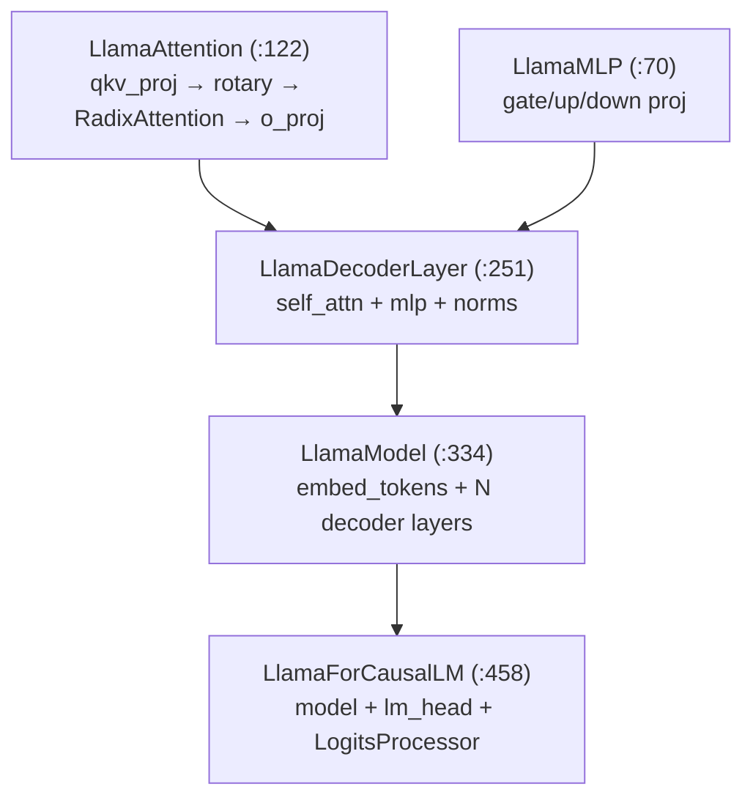

# Chapter 7 — Models & Weight Loading

> **You are here:** the model layer. This chapter shows how SGLang turns a Hugging Face
> checkpoint into a running `nn.Module`, and walks a concrete model (Llama) bottom-up so you can
> see exactly where `RadixAttention` and the parallel linear layers plug in.

## 7.1 The model loader

`python/sglang/srt/model_loader/`. The top-level entry is `get_model` (`__init__.py:23`), which
returns a loaded `nn.Module` on the right device.



`loader.py` defines `class BaseModelLoader` (`:333`) and the default `DefaultModelLoader`
(`:355`). `load_model` (`:772`) orchestrates:

1. `_prepare_weights` (`:434`) — resolve the model id, download/locate the checkpoint files.
2. `_initialize_model` (`:301`) — look up the architecture class from the HF `architectures`
   field and instantiate it (uninitialized weights).
3. `_get_weights_iterator` (`:544`) — stream weight tensors from safetensors shards (so the whole
   checkpoint is never in host memory at once).
4. `model.load_weights(iterator)` — the model maps checkpoint names onto its parameters.

Alternate loaders exist for special cases: `LayeredModelLoader`, `QuantizedRLModelLoader`, and
remote-instance loaders. Weight helpers live in `weight_utils.py`.

### The architecture registry

Each model file exports an `EntryClass`, and a registry maps the HF `architectures` string
(e.g. `"LlamaForCausalLM"`) to that class. That's how a checkpoint's `config.json` selects the
right implementation with no hardcoding.

## 7.2 Anatomy of a model: Llama, bottom-up

`python/sglang/srt/models/llama.py`. Reading a model file bottom-up (leaf modules first) is the
fastest way to understand it. Llama is the canonical example.



### `LlamaAttention` (`:122`) — where attention plugs in

The attention module builds `q, k, v`, applies rotary embeddings, then calls the shared
`RadixAttention` layer from [Chapter 6](06-attention-kv-cache.md):

```python
# llama.py — LlamaAttention.__init__ (:193)
self.attn = RadixAttention(
    self.num_heads, self.head_dim, self.scaling,
    num_kv_heads=self.num_kv_heads, layer_id=layer_id, ...
)

# LlamaAttention.forward (:224, essence)
qkv, _ = self.qkv_proj(hidden_states)          # fused QKV (Ch 10)
q, k, v = qkv.split(...)
q, k = self.rotary_emb(positions, q, k)
attn_output = self.attn(q, k, v, forward_batch)  # → active attention backend
output, _ = self.o_proj(attn_output)
```

Every model reuses the same `RadixAttention`/backend machinery — a model file is mostly wiring
(projection shapes, norms, rotary config), not attention kernels.

### `LlamaForCausalLM` (`:458`) — the top module

- `forward` (`:525`) — embed `input_ids`, run the decoder stack with `(positions, forward_batch)`,
  project through `lm_head`, and produce logits via a `LogitsProcessor`.
- `forward_split_prefill` (`:561`) — the split-prefill variant used by that forward path (Ch 5).
- `get_input_embeddings` — used for multimodal / embedding requests.

The uniform signature is `forward(input_ids, positions, forward_batch) → logits`. That contract
is what lets `ModelRunner._forward_raw` (Ch 5) treat all ~210 models interchangeably.

### `load_weights` (`:625`) — mapping checkpoint to parameters

The checkpoint stores separate `q_proj`/`k_proj`/`v_proj` and `gate_proj`/`up_proj`, but SGLang
fuses them into `qkv_proj` and `gate_up_proj` for efficiency (Ch 10). `load_weights` handles that
remapping with a **stacked-params mapping**: it recognizes the source names and writes each into
the correct slice of the fused parameter, using the per-parameter `weight_loader` (which also
performs the TP shard slice).

### `EntryClass` (`:847`)

```python
# llama.py:847
EntryClass = [LlamaForCausalLM]   # (+ Phi3ForCausalLM, InternLM3ForCausalLM subclasses)
```

This is the registration hook the loader uses to find the class by HF architecture name.

## 7.3 The pattern to reuse

When you read any other model in `python/sglang/srt/models/`, expect the same five-layer shape:
`*MLP` → `*Attention` (holding a `RadixAttention`) → `*DecoderLayer` → `*Model` →
`*ForCausalLM` (+ `EntryClass`), with a `load_weights` that maps checkpoint names onto fused,
TP-sharded parameters. MoE models (Ch 10) swap the MLP for a `FusedMoE`; MLA models (DeepSeek)
swap the attention projections for the compressed-KV variant.

---

**Next:** [Chapter 8 — Sampling](08-sampling.md): turning the logits this chapter produced into
tokens.
