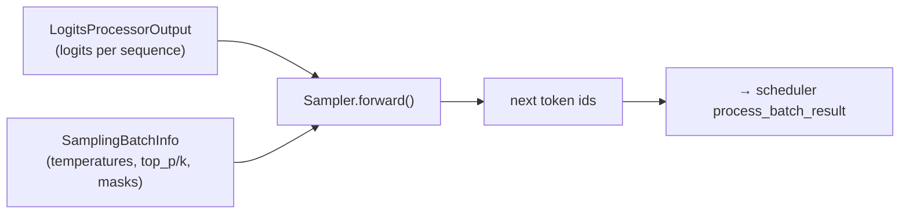
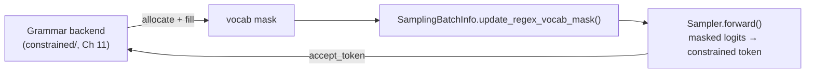

# Chapter 8 — Sampling

> **You are here:** the last step of a forward pass. The model produced logits; sampling turns
> them into the next token id per sequence. This chapter covers the sampler, the per-batch
> sampling state, penalties, and the hook where grammar constraints are applied.

## 8.1 Where sampling sits

After `ModelRunner.forward` returns logits, `ModelRunner.sample` (`model_runner.py:1491`) calls
the sampler:

## 8.2 The Sampler

`python/sglang/srt/layers/sampler.py:69`, `class Sampler(nn.Module)`. Its `forward` (`:94`) takes
a `LogitsProcessorOutput` plus a `SamplingBatchInfo` and:

1. **Preprocesses logits** (`_preprocess_logits`, `:85`) — applies custom logit processors and
   handles NaNs.
2. **Branches on the batch's sampling profile:**
   - if `sampling_info.is_all_greedy` → `torch.argmax` (fast path, no RNG).
   - else → top-k / top-p / min-p sampling via
     `top_k_top_p_min_p_sampling_from_probs_torch` (`:546`), or a fused
     FlashInfer/aiter/ascend kernel when available.
3. **Computes logprobs** when requested.
4. **Syncs token ids across TP** (`_sync_token_ids_across_tp`, `:476`) so every tensor-parallel
   rank agrees on the sampled token (they each hold a shard of the vocab logits).

The sampler is pluggable: `register_sampler_backend` / `create_sampler` (`:510`/`:524`) allow
alternative implementations.

> **Why the greedy fast path matters:** greedy decoding (`temperature = 0`) skips probability
> normalization and RNG entirely, and it's common in eval/agentic workloads — so it's worth a
> dedicated branch.

## 8.3 Per-batch sampling state: `SamplingBatchInfo`

`python/sglang/srt/sampling/sampling_batch_info.py:24`, `class SamplingBatchInfo`. This is the
sampling analogue of `ScheduleBatch` — the batched, GPU-resident sampling parameters, kept in
lockstep with continuous batching.

| Member | Purpose |
|--------|---------|
| `temperatures`, `top_ps`, `top_ks`, `min_ps` | per-sequence sampling knobs as tensors |
| penalizers | repetition / frequency / presence penalty state |
| vocab masks | grammar / structured-decoding constraints |
| `from_schedule_batch(batch, vocab_size)` (`:83`) | build it from a `ScheduleBatch` |
| `filter_batch` (`:299`) / `merge_batch` (`:385`) | keep in sync as requests leave/join |
| `update_regex_vocab_mask` (`:236`) | apply grammar constraints for this step |
| `apply_logits_bias` (`:280`) | user-supplied logit bias |

Because `filter_batch`/`merge_batch` mirror the same operations on `ScheduleBatch` (Ch 4), the
sampling state always matches the exact set and order of sequences in the current forward batch.

## 8.4 Sampling parameters and penalties

- `python/sglang/srt/sampling/sampling_params.py:75`, `class SamplingParams` (a `msgspec.Struct`)
  — the **per-request** user knobs: `temperature`, `top_p`, `top_k`, `min_p`, `max_new_tokens`,
  `stop` strings/token ids, penalties, `n`, etc. This is what the OpenAI layer (Ch 3) fills in
  and what `_tokenize_one_request` attaches to the `TokenizedGenerateReqInput`.
- `python/sglang/srt/sampling/penaltylib/` — the penalty orchestrator (repetition, frequency,
  presence). Penalties need per-sequence token-frequency state that must also survive
  filter/merge, so they live inside `SamplingBatchInfo`.
- `python/sglang/srt/sampling/custom_logit_processor.py` — user-supplied logit hooks applied in
  `_preprocess_logits`.

## 8.5 The grammar hook

Structured/constrained decoding (JSON schema, regex, EBNF grammar) works by **masking** logits so
that only tokens allowed by the grammar's current state can be sampled:

The grammar backend (xgrammar / outlines / llguidance) produces a per-request vocab mask; the
scheduler fills it into `SamplingBatchInfo`; the sampler applies it before sampling; and the
sampled token is fed back to the grammar object (`accept_token`) to advance its state. The full
grammar machinery is [Chapter 11 §11.4](11-advanced-features.md#114-structured--constrained-decoding).

---

**Next:** [Chapter 9 — Speculative Decoding](09-speculative-decoding.md). We've now covered the
whole baseline serving path (Ch 1–8); the remaining chapters are features layered on top.
