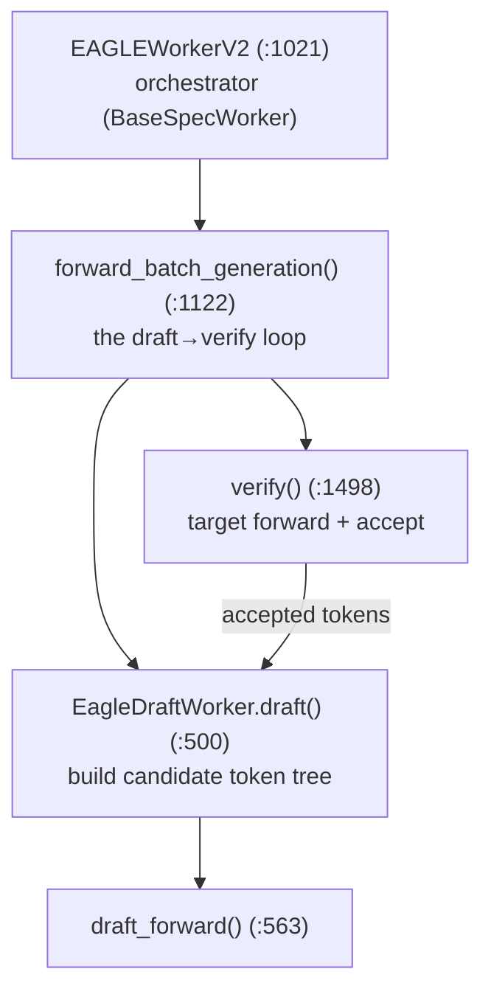

# Chapter 9 — Speculative Decoding

> **You are here:** the first "advanced feature" chapter. Speculative decoding accelerates decode
> by using a cheap **draft** model to propose several tokens, then **verifying** them all in one
> pass of the expensive **target** model. This chapter covers SGLang's EAGLE implementation and
> how it threads through the scheduler and attention.
>
> ⚠️ This subsystem has strict naming conventions — read the repo's `speculative-naming` skill
> before editing anything under `python/sglang/srt/speculative/`.

## 9.1 The idea

A normal decode step produces one token per model forward. Speculative decoding produces
**several** per target forward:

```mermaid
sequenceDiagram
    participant D as Draft model (cheap)
    participant T as Target model (expensive)
    D->>D: propose a tree of k candidate tokens
    D->>T: submit all k for verification
    T->>T: one forward pass over the tree
    T->>T: accept the longest matching prefix (m ≤ k tokens)
    Note over T: m tokens committed in 1 target forward
    T->>D: feed accepted tokens back; draft continues
```

If the draft is accurate, you commit multiple tokens per expensive forward, so decode throughput
rises without changing the output distribution (verification guarantees correctness).

## 9.2 The algorithm registry

`python/sglang/srt/speculative/spec_info.py:30`, `class SpeculativeAlgorithm(Enum)` — the
supported algorithms: `EAGLE`, `EAGLE3`, `FROZEN_KV_MTP`, `STANDALONE`, `NGRAM`, `DFLASH`,
`DSPARK`, `NONE`, with predicate helpers (`is_eagle()`, `is_ngram()`, …) and `from_string`
(`:47`). `create_worker(server_args)` (`:240`) returns the worker class to instantiate;
plugin algorithms register via `spec_registry.py`.

## 9.3 Worker structure

`python/sglang/srt/speculative/base_spec_worker.py`:

- `class BaseSpecWorker(ABC)` (`:45`) — the orchestrator base. Properties `target_worker`,
  `draft_worker`, `spec_v2_attn_backends`; setup hooks `alloc_memory_pool`,
  `init_attention_backends`, `init_cuda_graphs`.
- `class EagleDraftWorkerBase(ABC)` (`:15`) — the draft-model base: abstract `draft()`,
  `draft_extend()`, `draft_runners()`.

The EAGLE implementation is `python/sglang/srt/speculative/eagle_worker_v2.py`:



- `class EAGLEWorkerV2(BaseSpecWorker)` (`:1021`) is the orchestrator; `forward_batch_generation`
  (`:1122`) runs the loop and `verify` (`:1498`) calls the target model.
- `class EagleDraftWorker(EagleDraftWorkerBase)` (`:120`) holds the draft model: `draft` (`:500`)
  and `draft_forward` (`:563`) produce the candidate tree; `draft_extend` (`:739`) extends the
  draft's KV.

## 9.4 Tree attention and the data structures

EAGLE proposes not a linear sequence but a **tree** of candidate continuations, and verifies the
whole tree in one target forward using a specially-shaped attention mask. The data structures live
in `python/sglang/srt/speculative/eagle_info.py`:

- `class EagleVerifyInput(SpecInput)` (`:18`) — the verification batch. Builds the tree-attention
  arguments (`generate_attn_arg_prefill`), and carries `max_tree_depth` and `tree_topk`.
- `class EagleDraftInput(SpecInput)` (`:145`) — the draft-side input, with `filter_batch` /
  `merge_batch` so it stays in lockstep with continuous batching just like `ScheduleBatch` and
  `SamplingBatchInfo`.

The corresponding forward modes (`TARGET_VERIFY`, `DRAFT_EXTEND_V2`) come from `ForwardMode`
(Ch 5), and the tree mask is realized by dedicated **spec attention backends** returned from
`spec_v2_attn_backends`. CUDA graphs for the draft path have their own runners
(`eagle_draft_cuda_graph_runner.py`, `eagle_draft_extend_cuda_graph_runner.py`,
`multi_layer_eagle_draft_extend_cuda_graph_runner.py`).

## 9.5 Scheduler integration

The scheduler wires speculation in at init and per-step:

- `scheduler.py:353` — `self.spec_algorithm = SpeculativeAlgorithm.from_string(...)`.
- `scheduler.py:773` — `maybe_init_draft_worker()`: if an algorithm is set, it resolves
  `DraftWorkerClass = self.spec_algorithm.create_worker(...)` (`:797`) and calls the worker's
  `alloc_memory_pool(...)`. The target model runs through the normal `TpModelWorker`
  (Ch 5), with the `is_draft_worker` flag threading the draft path through the shared code.

Because acceptance is variable (0..k tokens per step), speculative batches interact carefully
with the overlap scheduler — recall `is_disable_overlap_for_batch` (Ch 4) disables overlap for
spec + grammar decode, where the next step's inputs can't be predicted before verification
finishes.

Other algorithms follow the same worker contract: `ngram_worker.py`,
`frozen_kv_mtp_worker_v2.py`, `standalone_worker_v2.py`, `dflash_worker_v2.py`.

---

**Next:** [Chapter 10 — Distributed Parallelism](10-distributed-parallelism.md).
