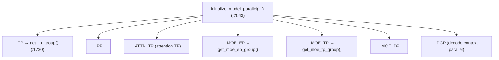
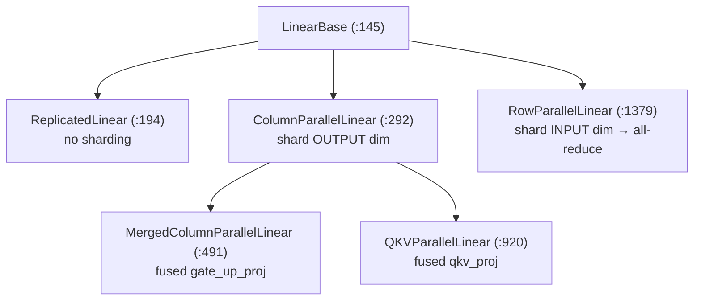

# Chapter 10 — Distributed Parallelism

> **You are here:** how SGLang scales one model across many GPUs (and many nodes). We cover the
> four parallelism axes, the process-group machinery that coordinates them, how tensor
> parallelism is baked into the linear layers, and how Mixture-of-Experts adds its own axes.

## 10.1 The four axes

| Axis | What it splits | Where |
|------|----------------|-------|
| **Tensor Parallel (TP)** | each layer's weights across GPUs (every GPU holds a shard, all-reduce to combine) | `layers/linear.py` |
| **Pipeline Parallel (PP)** | the model's layers into stages across GPUs | `distributed/parallel_state.py` |
| **Data Parallel (DP)** | whole model replicas, each serving different requests | `managers/data_parallel_controller.py` |
| **Expert Parallel (EP)** | MoE experts across GPUs | `layers/moe/` |

These compose: a common large-model topology is **DP-attention + EP-MoE**, where attention runs
data-parallel while the MoE experts are sharded expert-parallel.

## 10.2 Process groups: `parallel_state`

`python/sglang/srt/distributed/parallel_state.py`. The central abstraction is
`class GroupCoordinator` (`:216`) — a wrapper around one PyTorch process group and its
collectives (all-reduce, all-gather, etc.).

Module-level globals hold each axis, fetched through accessors:

`init_distributed_environment` (`:1940`) sets up the world (rank/world-size/backend), and
`initialize_model_parallel` (`:2043`) builds every group from the configured sizes. Note that MoE
has its **own** parallel axes (`_MOE_EP`/`_MOE_TP`/`_MOE_DP`) distinct from the main `_TP` — that
separation is what lets attention and MoE use different parallelism strategies in the same model.

Physical transport lives in `distributed/device_communicators/`: `pynccl.py`,
`custom_all_reduce.py`/`_v2.py`, `quick_all_reduce.py`, `shm_broadcast.py`, `torch_symm_mem.py`,
`pymscclpp.py`, plus NPU/HPU/XPU variants. `communication_op.py` exposes the tensor-parallel
all-reduce / all-gather ops the layers call.

## 10.3 Tensor parallelism in the linear layers

TP is not a separate code path — it's built into the linear layer classes in
`python/sglang/srt/layers/linear.py`. A model just uses these classes and gets sharding for free.

- **`ColumnParallelLinear`** (`:292`) shards the **output** dimension: each rank computes
  `output_size_per_partition = divide(output_size, tp_size)` columns. Used for the "expand"
  projections (`qkv_proj`, `gate_up_proj`).
- **`RowParallelLinear`** (`:1379`) shards the **input** dimension and **all-reduces** the
  partial outputs. Used for the "contract" projections (`o_proj`, `down_proj`).
- **`QKVParallelLinear`** (`:920`) and **`MergedColumnParallelLinear`** (`:491`) are fused
  column-parallel projections (this is why Ch 7's `load_weights` remaps separate q/k/v into one
  `qkv_proj`) with per-partition output sizes that respect head counts.
- **`ReplicatedLinear`** (`:194`) keeps a full copy on every rank (e.g. small router layers).

The classic column-then-row pattern (expand column-parallel, contract row-parallel) means only
**one** all-reduce is needed per attention block and per MLP block, minimizing communication.

> **Composition seam:** weights are allocated in `quant_method.create_weights(...)`, so
> quantization (Ch 11) and TP compose automatically — a shard is just a smaller quantized tensor.
> LoRA (Ch 11) wraps these same classes.

## 10.4 Data parallelism

`python/sglang/srt/managers/data_parallel_controller.py:130`, `class DataParallelController`. It
launches DP scheduler groups (`launch_dp_schedulers`, `launch_dp_attention_schedulers`,
`launch_tensor_parallel_group`) and routes incoming requests across replicas using
`class LoadBalanceMethod` (`:77`, round-robin / shortest-queue) with a `class DPBudget` (`:94`)
tracking per-replica load. `dispatch_batch_generate` / `round_robin_scheduler` distribute the
work.

Under DP, the process tree gains a controller in front of N scheduler groups, but each group is
still the Scheduler → Worker → ModelRunner stack from Chapters 4–5.

## 10.5 Mixture-of-Experts and Expert Parallelism

`python/sglang/srt/layers/moe/`. An MoE layer replaces the dense MLP with many "expert" MLPs and
a router that sends each token to its top-k experts.

- `fused_moe_triton/layer.py:154`, `class FusedMoE(torch.nn.Module)` — the base MoE layer:
  `forward`, `run_moe_core`, expert weight loading (`make_expert_params_mapping`), and
  `_map_global_expert_id_to_local_expert_id` for EP sharding (each rank owns a subset of experts).
- `ep_moe/layer.py:49`, `class DeepEPMoE(FusedMoE)` — the expert-parallel implementation.
- `topk.py` — routing: `class TopKConfig` (`:209`) and `select_experts` (`:1876`) decide which
  experts each token goes to.
- `token_dispatcher/deepep.py` — the all-to-all token dispatch/combine across EP ranks
  (`class DeepEPBuffer`, normal vs low-latency modes). Vendor kernels: `cutlass_moe.py`,
  `flashinfer_trtllm_moe.py`.

> **Why separate MoE axes?** Attention has few, large weight matrices (best sharded by TP);
> MoE has many small expert matrices (best sharded by EP, distributing whole experts). Giving MoE
> its own `_MOE_EP`/`_MOE_TP`/`_MOE_DP` groups (§10.2) lets each part of the model use the
> parallelism that fits it.

---

**Next:** [Chapter 11 — Advanced Features](11-advanced-features.md): quantization, LoRA,
disaggregated serving, structured decoding, and the config surface.
