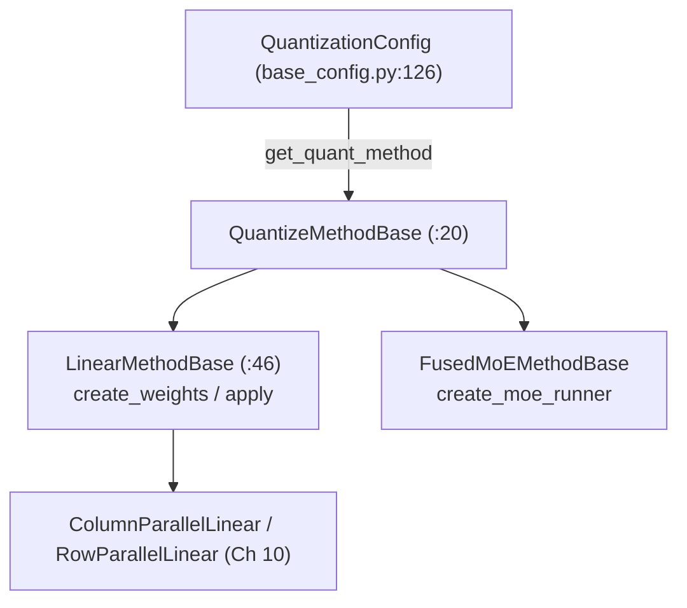
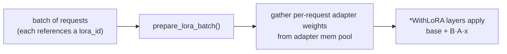

# Chapter 11 — Advanced Features

> **You are here:** the final chapter. A tour of the feature subsystems layered on the core path,
> plus the configuration surface (`ServerArgs`) that turns them on. Each section is a map, not a
> deep dive — enough to know what exists and where to start reading.

## 11.1 Quantization

`python/sglang/srt/layers/quantization/`. Quantization attaches a **quant method** to each linear
and MoE layer that owns how weights are stored and how the matmul runs.



- **Registry** — `__init__.py:73`, `BASE_QUANTIZATION_METHODS` maps names → config classes:
  `fp8`, `awq`/`awq_marlin`, `gptq`/`gptq_marlin`, `w8a8_int8`, `w8a8_fp8`, `modelopt_fp8/fp4`,
  `compressed-tensors`, `bitsandbytes`, `gguf`, `mxfp4`, `nvfp4`, `w4afp8`, `quark`, and more.
- **Base interfaces** — `base_config.py`: `class QuantizationConfig` (`:126`),
  `class QuantizeMethodBase` (`:20`, with `create_weights`/`apply`/`process_weights_after_loading`),
  specialized to `class LinearMethodBase` (`:46`) and `FusedMoEMethodBase`.
- **Example** — `fp8.py`: `Fp8Config` (`:220`), `Fp8LinearMethod` (`:414`), `Fp8MoEMethod`
  (`:997`), plus a KV-cache FP8 method.

**The key seam:** because weights are always allocated through `quant_method.create_weights`, the
same call composes with TP sharding (Ch 10) and LoRA (§11.2) — the layer doesn't know or care
whether its weights are full-precision, quantized, sharded, or LoRA-wrapped.

## 11.2 LoRA

`python/sglang/srt/lora/`. LoRA serves many fine-tuned adapters on top of one base model, swapping
adapters per request within a batch.

- `lora_manager.py:57`, `class LoRAManager` — the orchestrator: `load_lora_adapter` (`:166`) /
  `unload_lora_adapter`, `prepare_lora_batch(forward_batch)` (`:344`, selects each request's
  adapter for the current forward), memory-pool and CUDA-graph batch-info setup.
- `layers.py:34`, `class BaseLayerWithLoRA` and subclasses that mirror the TP linear classes from
  Ch 10 (`ColumnParallelLinearWithLoRA`, `QKVParallelLinearWithLoRA`, `RowParallelLinearWithLoRA`,
  `MergedColumnParallelLinearWithLoRA`, `VocabParallelEmbeddingWithLoRA`, `FusedMoEWithLoRA`).
  The manager substitutes these wrappers for the base layers.
- `lora.py` (`LoRAAdapter`/`LoRALayer`), `lora_config.py`, `lora_registry.py`, `mem_pool.py`
  (adapter weight pool), `eviction_policy.py`.



## 11.3 Disaggregated serving (Prefill/Decode split)

`python/sglang/srt/disaggregation/`. "PD disaggregation" runs prefill and decode on **separate**
GPU pools: prefill nodes build the KV cache, then transfer it to decode nodes that stream tokens.
This lets each phase scale independently (prefill is compute-bound, decode is memory-bandwidth-bound).

- `utils.py`: `class DisaggregationMode(Enum)` (`:68`, `PREFILL`/`DECODE`/null),
  `class TransferBackend(Enum)` (`:509`, `MOONCAKE`/`MORI`/`NIXL`/`ASCEND`/`FAKE`), and
  `get_kv_class(...)` (`:526`) factory over `KVClassType` (KVARGS/MANAGER/SENDER/RECEIVER/
  BOOTSTRAP_SERVER).
- `base/conn.py`: the transfer interface — `class BaseKVManager` (`:92`), `class BaseKVSender`
  (`:110`, `init`/`send`/`poll`), `class BaseKVReceiver`, `class KVPoll` (`:84`, a state machine).
  Concrete backends in `mooncake/`, `mori/`, `nixl/`, `ascend/`, `fake/`.
- Prefill side (`prefill.py`): `PrefillBootstrapQueue`, `SchedulerDisaggregationPrefillMixin`.
  Decode side (`decode.py`): `DecodePreallocQueue`, `DecodeReqToTokenPool`, `DecodeRequest`.

```mermaid
flowchart LR
    C([client]) --> BOOT["bootstrap server"]
    BOOT --> P["Prefill pool<br/>(mode=PREFILL): build KV"]
    P -->|KV transfer<br/>(Mooncake/NIXL/…)| D["Decode pool<br/>(mode=DECODE): stream tokens"]
    D --> C
```

Recall `ForwardMode.PREBUILT` (Ch 5) — the decode side runs forwards over KV it received rather
than computed.

## 11.4 Structured / constrained decoding

`python/sglang/srt/constrained/`. Enforces that output matches a JSON schema, regex, or grammar by
masking logits (the hook is in Ch 8 §8.5).

- `base_grammar_backend.py`: `class BaseGrammarObject` (`:42`, per-request grammar state:
  `accept_token`, `rollback`, `allocate_vocab_mask`, `fill_vocab_mask`, `apply_vocab_mask`,
  `try_jump_forward`) and `class BaseGrammarBackend` (`:131`). Factory `create_grammar_backend`
  (`:223`) selects the implementation.
- Backends: `xgrammar_backend.py` (GPU bitmask filtering — the default), `outlines_backend.py`
  (regex/JSON, with jump-forward in `outlines_jump_forward.py`), `llguidance_backend.py`.
  `reasoner_grammar_backend.py` wraps a backend so grammar is only enforced after a reasoning phase.
- Scheduler-side: `grammar_manager.py`, `class GrammarManager` handles async grammar compilation
  and readiness so a slow-to-compile grammar doesn't stall the batch.

> **Jump-forward decoding** is a notable optimization: when the grammar makes the next several
> tokens deterministic (e.g. the `": "` after a JSON key), SGLang emits them directly and skips the
> model forward for those positions.

## 11.5 The configuration surface: `ServerArgs`

`python/sglang/srt/server_args.py:410`, `class ServerArgs` — the single dataclass holding every
runtime knob (thousands of lines), with a resolution block that fills hardware/mode-dependent
defaults. Read the `sglang-runtime-context` and `env-var-conventions` skills before touching it.

Representative knobs, grouped by the chapter they affect:

| Group | Fields | Chapter |
|-------|--------|---------|
| Model / loading | `model_path`, `load_format`, `context_length`, `dtype`, `quantization`, `kv_cache_dtype` | 7, 11 |
| Memory / scheduling | `mem_fraction_static`, `max_running_requests`, `chunked_prefill_size`, `schedule_policy`, `page_size` | 4, 6 |
| Parallelism | `tp_size`, `pp_size`, `dp_size`, `enable_dp_attention`, `ep_size`, `moe_a2a_backend`, `dist_init_addr`, `nnodes`, `node_rank` | 10 |
| Backends | `attention_backend`, `grammar_backend`, `enable_torch_compile` | 6, 11 |
| Speculative | `speculative_algorithm`, `speculative_num_steps` | 9 |
| Cache / LoRA / PD | `enable_hierarchical_cache`, `enable_lora`, `max_lora_rank`, `lora_paths`, `disaggregation_mode`, `disaggregation_transfer_backend` | 6, 11 |

The resolution logic adjusts interdependent defaults (e.g. `chunked_prefill_size`,
`mem_fraction_static`, `attention_backend`) based on `tp_size`, `pp_size`, `disaggregation_mode`,
and detected hardware — so most users set a handful of flags and let SGLang derive the rest.

## 11.6 How it all composes — the one-paragraph recap

A quantized, TP-sharded, optionally-LoRA-wrapped model (Ch 7, 10, 11) is loaded onto one or more
GPUs. Requests arrive over HTTP, are tokenized in the main process (Ch 3), and dispatched to a
scheduler (Ch 4) that packs them into batches using prefix-cache-aware policies (Ch 6),
prioritizing prefill and continuously merging/filtering the running set. Each batch becomes a
`ForwardBatch` (Ch 5) run through the model — possibly via CUDA graph replay, possibly with a
speculative draft/verify loop (Ch 9), possibly across EP-sharded MoE experts (Ch 10) — reading and
writing KV through the two-level pool (Ch 6). Logits are sampled (Ch 8), optionally masked by a
grammar (Ch 11), the tokens are detokenized (Ch 3), and streamed back to the client. Every step,
the scheduler re-decides the batch. That loop, kept full, is the whole game.

---

**Next:** [Chapter 12 — Model Support & Adding a New Model](12-model-support-and-new-models.md):
how every architecture in the tree plugs into the machinery this book has described, and how to add
one yourself.
