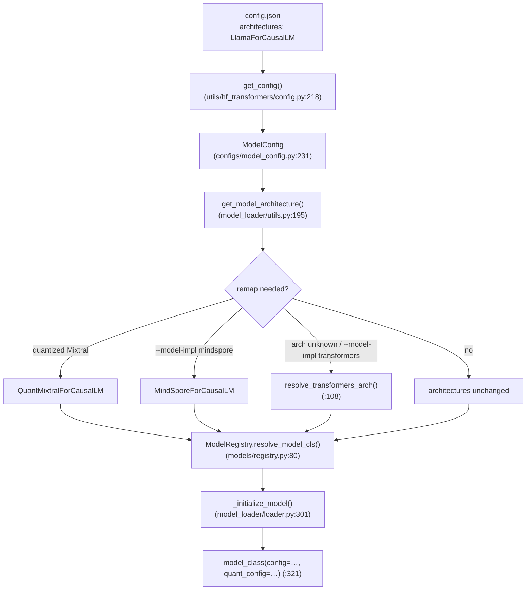
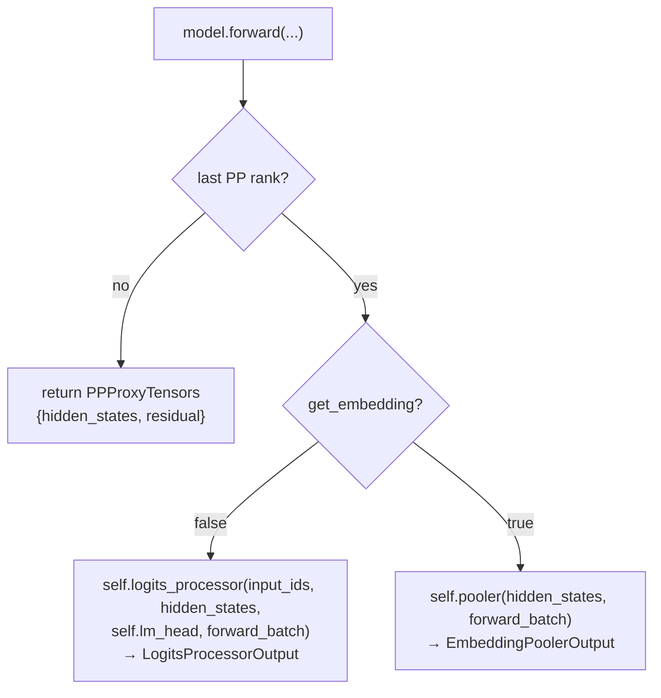
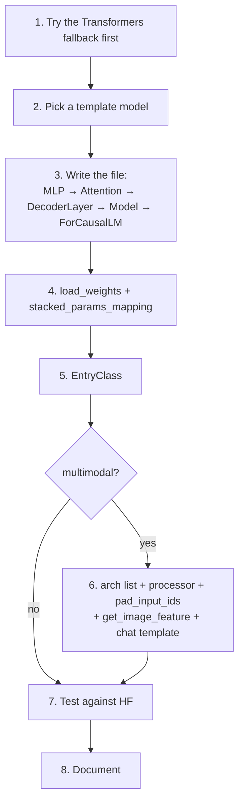

# Chapter 12 — Model Support & Adding a New Model

> **You are here:** the contributor's chapter. [Chapter 7](07-models-and-loading.md) showed *one*
> model (Llama) and the loader that instantiates it. This chapter zooms out: how ~230 different
> architectures — dense, MoE, MLA, hybrid, multimodal, embedding, reward, draft heads — all live
> behind the same runtime, what contract a model must satisfy for `ModelRunner` to drive it, and the
> concrete steps to add one of your own.

## 12.1 The model zoo — what "supporting a model" means

`python/sglang/srt/models/` holds **209 Python files**, **189 of which export an `EntryClass`**,
registering roughly **230 distinct architecture names**. They are not 230 special cases in the
runtime — they are 230 leaf implementations of one very small contract.

| Kind | What makes it different | Representative files |
|------|-------------------------|----------------------|
| **Dense causal LM** | The baseline: `RadixAttention` + `LogitsProcessor` head | `models/llama.py`, `models/qwen2.py` |
| **MoE LM** | `FusedMoE` replaces the dense MLP; expert parallelism (Ch 10) | `models/qwen3_moe.py:1238`, `models/deepseek_v2.py:3005` |
| **MLA LM** | Compressed latent KV instead of per-head K/V; `AttentionArch.MLA` | `models/deepseek_v2.py` |
| **Hybrid / linear attention** | Interleaves softmax attention with linear/Mamba layers, so the "KV cache" is partly a recurrent state (Ch 6) | `models/qwen3_next.py`, `models/nemotron_h.py`, `models/kimi_linear.py` |
| **Embedding** | `Pooler` head instead of `lm_head`; prefill-only | `models/llama_embedding.py:14` |
| **Reward / classification** | A small `score` head + `score_and_pool` | `models/qwen2_classification.py:33`, `models/qwen2_rm.py` |
| **Encoder-only** | Bidirectional, no autoregressive KV growth | `models/bert.py:501`, `models/roberta.py` |
| **Multimodal (VLM/ALM)** | A vision/audio tower + `general_mm_embed_routine`, plus a *processor* on the tokenizer side | `models/qwen2_5_vl.py:575`, `models/qwen2_vl.py` |
| **Speculative draft head** | A 1–2 layer head sharing the target's embeddings (Ch 9); **24 files** matching `*_nextn.py` / `*_mtp.py` / `*_eagle*.py` | `models/deepseek_nextn.py`, `models/llama_eagle3.py` |
| **Escape hatches** | Wrap an arbitrary HF or MindSpore model | `models/transformers.py:1625`, `models/mindspore.py:363` |

**The framing that makes this tractable:** none of these is a class hierarchy. There is no
`GenerationModel` base, no `SupportsMultiModal` protocol. Every one of them is a plain
`torch.nn.Module`, and the runtime discovers capabilities by **duck typing** — `hasattr(model, "…")`
and `inspect.signature(model.forward)`. A "kind" is simply *which optional hooks this module happens
to implement*.

> **Why it matters:** adding a model is additive. You write one file, nothing else in the tree
> changes, and no interface has to grow a new branch. The price is that the contract lives in call
> sites rather than in a base class — which is exactly what §12.4 writes down.

## 12.2 From `config.json` to a Python class

The only key SGLang has is the `architectures` list in the checkpoint's `config.json`. Turning that
string into a class is a pipeline of a registry plus several rewrite layers.



### The registry

`python/sglang/srt/models/registry.py`. Discovery is **eager, at import time** — the module ends with:

```python
# registry.py:130
ModelRegistry = _ModelRegistry()
ModelRegistry.register("sglang.srt.models")

if external_pkg := envs.SGLANG_EXTERNAL_MODEL_PACKAGE.get():
    ModelRegistry.register(external_pkg, overwrite=True)
```

`import_model_classes` (`:94`, memoized with `@lru_cache`) walks `pkgutil.iter_modules` over the
package, imports every non-package module, and reads its module-level `EntryClass` (`:111-125`,
which may be a single class or a list). **The dictionary key is the class `__name__`** — which is
why a model class must be named exactly like the HF architecture string.

Three behaviors worth knowing:

- **Import errors are swallowed** (`:104-110`) with a warning unless `strict=True`. A model whose
  optional dependency is missing simply vanishes from the registry rather than breaking startup.
- **Duplicate names are fatal** — `assert "Duplicated model implementation for {name}"` (`:117`).
- `SGLANG_DISABLED_MODEL_ARCHS` (`environ.py:216`) skips modules **by module name** (`:100`), which
  is how you exclude a model that fails to import in your environment.

`_normalize_archs` (`:61-78`) filters the checkpoint's architectures down to registered ones, and —
if anything was dropped — appends `"TransformersForCausalLM"` as a last-resort fallback.
`resolve_model_cls` (`:80`) returns the first hit; `_raise_for_unsupported` (`:41`) distinguishes
"this arch exists but failed to import" from "never heard of it".

### The rewrite layers

Chapter 7 stops at "the registry maps the architecture name to a class". In practice the name can be
rewritten at three different points before it reaches the registry:

1. **Config-level rewriting**, in the HF config parser `utils/hf_transformers/config.py:75-199`:
   `model_type: multi_modality → MultiModalityCausalLM` (`:156`), Longcat normalization (`:109`), a
   DeepSeek-OCR misdetection workaround (`:128`), a synthetic Phi4MM `vision_config` (`:93`). GGUF
   checkpoints have **no** `architectures` field at all — one is synthesized from
   `MODEL_FOR_CAUSAL_LM_MAPPING_NAMES[config.model_type]` by `_set_architectures` (`:45`).
2. **Draft-model rewriting**, `ModelConfig._config_draft_model` (`configs/model_config.py:551`) —
   ~18 rules that swap a full model's arch for its MTP/NextN head, e.g.
   `DeepseekV3ForCausalLM → DeepseekV3ForCausalLMNextN` (`:554`),
   `Qwen3NextForCausalLM → Qwen3NextForCausalLMMTP` (`:629`). This is how `--speculative-draft-model-path`
   pointing at a full checkpoint still loads the small head (Ch 9).
3. **Load-time rewriting**, `get_model_architecture` (`model_loader/utils.py:195`): the
   quantized-Mixtral special case (`:199-214`), `--model-impl mindspore` (`:219`), and the
   Transformers fallback (`:221`). The result is cached on the config as `_resolved_model_arch` /
   `_resolved_model_impl` (`:224-229`), readable later via `get_resolved_model_impl` (`:233`).

### The Transformers fallback

For an architecture SGLang has never seen, the fallback class name is **composed, not looked up** —
`_get_transformers_backend_arch` (`model_loader/utils.py:76-97`) from three booleans:

| Signal | Source | Effect on the name |
|--------|--------|--------------------|
| not a generation model | `ModelConfig.is_generation`, or `*sequenceclassification*`/`*rewardmodel*` in the arch (`:69`) | `…EmbeddingModel` / `…ForSequenceClassification` instead of `…ForCausalLM` |
| multimodal | `is_multimodal`, or `hf_config is not hf_text_config` | inserts `MultiModal` |
| MoE | `_is_moe_model` (`:32`) — name contains `moe`/`mixtral`, or the text config has `num_local_experts` / `n_routed_experts` / … | inserts `MoE` |

…yielding names like `TransformersMultiModalMoEForCausalLM`. Those 12 concrete classes are exactly
the mixin cross-product built at `models/transformers.py:1565-1622` (`TransformersBase` at `:535`
plus `CausalMixin` `:1098`, `EmbeddingMixin` `:1126`, `MoEMixin` `:1139`, `MultiModalMixin` `:1307`)
and listed in `EntryClass` at `:1625`. `resolve_transformers_arch` (`model_loader/utils.py:108`) also
handles `auto_map` remote-code classes and gates on the HF model declaring
`_supports_attention_backend` (`models/transformers.py:603-624`) — a hard error under
`--model-impl auto`, a warning under an explicit `--model-impl transformers`.

## 12.3 What `ModelConfig` decides before the model exists

`python/sglang/srt/configs/model_config.py` (`class ModelConfig`, `:231`) is the switchboard: by the
time the class is instantiated, the runtime already knows what *kind* of thing it is loading and has
sized the KV cache accordingly.

- **Enums**: `AttentionArch{MLA, MHA}` (`:76`), `ModelImpl{AUTO, SGLANG, TRANSFORMERS, MINDSPORE}` (`:81`).
- **Generation vs pooling** — `is_generation` (`:398`) ← `is_generation_model` (`:1656`), a deny-list
  of embedding/reward/classification archs plus the `--is-embedding` flag. This single boolean is
  what later becomes `get_embedding=True` on the forward call.
- **Multimodal** — `is_multimodal` (`:413`) ← `is_multimodal_model` (`:1786`) tested against the
  `multimodal_model_archs` list (`:1684`, **67 architectures**), extensible at runtime by
  `SGLANG_EXTERNAL_MM_MODEL_ARCH` (`:1782`). Siblings: `is_audio_model` (`:1796`),
  `is_encoder_decoder` (`:1804`), `is_local_attention_model` (`:1813`),
  `is_multimodal_chunked_prefill_supported` (`:1817`).
- **Hybrid** — `_derive_hybrid_model` (`:660`) sets `is_hybrid_swa` (`:1895`) and splits layers into
  `swa_attention_layer_ids` / `full_attention_layer_ids`; `_detect_attention_sinks` (`:702`); linear-attention
  hybrids resolve through `configs/linear_attn_model_registry.py`.
- **Shapes** — `_derive_model_shapes` (`:755`) is a long arch-name `if/elif` chain that picks
  `attention_arch`. MLA branches (DeepSeek V2/V3/V3.2, GLM4-MoE-Lite, KimiLinear, MiniCPM3, …) sit at
  `:780-826` and set `kv_lora_rank` / `qk_nope_head_dim` / `qk_rope_head_dim` / `v_head_dim`;
  everything else falls through to `AttentionArch.MHA` (`:938`). **GQA is not an enum** — it is just
  `get_total_num_kv_heads` (`:1002`) returning fewer heads than `get_total_num_attention_heads`.

### Models `transformers` has never heard of

`python/sglang/srt/configs/` holds ~40 hand-written `PretrainedConfig` subclasses. They are keyed by
`cls.model_type` into `_CONFIG_REGISTRY` and pushed into HF's `AutoConfig` by
`utils/hf_transformers/common.py:78-191`, so `AutoConfig.from_pretrained` works for them.
`get_hf_text_config` (`common.py:319`) picks the language sub-config out of a composite config,
preferring `thinker_config > llm_config > language_config > text_config` — and the fact that
`hf_config is not hf_text_config` is itself the signal used for multimodal detection above.

## 12.4 The common forward interface

This is the contract. [Chapter 5](05-model-runner-forward.md) covered the dispatcher that decides
*which* path runs; this section covers what the model on the other end must look like.

### The signature

```python
# models/qwen2.py:488  (identically models/llama.py:524)
@torch.no_grad()
def forward(
    self,
    input_ids: torch.Tensor,
    positions: torch.Tensor,
    forward_batch: ForwardBatch,
    input_embeds: torch.Tensor = None,
    get_embedding: bool = False,
    pp_proxy_tensors: Optional[PPProxyTensors] = None,
) -> LogitsProcessorOutput | EmbeddingPoolerOutput | PPProxyTensors:
```

The first three arguments are passed **positionally**; everything after is passed as a keyword, and
only when the runtime has a reason to.

### Who actually calls it

Note that the call site is no longer in `ModelRunner` itself — `_forward_raw` delegates to a runner
object, and the runner invokes the model:

| Path | Call site |
|------|-----------|
| eager decode | `model_executor/runner/eager_runner.py:245` |
| eager extend / prefill | `model_executor/runner/eager_runner.py:332` (HIP fallback `:323`) |
| eager idle (DP padding) | `model_executor/runner/eager_runner.py:406` |
| split prefill | `model_executor/model_runner.py:1222` → `model.forward_split_prefill(...)` |
| prefill CUDA graph | `model_executor/runner/prefill_cuda_graph_runner.py:515` |
| decode CUDA graph capture | `model_executor/runner/decode_cuda_graph_runner.py:979` |
| warmup / dummy run | `model_executor/runner/base_runner.py:575` |

### How the optional kwargs are built

Two small helpers on `ModelRunner` are the whole story:

- `_pp_kwargs` (`model_runner.py:1172`) — adds `pp_proxy_tensors` **only if** `self.support_pp`.
- `_extend_forward_kwargs` (`:1180`) — adds `input_embeds` from `forward_batch.input_embeds`, applies
  the `replace_embeds` / `replace_positions` overrides through `self.model.get_input_embeddings()`
  (`:1195`), and sets `get_embedding=True` when `not self.is_generation` (`:1200`).

And PP support is detected purely by introspection:

```python
# model_runner.py:366
self.support_pp = (
    "pp_proxy_tensors" in inspect.signature(self.model.forward).parameters
)
```

Adding that parameter to your `forward` is *literally* how a model opts into pipeline parallelism.

### The three return branches



Straight from `qwen2.py:507-521`. Note that generation models still construct a `Pooler`
(`qwen2.py:477`, `llama.py:504`) so that `--is-embedding` works on them without a separate class.
One extra wrinkle: when `self.capture_aux_hidden_states` is set (EAGLE3, Ch 9), `hidden_states` is a
2-tuple that must be unpacked before either head (`qwen2.py:505`).

The two heads:

- `layers/logits_processor.py` — `LogitsProcessorOutput` (`:152`), `LogitsMetadata` (`:202`, built
  from the batch by `from_forward_batch` `:241` — which is why models can hand the raw `forward_batch`
  straight through), `LogitsProcessor.forward` (`:375`).
- `layers/pooler.py` — `PoolingType{LAST, CLS}` (`:20`), `EmbeddingPoolerOutput` (`:26`), `Pooler`
  (`:159`), `score_and_pool` (`:108`, the reward/classification entry point), `CrossEncodingPooler`
  (`:204`).

### The duck-typed method table

**Required of every model:**

| Member | Enforced by |
|--------|-------------|
| `__init__(self, config, quant_config=None, prefix="")` | `model_loader/loader.py:321`, `model_class(**kwargs)` |
| `forward(...)` | the runner call sites above |
| `load_weights(self, weights: Iterable[Tuple[str, torch.Tensor]])` | `model_loader/loader.py:823`; also weight hot-update, `model_runner_components/weight_updater.py:141` |
| module-level `EntryClass` | `models/registry.py:111` |

**Optional — implement it and a feature switches on:**

| Method | Who calls it, and for what |
|--------|---------------------------|
| `get_input_embeddings() -> nn.Embedding` | `model_runner.py:1195` (embed overrides); **asserted** for every multimodal model at `managers/mm_utils.py:1219` |
| `forward_split_prefill(input_ids, positions, forward_batch, split_interval)` | `model_runner.py:1222`; reference impl `qwen2.py:523` |
| `start_layer` / `end_layer` | PP layer accounting — `model_runner_components/layer_setup.py:176`, `model_loader/loader.py:1364` |
| `get_attention_sliding_window_size()` | KV-pool sizing for SWA — `model_runner_components/load_model_utils.py:111` |
| `get_embed_and_head()` / `set_embed_and_head(embed, head)` | EAGLE weight sharing — `speculative/eagle_worker_v2.py:308,327` |
| `get_embed()` / `set_embed(embed)` | EAGLE3 embed-only sharing — `speculative/eagle_worker_v2.py:330` |
| `set_eagle3_layers_to_capture(layer_ids)` | `model_runner_components/attention_backend_setup.py:54` — **called unguarded**, so it is mandatory for any model used as an EAGLE3 *target* |
| `pad_input_ids(input_ids, mm_inputs)` | `managers/tp_worker.py:99` → the scheduler, `managers/scheduler.py:2254` |
| `get_image_feature` / `get_video_feature` / `get_audio_feature` | wired into `general_mm_embed_routine`'s `data_embedding_funcs` |
| `post_load_weights()` | `model_loader/loader.py:324`, for loaders that bypass `load_weights` |
| `get_weights_by_name(name, truncate_size)` | the `/get_weights_by_name` endpoint — `model_runner_components/weight_exporter.py:152` |
| `get_hidden_dim(module_name, layer_idx)` | LoRA shape inference — `lora/utils.py:117` (has a default fallback) |
| `prepare_forward_batch(forward_batch)` | model-specific attention metadata — `eager_runner.py:230` |
| `load_kv_cache_scales(path)` | FP8 KV-cache scale loading |

> **Callout — there is no base class, and that's a deliberate trade.** SGLang has no `SupportsPP`,
> `SupportsLoRA`, or `SupportsMultiModal` protocol; `models/utils.py` is a helper grab-bag, not an
> interface module. The upside is that a new model is one additive file. The downside is that the
> contract only exists in call sites — hence this table. One consequence to be aware of:
> `should_apply_lora` is a **dead hook**. About ten VL models implement it, but the only surviving
> references are comments at `lora/lora_manager.py:830-831`; the live gate is the `target_modules`
> name match at `:869`.

### Pipeline-parallel plumbing

Three pieces, and the canonical body pattern is `Qwen2Model` (`models/qwen2.py:284-336` for
construction, `:350-395` for the forward):

- `make_layers(num_hidden_layers, layer_fn, pp_rank=…, pp_size=…)` → `(ModuleList, start_layer, end_layer)`
  — `utils/common.py:1421` (non-PP variant `make_layers_non_pp` at `:1465`).
- `PPMissingLayer` — `layers/utils/common.py:109`, an `Identity` standing in for `embed_tokens` /
  `norm` / `lm_head` on ranks that don't own them (`qwen2.py:299`, `:474`).
- `PPProxyTensors` — `model_executor/forward_batch_info.py:1577`, the `{hidden_states, residual}`
  bundle shipped between ranks. Non-first ranks read from it; non-last ranks return it.

### The multimodal path

Multimodal models don't override `forward` in an unusual way — they delegate to one routine:

```python
# models/qwen2_5_vl.py:752 (essence)
hidden_states = general_mm_embed_routine(
    input_ids=input_ids,
    forward_batch=forward_batch,
    language_model=self.model,
    data_embedding_funcs={
        Modality.IMAGE: self.get_image_feature,
        Modality.VIDEO: self.get_video_feature,
    },
    positions=positions,
)
```

`general_mm_embed_routine` (`managers/mm_utils.py:1194`) resolves every multimodal placeholder into
real embeddings — handling chunked prefill (`_get_chunked_prefill_embedding` `:754`) and precomputed
embeddings (`:415`) — then calls the inner language model with `input_ids=None` and `input_embeds=`
(`:1315`). The placeholder expansion itself happens earlier, in `pad_input_ids`, using one of the
padding patterns at `mm_utils.py:228` / `:245` / `:320`.

## 12.5 Adding a new model — the checklist



### Step 1 — Check whether you need a new file at all

Run the checkpoint with `--model-impl transformers` (`server_args.py:531`) before writing anything.
If the HF implementation sets `_supports_attention_backend = True`, the fallback in §12.2 gives you a
working, TP-sharded, RadixAttention-backed model for free. Write a native file only when you need
performance or features the generic wrapper can't express (fused QKV, MLA, custom rotary, MoE kernels).

### Step 2 — Pick a template

| Your model is… | Copy |
|----------------|------|
| a dense causal LM | `models/llama.py`, `models/qwen2.py` |
| MoE | `models/qwen3_moe.py` |
| MLA / DeepSeek-like | `models/deepseek_v2.py` |
| a VLM | `models/qwen2_5_vl.py`, `models/qwen2_vl.py` |
| an embedding model | `models/llama_embedding.py` |
| a reward / classifier | `models/qwen2_classification.py` |

### Step 3 — Write the file

Follow the five-layer shape from [Chapter 7 §7.3](07-models-and-loading.md) — `*MLP` → `*Attention`
→ `*DecoderLayer` → `*Model` → `*ForCausalLM`. Build it out of these shared pieces (verified import
paths):

| You need | Symbol | Where |
|----------|--------|-------|
| attention | `RadixAttention`, `AttentionType` | `layers/radix_attention.py:70`, `:56` |
| fused QKV | `QKVParallelLinear` | `layers/linear.py:920` |
| fused gate/up | `MergedColumnParallelLinear` | `layers/linear.py:491` |
| other projections | `RowParallelLinear` / `ColumnParallelLinear` / `ReplicatedLinear` | `layers/linear.py:1379` / `:292` / `:194` |
| embeddings & head | `VocabParallelEmbedding`, `ParallelLMHead` | `layers/vocab_parallel_embedding.py:188`, `:587` |
| rotary | `get_rope` | `layers/rotary_embedding/factory.py:63` |
| norms & activations | `RMSNorm`, `SiluAndMul` | `layers/layernorm.py:216`, `layers/activation.py` |
| MoE | `FusedMoE`, `TopK`, `get_moe_impl_class` | `layers/moe/fused_moe_triton/layer.py:154`, `layers/moe/topk.py`, `layers/moe/ep_moe/layer.py` |
| PP-aware layer stack | `make_layers`, `PPMissingLayer` | `utils/common.py:1421`, `layers/utils/common.py:109` |
| heads | `LogitsProcessor`, `Pooler` | `layers/logits_processor.py`, `layers/pooler.py` |

> **Why it matters:** building from exactly these classes is what makes everything else free.
> `lora/layers.py:1183` wraps precisely this set — `FusedMoE`, `ParallelLMHead`,
> `VocabParallelEmbedding`, `ReplicatedLinear`, `QKVParallelLinear`, `MergedColumnParallelLinear`,
> `ColumnParallelLinear`, `RowParallelLinear` — and raises *"No corresponding LoRA layer supported"*
> for anything custom. On the quantization side, weights are always allocated through
> `quant_method.create_weights` (Ch 11 §11.1), and the loader reads a `packed_modules_mapping`
> attribute off your model class (`model_loader/loader.py:204`) so fp8/awq/gptq/compressed-tensors
> know which checkpoint modules were fused. Use a hand-rolled `nn.Linear` and you silently opt out of
> TP, quantization, and LoRA at once.

### Step 4 — `load_weights`

The checkpoint has separate `q_proj`/`k_proj`/`v_proj` and `gate_proj`/`up_proj`; your module has
fused `qkv_proj` and `gate_up_proj`. The convention is a `stacked_params_mapping` of
`(fused_param_name, checkpoint_shard_name, shard_id)` triples:

```python
# models/llama.py:626
stacked_params_mapping = [
    (".qkv_proj", ".q_proj", "q"),
    (".qkv_proj", ".k_proj", "k"),
    (".qkv_proj", ".v_proj", "v"),
    (".gate_up_proj", ".gate_proj", 0),
    (".gate_up_proj", ".up_proj", 1),
]
```

The loop at `:669` rewrites the name and calls `param.weight_loader(param, loaded_weight, shard_id)`
(which also performs the TP slice); anything unmatched falls through to
`getattr(param, "weight_loader", default_weight_loader)` at `:692`
(`model_loader/weight_utils.py:1346`). The same loop is where you skip rotary caches, handle a tied
`lm_head`, filter out layers this PP rank doesn't own (`:646-652`), and remap FP8 KV scales (`:665`).

For a declarative alternative, `models/utils.py` offers `WeightsMapper` (`:51`) for prefix/suffix
renaming and `AutoWeightsLoader` (`:122`) for recursive delegation with `skip_prefixes` /
`ignore_unexpected_suffixes`.

### Step 5 — `EntryClass`

One line at the bottom of the file:

```python
# models/qwen2.py:671
EntryClass = Qwen2ForCausalLM
# …or a list, models/llama.py:847
EntryClass = [LlamaForCausalLM, Phi3ForCausalLM, InternLM3ForCausalLM, IQuestCoderForCausalLM]
```

**The class `__name__` must equal the checkpoint's `architectures[0]` string.** There is no other
registration step — no table to edit, no import to add.

### Step 6 — Multimodal extras

Six additional items, all of them required:

1. **Declare the arch multimodal** — append to `multimodal_model_archs`
   (`configs/model_config.py:1684`), so `is_multimodal_model` (`:1786`) returns `True`.
2. **Write a processor** — subclass `BaseMultimodalProcessor`
   (`multimodal/processors/base_processor.py:180`) in a new file under
   `python/sglang/srt/multimodal/processors/` (there are 49 today), implementing
   `process_mm_data_async` (`:514`). Set the class attribute `models = [YourModelClass]` (`:181`) —
   **that list is the registration key.** `import_processors`
   (`managers/multimodal_processor.py:16`) scans the package, asserts the attribute exists (`:34`),
   and fills `PROCESSOR_MAPPING`; `get_mm_processor` (`:44`) matches on `model_cls.__name__`.
3. **Implement `pad_input_ids`** — expand each multimodal placeholder into as many tokens as the
   feature occupies, and pad with the multimodal data hash so RadixAttention (Ch 6) doesn't confuse
   two different images that share a placeholder token. Use one of the patterns at
   `managers/mm_utils.py:245` / `:320`.
4. **Implement `get_image_feature`** (and `get_video_feature` / `get_audio_feature` as applicable)
   and route them through `general_mm_embed_routine` in `forward`.
5. **Use `VisionAttention`** in the vision tower rather than a hand-written attention, so the ViT
   picks up SGLang's kernels and TP.
6. **Register a chat template** in `parser/conversation.py` (`register_conv_template` `:506`,
   `register_conv_template_matching_function` `:516`) — only if the checkpoint's default template
   can't carry images.

### Step 7 — Test

The core test compares SGLang against HF `transformers` on the same prompts:

- Add a `ModelCase` (`test/registered/models/test_generation_models.py:49`) to **`ALL_MODELS`**
  (`:67`), then run just yours:

  ```bash
  ONLY_RUN=<hf-model-id> python3 -m unittest \
      test_generation_models.TestGenerationModels.test_all_models
  ```

  (`test_all_models` is at `:202`; `CI_MODELS` at `:61` is the much smaller per-commit set.)
- **What "correct" means** — `python/sglang/test/runners.py` runs `HFRunner` (`:163`) in a separate
  process and `SRTRunner` (`:546`) in-process, then `check_close_model_outputs` (`:917`) asserts
  three things: ROUGE-L over the output strings ≥ `rouge_l_tolerance` (default `1`, i.e. exact match),
  prefill top-logprob max-abs-diff < `prefill_tolerance`, and decode top-logprob diff <
  `decode_tolerance`. Your `ModelCase` can loosen the per-model tolerances.
- **Quick manual A/B** while debugging:
  `python3 scripts/playground/reference_hf.py --model-path X` versus
  `python3 -m sglang.bench_one_batch --correct --model X`.
- **Other kinds**: embedding → `test/registered/prefill_only/test_embedding_models.py`; reward →
  `test/registered/prefill_only/test_reward_models.py`; VLM accuracy →
  `test/registered/models/test_vlm_models.py` (MMMU); VLM server e2e → `test/registered/vlm/`.
- **Nightly eval registration**: text-model score floors live in
  `python/sglang/test/test_utils.py:153-158`, VLM thresholds in
  `test/registered/eval/test_vlms_mmmu_eval.py`. CI placement is declared by the
  `register_cuda_ci(...)` marker at the top of each test file
  (`python/sglang/test/ci/ci_register.py:115`) — see `test/README.md` and the `write-sglang-test` skill.

### Step 8 — Document

Add a row to `docs_new/docs/supported-models/generative_models.mdx` or
`multimodal_language_models.mdx`. The step-by-step contributor guide lives at
`docs_new/docs/supported-models/support_new_models.mdx`.

## 12.6 Out-of-tree models — no fork required

You can register a model without touching the SGLang tree at all:

| Env var | Effect | Defined at |
|---------|--------|-----------|
| `SGLANG_EXTERNAL_MODEL_PACKAGE` | second package scanned for `EntryClass`, with `overwrite=True` | `environ.py:863` → `models/registry.py:133` |
| `SGLANG_EXTERNAL_MM_MODEL_ARCH` | appends your arch to `multimodal_model_archs` | `environ.py:864` → `configs/model_config.py:1782` |
| `SGLANG_EXTERNAL_MM_PROCESSOR_PACKAGE` | second package scanned for processors | `environ.py:865` → `managers/tokenizer_manager.py:362` |

Because the external package is registered with `overwrite=True`, it can also **replace** a built-in
architecture — useful for patching one model without a fork. A working end-to-end example ships in
the tree: `python/sglang/test/external_models/custom_qwen2_vl.py`, exercised by
`test/registered/model_loading/test_external_models.py`.

For offline `Engine` use there is also the in-process route — assign into `ModelRegistry.models`
before constructing the engine; `docs_new/docs/supported-models/support_new_models.mdx` walks through
a full Llama-wrapper example.

## 12.7 Recap

A checkpoint's `architectures` string is the only key SGLang has. A registry built by importing every
file in `models/` and reading its `EntryClass` turns that string into a class — with rewrite layers
for quantized variants, draft heads, GGUF, and a composed Transformers fallback for anything unknown.
`ModelConfig` classifies the checkpoint (generation vs pooling, MLA vs MHA, hybrid, multimodal) and
sizes the KV cache before the module is built. Then the entire runtime contract is one duck-typed
method — `forward(input_ids, positions, forward_batch, …)` returning a `LogitsProcessorOutput`, an
`EmbeddingPoolerOutput`, or a `PPProxyTensors` — plus `load_weights` and `EntryClass`. Every optional
hook in §12.4 is a feature the model opts into by defining a method. And everything the earlier
chapters described — RadixAttention and prefix caching (Ch 6), TP/PP/EP sharding (Ch 10), CUDA graphs
(Ch 5), quantization and LoRA (Ch 11), speculative decoding (Ch 9) — comes not from the model file
but from the shared layer classes it is assembled out of. That is why the 190th model is roughly as
easy to add as the tenth.

---

**End of book.** Back to the [index](README.md).
