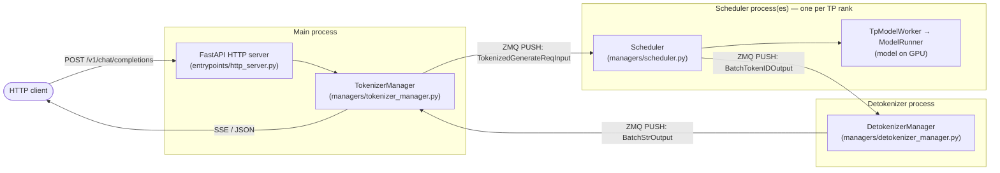

# SGLang Architecture Walkthrough

A high-level code walthrough of the SGLang model-serving framework — from the
big picture down to the subsystems. Each chapter cites real SGLang files, classes, and methods for easy navigation (though code may change over time).

> Paths are relative to the repository root. Line numbers are accurate as of the tree this
> was written against; if one has drifted, search for the named class/method instead — those
> are stable.

## How to read this book

Read top to bottom the first time. The chapters are ordered so each one builds on the
previous: the first two give you the whole system at a glance, the middle chapters open up
the core request-serving path, and the last chapters cover the features layered on top and how to
extend the system with a model of your own.

| # | Chapter | What you'll learn |
|---|---------|-------------------|
| 1 | [Architecture Overview](01-architecture-overview.md) | The three-process design, ZMQ topology, launch sequence, and the design ideas (RadixAttention, continuous batching, overlap scheduling) that shape everything else. |
| 2 | [Request Lifecycle](02-request-lifecycle.md) | The end-to-end journey of a single inference request — the spine that the rest of the book hangs off. |
| 3 | [Frontend & TokenizerManager](03-tokenizer-manager.md) | HTTP/OpenAI entry points, tokenization, the main-process request state machine, and detokenization. |
| 4 | [The Scheduler](04-scheduler.md) | Continuous batching, prefill vs decode, chunked prefill, scheduling policies, and memory-pressure preemption. |
| 5 | [ModelRunner & the Forward Pass](05-model-runner-forward.md) | How a batch becomes a GPU forward call, `ForwardBatch`/`ForwardMode`, and CUDA graph capture/replay. |
| 6 | [Attention & the KV Cache](06-attention-kv-cache.md) | The two-level KV indirection, allocators, the RadixCache prefix tree, and pluggable attention backends. |
| 7 | [Models & Weight Loading](07-models-and-loading.md) | The model loader/registry and a bottom-up walk of a concrete model (Llama). |
| 8 | [Sampling](08-sampling.md) | Turning logits into tokens: the sampler, per-batch sampling state, penalties, and the grammar hook. |
| 9 | [Speculative Decoding](09-speculative-decoding.md) | The EAGLE draft→verify loop, tree attention, and how it plugs into the scheduler. |
| 10 | [Distributed Parallelism](10-distributed-parallelism.md) | Tensor/pipeline/data/expert parallelism, process groups, sharded linear layers, and MoE. |
| 11 | [Advanced Features](11-advanced-features.md) | Quantization, LoRA, disaggregated (prefill/decode) serving, structured decoding, and the `ServerArgs` config surface. |
| 12 | [Model Support & Adding a New Model](12-model-support-and-new-models.md) | How ~230 architectures share one runtime, the duck-typed `forward` contract every model implements, and the step-by-step recipe for adding your own. |

## The system in one picture

Three OS processes, connected only by ZeroMQ sockets:

- **Main process** — the FastAPI server plus the `TokenizerManager`. Accepts HTTP, tokenizes,
  dispatches work, and streams results back.
- **Scheduler process(es)** — the batching brain and the model executor. One per tensor-parallel
  rank (more under data parallelism).
- **Detokenizer process** — turns generated token IDs back into UTF-8 text, incrementally.

Chapter 1 explains why it's split this way; Chapter 2 traces a request all the way around the loop.

## Conventions used in this book

- **File references** look like `python/sglang/srt/managers/scheduler.py:2670` — click to open.
- **Symbols** (classes/methods) are in `code font`.
- **Diagrams** are Mermaid and render on GitHub.
- Callout boxes marked **Why it matters** connect a mechanism to a real serving concern
  (latency, throughput, memory).
