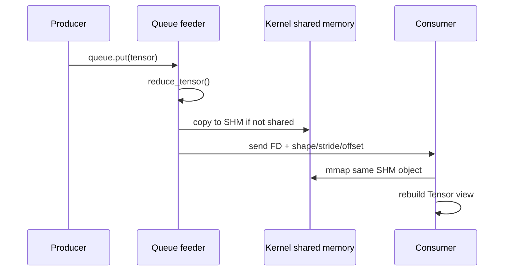

# How does tensor travels through the system?

# How PyTorch tensors travel between processes

The short answer:

> PyTorch does not normally copy tensor bytes through a multiprocessing pipe. It puts the tensor’s CPU `Storage` into shared memory, sends a small handle plus tensor metadata through the queue, and maps that same storage into the receiving process.

But “zero-copy” needs qualification:

* If the tensor is already in shared memory, the inter-process transfer is zero-copy for its payload.
* If it is an ordinary CPU tensor, the first send copies its entire storage once into shared memory.
* DataLoader avoids this extra first-send copy by constructing its batch directly in shared memory.
* `pin_memory=True` adds another CPU copy into pinned memory.
* Moving the batch to CUDA adds a host-to-device copy.

## 1. Tensor versus Storage

A dense PyTorch tensor is conceptually split into:

```text
TensorImpl
  ├── shape
  ├── strides
  ├── storage_offset
  ├── dtype / device
  └── reference to StorageImpl
                         └── DataPtr → actual bytes
```

Multiple tensors can reference the same storage:

```python
x = torch.arange(100)
y = x[20:30]             # same storage, different offset/shape
```

For multiprocessing, PyTorch primarily shares the `Storage`, while serializing the tensor’s small metadata:

* tensor class
* dtype
* shape
* strides
* storage offset
* `requires_grad`
* shared-memory handle for the storage

The receiver creates a new `TensorImpl` and `StorageImpl`, but its storage maps the same physical shared-memory pages. Its `data_ptr()` will usually be a different virtual address because each process has its own virtual address space.

## 2. What happens during `queue.put(tensor)`

PyTorch registers custom reducers with Python’s `ForkingPickler` for tensors and storages. The registrations can be seen at the bottom of [`torch/multiprocessing/reductions.py`](https://github.com/pytorch/pytorch/blob/main/torch/multiprocessing/reductions.py).

The complete CPU path is:



### Step 1: `Queue.put()` does not serialize immediately

A normal `multiprocessing.Queue` places the Python object into an in-process deque and wakes a background `QueueFeederThread`. The feeder later invokes `ForkingPickler.dumps()` and sends the serialized result through a pipe. This is visible in [CPython’s `multiprocessing/queues.py`](https://github.com/python/cpython/blob/main/Lib/multiprocessing/queues.py).

Consequences:

* `queue.put(tensor)` can return before PyTorch has prepared shared storage.
* Do not modify or reuse the tensor immediately after `put()` without synchronization.
* Serialization exceptions can arise in the feeder thread rather than directly inside `put()`.
* `SimpleQueue` avoids the feeder thread, but uses the same PyTorch tensor reducers and shared-storage mechanism.

### Step 2: `reduce_tensor()`

For a dense CPU tensor, `reduce_tensor()` extracts its storage and returns something equivalent to:

```python
rebuild_tensor, (
    tensor_type,
    storage,
    (
        tensor.storage_offset(),
        tensor.size(),
        tensor.stride(),
        tensor.requires_grad,
    ),
)
```

The storage is then independently reduced by `reduce_storage()`.

PyTorch refuses to serialize non-leaf tensors requiring gradients because autograd graphs do not cross process boundaries. Such a tensor must normally be detached first.

### Step 3: `reduce_storage()`

On Linux, the default CPU sharing strategy is normally `file_descriptor`:

```python
fd, size = storage._share_fd_cpu_()
df = multiprocessing.reduction.DupFd(fd)

return rebuild_storage_fd, (storage_type, df, size)
```

Only the descriptor, storage size, and tensor metadata are serialized—not the storage bytes. See the exact implementation in [`reduce_storage()`](https://github.com/pytorch/pytorch/blob/main/torch/multiprocessing/reductions.py).

## 3. The important first-copy behavior

The C++ implementation of `_share_fd_cpu_()` first checks whether the storage is already managed by `MapAllocator`.

If it is already shared, PyTorch simply returns its file descriptor.

If it is not shared, current PyTorch does this:

1. Creates a new POSIX shared-memory storage of the same size.
2. Calls `storage_copy(new_storage, storage)`.
3. Replaces the original storage’s `DataPtr` and allocator with the shared allocation.
4. Returns the shared-memory FD.

This is explicit in [`THPStorage_shareFd`](https://github.com/pytorch/pytorch/blob/main/torch/csrc/StorageSharing.cpp).

Therefore:

| Sender storage                               |  Payload copy during first send |         Later sends |
| -------------------------------------------- | ------------------------------: | ------------------: |
| Ordinary CPU allocation                      |  One full storage copy into SHM |           Zero-copy |
| `tensor.share_memory_()` already called      |                            None |           Zero-copy |
| DataLoader batch constructed directly in SHM | None during queue serialization |           Zero-copy |
| CUDA storage                                 |   Uses CUDA IPC, not `/dev/shm` | No D2D payload copy |

Calling `share_memory_()` ahead of time moves the storage into shared memory explicitly:

```python
x = torch.empty(1_000_000)
print(x.is_shared())      # False

x.share_memory_()
print(x.is_shared())      # True
```

Shared storages are not resizable.

## 4. How `/dev/shm` and `mmap` are involved

On POSIX systems, PyTorch’s shared-memory allocator uses approximately:

```c
fd = shm_open(name, O_RDWR | O_CREAT, 0600);
ftruncate(fd, size);
ptr = mmap(NULL, size, PROT_READ | PROT_WRITE, MAP_SHARED, fd, 0);
```

The current implementation is in [`ATen/MapAllocator.cpp`](https://github.com/pytorch/pytorch/blob/main/aten/src/ATen/MapAllocator.cpp).

On Linux, POSIX shared-memory objects are normally backed by the tmpfs mounted at `/dev/shm`. This means:

* The allocation consumes `/dev/shm` capacity.
* It is memory-backed, although pages can still participate in normal virtual-memory behavior.
* All processes mapping it with `MAP_SHARED` see the same physical pages.
* Changes are visible across processes, but PyTorch provides no automatic locking or synchronization.

### `file_descriptor` strategy

This is the preferred strategy on supported platforms:

1. Create a shared-memory object with `shm_open`.
2. Map it.
3. Usually `shm_unlink` the name.
4. Keep the FD open.
5. Pass duplicated FDs to other processes.
6. The object is destroyed after the last mapping/FD is released.

The object may therefore appear as deleted in `lsof` and not be visible with a simple `ls /dev/shm`.

This strategy is robust against stale named objects but consumes file descriptors. PyTorch documents the trade-off in its [multiprocessing sharing-strategy documentation](https://docs.pytorch.org/docs/main/multiprocessing.html).

### `file_system` strategy

This sends the shared-memory object’s name instead of retaining and transferring an FD.

Advantages:

* Fewer persistent FDs.

Disadvantages:

* The named object cannot be unlinked immediately.
* Crashes can leave shared-memory objects behind.
* PyTorch runs `torch_shm_manager` to clean them after all related processes exit.

Use `file_system` mainly when FD limits are the actual bottleneck.

## 5. Receiver-side reconstruction

For the FD strategy, the consumer:

1. Detaches the received FD.
2. Uses `(st_ino, st_dev)` from `fstat()` as a cache key.
3. Calls `_new_shared_fd_cpu(fd, size)`.
4. Maps the FD with `mmap(..., MAP_SHARED, ...)`.
5. Rebuilds the tensor using its original size, stride, and storage offset.

See [`rebuild_storage_fd()`](https://github.com/pytorch/pytorch/blob/main/torch/multiprocessing/reductions.py).

The cache matters when multiple tensor views refer to the same storage. They are reconstructed as views of one receiver-side storage rather than independent mappings.

### A dangerous view-related detail

Suppose:

```python
large = torch.empty(1_000_000_000)
small = large[:10]
queue.put(small)
```

`small` has ten elements, but it still references `large`’s entire storage. PyTorch reduces and shares the storage, not merely the visible ten elements. It can therefore share or copy the whole multi-gigabyte allocation.

If that is undesirable:

```python
queue.put(small.clone())
```

The clone gives the small tensor its own compact storage.

## 6. DataLoader multiprocessing path

With `num_workers > 0`, the classic DataLoader path is:

```text
main process
    │ indices
    ▼
per-worker multiprocessing index queues
    │
    ▼
worker process
    dataset.__getitem__ / __getitems__
    collate_fn
    │ batch
    ▼
worker_result_queue
    │
    ├─ pin_memory=False ─────────────► user
    │
    └─ pin_memory=True
          pin-memory thread
          local queue
              └──────────────────────► user
```

The source describes this topology in [`dataloader.py`](https://github.com/pytorch/pytorch/blob/main/torch/utils/data/dataloader.py). The worker calls `fetcher.fetch(index)` and then `data_queue.put((idx, data))` in [`worker.py`](https://github.com/pytorch/pytorch/blob/main/torch/utils/data/_utils/worker.py).

### Why default collation is efficient

Inside a worker, `default_collate` detects that it is executing in a DataLoader worker and does:

```python
numel = sum(x.numel() for x in batch)
storage = elem._typed_storage()._new_shared(numel, device=elem.device)
out = elem.new(storage).resize_(len(batch), *elem.size())
return torch.stack(batch, 0, out=out)
```

Thus the stacked batch is written directly into shared storage. The queue reducer then sees an already-shared storage and does not make a second IPC copy. See [`collate_tensor_fn()`](https://github.com/pytorch/pytorch/blob/main/torch/utils/data/_utils/collate.py).

There is still a copy from individual sample tensors into the stacked batch. That is batching/materialization, not an IPC copy.

### Approximate copy path

Without pinning:

```text
decoded sample memory
    └─ stack/collate copy ─► shared batch
                               └─ mmap in main process: no payload copy
```

With `pin_memory=True`:

```text
decoded sample memory
    └─ stack/collate ─► shared pageable batch
                           └─ pin_memory copy ─► pinned batch
                                                  └─ H2D copy ─► CUDA
```

`Tensor.pin_memory()` explicitly copies a pageable CPU tensor into pinned memory. Pinned memory is not ordinarily the same `/dev/shm` allocation. This extra copy enables efficient asynchronous CUDA transfers; it is not zero-copy. See PyTorch’s [pinned-memory guide](https://docs.pytorch.org/tutorials/intermediate/pinmem_nonblock.html).

### `/dev/shm` sizing for DataLoader

A useful first-order estimate is:

[
\text{SHM demand} \approx
\text{batch bytes}
\times \text{num workers}
\times \text{prefetch factor}
]

Then add room for:

* batches waiting for in-order delivery,
* batches currently retained by user code,
* multiple tensors per batch,
* allocator/page alignment and control data.

If you append every returned batch to a list, those shared mappings remain alive and `/dev/shm` usage can grow throughout the epoch.

## 7. CUDA tensors between processes

CUDA tensors do not use the CPU `/dev/shm` strategy for their payload. PyTorch calls `_share_cuda_()` and serializes:

* CUDA IPC memory handle,
* allocation size,
* storage offset inside the CUDA allocator allocation,
* tensor offset, shape, and strides,
* IPC reference-counter information,
* optional CUDA event synchronization information.

The receiving process opens the CUDA IPC handle and builds a storage pointing into the same GPU allocation. The detailed allocation-offset logic is documented directly in [`reductions.py`](https://github.com/pytorch/pytorch/blob/main/torch/multiprocessing/reductions.py).

Important restrictions:

* Use `spawn` or `forkserver`, not `fork`, with CUDA.
* The producer must remain alive while consumers retain the tensor.
* Abnormal consumer termination can keep allocations alive.
* Do not forward a received CUDA IPC tensor into another process without cloning.
* DataLoader generally recommends returning CPU tensors and using `pin_memory=True`, rather than returning CUDA tensors from workers. See the official [DataLoader guidance](https://docs.pytorch.org/docs/2.13/data.html) and [CUDA multiprocessing guidance](https://docs.pytorch.org/docs/2.13/notes/multiprocessing.html).

## 8. Fork is not the same as shared memory

With a fork-like start method, the child initially inherits the parent’s page tables.

Ordinary anonymous memory is generally copy-on-write:

* Reads can initially use the same physical pages.
* A write causes the writing process to receive a private copy.
* It is not a reliable mutable shared tensor.

A tensor explicitly moved to shared memory uses `MAP_SHARED`, so writes remain visible across processes.

With `spawn`, the child starts a fresh interpreter. Process arguments and the Dataset must be serialized. Tensor arguments still benefit from PyTorch’s reducers, but normal Python structures are pickled conventionally.

## 9. What is an “mmap tensor”?

An mmap tensor is not a separate tensor type. It is a regular tensor whose `Storage` points into a virtual-memory mapping rather than an ordinary allocator allocation.

There are three related cases:

| Mapping                      | Backing object             | Typical purpose                          |
| ---------------------------- | -------------------------- | ---------------------------------------- |
| PyTorch multiprocessing SHM  | POSIX shared-memory object | IPC between local processes              |
| `torch.from_file()`          | User-specified file        | Persistent or private file-backed tensor |
| `torch.load(..., mmap=True)` | PyTorch checkpoint file    | Lazy, demand-paged checkpoint loading    |
| `numpy.memmap`               | User-specified file        | NumPy file-backed array                  |

`torch.from_file()` selects:

* `shared=True` → `MAP_SHARED`: writes are visible to other mappings and update the file.
* `shared=False` → `MAP_PRIVATE`: writes are copy-on-write and do not update the underlying file.

Only CPU tensors can be file-mapped. See [`torch.from_file`](https://docs.pytorch.org/docs/main/generated/torch.from_file.html) and the [Storage documentation](https://docs.pytorch.org/docs/2.13/storage.html).

`torch.load(path, mmap=True)` maps checkpoint storages instead of eagerly reading all of them into separate CPU allocations. Pages are populated on demand through page faults. It saves eager copying and peak memory, but accessing every page still causes the data to be read eventually. See [`torch.load`](https://docs.pytorch.org/docs/main/generated/torch.load.html).

## 10. How NumPy arrays and tensors share memory

### NumPy → PyTorch

```python
a = np.arange(10, dtype=np.float32)
t = torch.from_numpy(a)

t[0] = 99
assert a[0] == 99
```

`torch.from_numpy()` does not allocate or copy the data. Internally PyTorch:

1. Reads NumPy’s pointer, sizes, byte strides, and dtype.
2. Converts byte strides into element strides.
3. Calls `at::from_blob()` around `PyArray_DATA(array)`.
4. Increments the NumPy object’s reference count.
5. Installs a storage deleter that decrements the NumPy reference when the tensor dies.

The implementation is in [`tensor_numpy.cpp`](https://github.com/pytorch/pytorch/blob/main/torch/csrc/utils/tensor_numpy.cpp); the behavior is documented by [`torch.from_numpy`](https://docs.pytorch.org/docs/main/generated/torch.from_numpy.html).

Limitations:

* CPU memory only.
* Supported dtype must have a direct PyTorch equivalent.
* Native byte order is required.
* Negative NumPy strides are rejected; use `array.copy()`.
* The resulting tensor is not resizable.
* A read-only NumPy array produces a warning; writing through the tensor is undefined behavior.

`torch.as_tensor(a)` uses the same zero-copy path when dtype and device are compatible. A dtype conversion or `device="cuda"` requires a copy. `torch.tensor(a)` always copies. See [`torch.as_tensor`](https://docs.pytorch.org/docs/main/generated/torch.as_tensor.html).

### PyTorch → NumPy

```python
t = torch.arange(10, dtype=torch.float32)
a = t.numpy()

a[0] = 99
assert t[0] == 99
```

PyTorch creates an ndarray using:

* `prepared_tensor.data_ptr()` as the array data pointer,
* tensor sizes,
* tensor strides converted from elements to bytes,
* a Python tensor wrapper as `ndarray.base`.

The base reference keeps the tensor alive, and the storage is marked non-resizable. The implementation is also in [`tensor_numpy.cpp`](https://github.com/pytorch/pytorch/blob/main/torch/csrc/utils/tensor_numpy.cpp).

Zero-copy `tensor.numpy()` requires a compatible:

* CPU tensor,
* strided layout,
* NumPy-supported dtype,
* no unresolved conjugate or negative bit,
* no active autograd requirement unless detached.

`tensor.numpy(force=True)` is effectively:

```python
tensor.detach().cpu().resolve_conj().resolve_neg().numpy()
```

It may therefore copy. See [`Tensor.numpy`](https://docs.pytorch.org/docs/2.13/generated/torch.Tensor.numpy.html).

### NumPy sharing is not automatically cross-process sharing

A normal ndarray sent through a Python `multiprocessing.Queue` is ordinarily pickled, so its bytes are copied.

Also consider:

```python
a = np.arange(10, dtype=np.float32)
t = torch.from_numpy(a)
t.share_memory_()
```

In the current implementation, `share_memory_()` copies `t` into a new shared storage and replaces its `DataPtr`. Therefore `t` no longer aliases `a`; `a` remains attached to the original NumPy allocation. This follows directly from the `from_blob` construction and `_share_fd_cpu_()` storage replacement described above.

A safe pattern when both NumPy and multiprocessing must observe the same shared bytes is:

```python
t = torch.empty(10).share_memory_()
a = t.numpy()
```

Now:

* `t` uses PyTorch shared storage.
* `a` views that shared storage.
* tensors received in other processes map the same storage.
* writes can be observed through `a`, subject to application-level synchronization.

Another option is to create a shared buffer with `multiprocessing.shared_memory` or a file-backed `numpy.memmap`, construct an ndarray over it in every process, and call `torch.from_numpy()` locally.

## 11. Practical diagnostics

```python
import torch.multiprocessing as mp

print(mp.get_sharing_strategy())
print(mp.get_all_sharing_strategies())

print(t.is_shared())
print(t.untyped_storage().nbytes())
print(t.storage_offset())
print(t.stride())
print(t.data_ptr())
```

On Linux:

```bash
df -h /dev/shm
lsof /dev/shm | grep torch
cat /proc/$PID/maps | grep -E 'torch_|/dev/shm'
cat /proc/$PID/smaps_rollup
```

When interpreting memory metrics:

* RSS may count the same shared pages in every process.
* Summing RSS can substantially overstate physical memory use.
* PSS divides shared pages among the processes mapping them.
* `/dev/shm` usage measures the shared-memory backing allocation independently of per-process RSS accounting.

The most important conclusion is that PyTorch multiprocessing is best described as **handle passing after shared-storage placement**, not universally copy-free serialization. DataLoader’s implementation is deliberately designed to place the unavoidable batch-construction copy directly into the final shared buffer.
