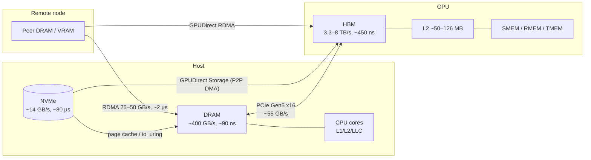

# Systems Programming for LLM Inference

**Scope of fundamental knowledge, and a learning path to acquire it.**

The goal is not "learn Linux internals." The goal is to be the person who can look at a
serving deployment and say *which physical resource is the binding constraint, by how much,
and what mechanism removes it* — across CPU, cache, DRAM, PCIe, VRAM, NVMe, and RDMA fabric.

---

## 0. Calibration and the organizing idea

### What this assumes you already have

This repo already contains the two halves of the stack that most people stop at:

| You have | Where | What it gives you |
|---|---|---|
| GPU microarchitecture | [`gpu-architecture/`](../gpu-architecture/modern-gpu-microarchitrue.md) | SM, SMEM, TMA, tensor cores, TMEM, per-generation specs |
| Kernel-level optimization | [`kernel-programming/`](../kernel-programming/GEMM.md) | Tiling, pipelining, warp specialization |
| Serving engine internals | [`learning-sglang/`](../learning-sglang/architecture/README.md) | Scheduler, batching, KV cache, PD disaggregation |
| **Your lab hardware** | [`lab-dgx-spark.md`](lab-dgx-spark.md) | Measured GB10 inventory + per-phase feasibility |

All three live **inside one GPU, or inside one Python process**. What's missing is the layer
those two rest on: the host that feeds the GPU, the buses the bytes cross, the tiers the bytes
live in, and the fabric that connects boxes. That layer is where the next order of magnitude is,
and it is exactly what the two WiCi posts are about.

### The one idea everything hangs off

> **LLM inference is a byte-movement problem wearing a compute problem's clothes.**

Decode is memory-bound almost everywhere that matters. Every real optimization is one of four
verbs applied to bytes:

| Verb | Meaning | Examples |
|---|---|---|
| **Fewer** | Move less data per token | Quantization, MLA/GQA, prefix reuse, sparsity, speculative decoding |
| **Closer** | Move it over a fatter or shorter wire | HBM > NVLink > DRAM > PCIe > NVMe > RDMA; NUMA placement; P2P DMA |
| **Earlier** | Move it before it's needed, so the move hides | Prefetch, async copy, deep queues, double-buffering, CUDA graphs |
| **Shared** | Don't move it at all — one copy, many consumers | Radix/prefix cache, page tables, CUDA IPC, KV cache stores, dedup weights |

The two reference posts are each one verb taken seriously:
[*The SSD Is the New VRAM*](https://wici.ai/article/ssd-is-the-new-vram.html) is **Closer + Earlier**
(a new tier, and the prefetch problem that makes it usable);
[*The GPU Never Learned to Share*](https://wici.ai/article/gpu-never-learned-to-share.html) is
**Shared** (VRAM as a schedulable, multi-tenant resource rather than a private heap).

### The pipeline you are learning to control



Every arrow is a bandwidth, a latency, a queue, a control-plane API, and a failure mode.
**Mastering this layer = being able to write down all five for every arrow, from memory,
then measure them on real hardware and explain the delta.**

---

# Part I — Scope of Fundamental Knowledge

Eight domains. For each: why an inference engineer cares, what to master, the **control surface**
(the actual knobs and APIs — you asked to *control* these, not just understand them), and how you
prove you know it.

---

## D0 — Quantitative foundations

The cheapest domain and the highest leverage. Skipping it produces cargo-cult tuning.

**Master**
- **Roofline**: arithmetic intensity, ridge point, why prefill and decode sit on opposite sides.
- **Bandwidth–delay product**: `bytes_in_flight = bandwidth × latency`. The single most reusable
  formula in this document — it governs NVMe queue depth, PCIe descriptor batching, RDMA
  outstanding-WR count, and CUDA stream depth *identically*.
- **Little's Law**: `concurrency = throughput × latency`. Why a serving system's batch size,
  its queue depth, and its p99 are three views of one number.
- **Tail latency**: why p99 is dominated by rare synchronous events (major faults, `cudaMalloc`,
  TLB shootdowns, C-state exit, GC-like allocator stalls), not by the average path.
- **Amdahl on a pipeline**: a serialized 5% is a hard ceiling; overlap is worth more than speed.

**Derive by hand, no notes** (see Part II for the answers):
1. Peak decode tok/s for a 70B dense model at FP8 on one H100.
2. Batch size at which the linear layers stop being memory-bound.
3. KV cache bytes/token for Llama-3-70B vs DeepSeek-style MLA.
4. Bytes in flight needed to saturate a PCIe-5 NVMe drive.
5. Tok/s ceiling for 4-bit MoE weight streaming straight off NVMe — and what cache hit rate
   closes the gap to interactive speed.

---

## D1 — CPU core, cache, and the memory model

The host is not "just glue." In a well-optimized engine the CPU is the thing that stalls
the GPU: scheduler overhead, sampling, detokenization, per-step launch cost, memory pinning.

**Master**
- Cache hierarchy: line size (64 B, 128 B sectored on some ARM), inclusive vs exclusive LLC,
  sliced LLC and its address hash, set/way structure, why 2 MB-strided access destroys you.
- Coherence: MESI/MOESI/MESIF, snoop filters, **false sharing**, cacheline ping-pong, and why
  an innocent shared counter costs 100 ns per increment across sockets.
- Store buffers, memory ordering (TSO on x86 vs weak on ARM), `mfence`/`dmb`, and how
  `Acquire`/`Release`/`SeqCst` map to actual instructions on each.
- Hardware prefetchers: streamer, adjacent-line, stride; when they help and when they pollute.
- Non-temporal stores and cache-bypassing copies — the right way to write a 100 GB KV blob to
  DRAM without evicting your working set.
- TLB: entry counts per level, huge-page TLB reach, TLB shootdown IPIs as a p99 source.
- SIMD on the host path where it matters (memcpy, dequant, sampling, hashing for prefix cache).

**Control surface**
```
CPU:     sched_setaffinity(2), cgroup v2 cpuset, isolcpus / nohz_full / rcu_nocbs,
         SCHED_FIFO / SCHED_DEADLINE, cpupower, intel_idle.max_cstate, uncore freq
Cache:   CLFLUSHOPT / CLWB, PREFETCHT0/T1/NTA, MOVNTDQ non-temporal stores,
         Intel CAT + MBA via resctrl (/sys/fs/resctrl) — real LLC partitioning,
         ARM MPAM, HW-prefetcher MSR 0x1A4
Barrier: fence / atomic Ordering, compiler barriers, volatile MMIO accessors
```

> **Note.** Intel CAT/MBA via `resctrl` is the closest thing to "allocating cache" that exists on
> commodity silicon, and almost nobody in the ML world uses it. On a box where the inference
> data plane shares an LLC with a tokenizer pool or a metrics agent, it is a genuine tail-latency
> tool. Learn it — it's a differentiator. **x86-only**; ARM's equivalent is MPAM, which is not
> exposed on the Spark, so this lab needs borrowed Xeon/EPYC time.

---

## D2 — DRAM and NUMA

Host DRAM is tier-2 for KV cache and tier-2 for weights. Its bandwidth is 5–20× *below* HBM,
so the moment you offload, DRAM becomes the new bottleneck — and NUMA can halve it silently.

**Master**
- DDR5 organization: channels, sub-channels, ranks, bank groups, rows; row-buffer hit vs
  miss vs conflict; `tRCD/tRP/tCL`; read/write turnaround penalty; refresh.
- Why streaming reads get ~70–75% of theoretical and mixed read/write gets much less.
- NUMA: node distance, local vs remote latency and bandwidth, interleaving vs first-touch,
  **which NUMA node your GPU and your NIC are attached to** (this is the one that bites).
- Huge pages: THP vs explicit hugetlbfs, 2 MB vs 1 GB, allocation-time cost, fragmentation,
  and their effect on TLB reach for a 100 GB pinned KV pool.
- Page pinning and its real cost: `mlock`, `pin_user_pages`, why pinned memory is a
  system-wide scarce resource and what happens when you over-pin.
- Memory tiering as a kernel concept (NUMA demotion, `numa_balancing`, DAMON) — and CXL as
  where this is going.

**Control surface**
```
Placement:  numactl, mbind(2), set_mempolicy(2), first-touch discipline, --interleave
Pages:      hugetlbfs, /sys/kernel/mm/transparent_hugepage/*, MADV_HUGEPAGE,
            MADV_DONTNEED / MADV_FREE / MADV_COLD / MADV_POPULATE_WRITE
Pinning:    mlock/mlockall, RLIMIT_MEMLOCK, cudaHostRegister/cuMemHostRegister
Observe:    numastat, numactl -H, /proc/*/numa_maps, DAMON, perf c2c, Intel PCM / pcm-memory
```

---

## D3 — The kernel: scheduling, the syscall path, and I/O interfaces

**Master**
- Cost model of crossing the kernel boundary: syscall (~60–300 ns), context switch (~1–3 µs),
  minor fault (~1–2 µs), **major fault to NVMe (~80–100 µs, synchronous)**.
- CFS/EEVDF basics, priority, preemption, and why a runaway tokenizer thread on the same core
  as your scheduler loop shows up as p99 jitter.
- Interrupt path: IRQ affinity, softirq, NAPI, threaded IRQs, and interrupt coalescing.
  Polled vs interrupt-driven completion, and when each wins.
- `mmap` semantics in depth: MAP_POPULATE, MAP_LOCKED, MAP_HUGETLB, page-cache-backed vs
  anonymous, readahead, and **the mmap fault-storm pathology** the SSD post describes.
- `io_uring`: SQ/CQ rings, submission batching, registered buffers and files, `IORING_SETUP_SQPOLL`,
  `IOPOLL`, linked SQEs, multishot, and how it compares to psync/libaio/SPDK.
- cgroup v2: `cpuset`, `memory.max`, `io.max`, and PSI as a pressure signal.
- eBPF as your universal instrument: kprobes, tracepoints, USDT, and writing a one-off
  `bpftrace` script instead of guessing.

**Control surface**
```
Sched:  cgroup v2, chrt, taskset, isolcpus/nohz_full, /proc/sys/kernel/sched_*
IRQ:    /proc/irq/N/smp_affinity, irqbalance off, ethtool -C, threadirqs
IO:     io_uring (SQPOLL/IOPOLL/registered buffers), O_DIRECT, posix_fadvise,
        /sys/block/*/queue/{nr_requests,scheduler,read_ahead_kb,nomerges}
Probe:  perf, bpftrace, ftrace, blktrace/blkparse, PSI (/proc/pressure/*)
```

> **Note.** `mmap`-based weight loading is the default in llama.cpp-style stacks and it is
> precisely the wrong primitive for cold MoE experts: every miss is one small synchronous
> fault, which is the anti-pattern of "large, aligned, deeply queued." This is the mechanism
> behind the SSD post's 2–5 GB/s realized on a 14 GB/s drive. Understand it at fault-handler
> level, not slogan level.

---

## D4 — PCIe, DMA, and the IOMMU

The bus everyone quotes and almost nobody measures. Every heterogeneous optimization —
GPUDirect Storage, GPUDirect RDMA, P2P, kernel-bypass drivers — is a PCIe topology question first.

**Master**
- Topology: Root Complex, switches, endpoints; **which devices share an upstream port**;
  root-port P2P support vs switch P2P; how to read `lspci -tv` and a `nvidia-smi topo -m`.
- Link math: Gen4/5/6 GT/s → GB/s, encoding overhead, x16 vs x8 vs bifurcation, and why an
  M.2 slot wired x4 to the chipset is not the same drive as one wired x4 to the CPU.
- TLPs: MRd/MWr, posted vs non-posted, max payload size, max read request size, completion
  credits, relaxed ordering, and **why an MMIO read costs ~1 µs while an MMIO write is ~free**.
- DMA: descriptor rings, doorbells, MSI/MSI-X, and who owns a buffer when.
- IOMMU: IOVA vs PA, VT-d/AMD-Vi, DMA remapping cost, IOTLB misses, passthrough vs strict mode,
  and **ACS as the setting that silently kills P2P**.
- BARs, resizable BAR, `/sys/bus/pci/devices/*/resource*` mapping, and VFIO as the sanctioned
  route to a user-space driver.

**Control surface**
```
Topology:  lspci -tvv, nvidia-smi topo -m, /sys/bus/pci/devices/*/numa_node
Tuning:    setpci MaxPayload/MaxReadReq, ASPM off, pcie_aspm=off,
           intel_iommu=on,iommu=pt, ACS override (dev boxes only)
Bypass:    VFIO (/dev/vfio), vfio-pci binding, hugepage-backed DMA buffers
Measure:   nvbandwidth, p2pBandwidthLatencyTest, Intel PCM PCIe counters,
           perf uncore events, GPU-side DMA counters
```

> **Note.** "PCIe Gen5 x16 = 64 GB/s" is one direction, theoretical. Realized H2D on a well-tuned
> host with pinned memory is ~50–55 GB/s; with pageable memory it's roughly half, because the
> driver stages through its own bounce buffers. Meanwhile NVIDIA quotes NVLink **bidirectionally**
> (900 GB/s on H100 = 450 each way). Comparing a bidirectional NVLink number to a unidirectional
> PCIe number is the most common arithmetic error in this field.

---

## D5 — NVMe and the storage tier

The subject of the SSD post: the only tier with capacity headroom at consumer prices, and
the one where realized-vs-rated bandwidth is a chasm rather than a gap.

**Master**
- NVMe controller model: BAR registers, admin vs I/O queues, SQ/CQ pairs per core, doorbells,
  completion phase tags, PRP vs SGL, namespaces, LBA format and 4K vs 512e.
- Why bandwidth requires **large + aligned + deeply queued**: apply the BDP formula
  (14 GB/s × 80 µs ≈ **1.1 MB must be in flight at all times**).
- The realized-bandwidth ladder for the *same* drive: `mmap` faults → buffered `pread` →
  `O_DIRECT` + libaio → `io_uring` + registered buffers → `io_uring` SQPOLL/IOPOLL →
  SPDK user-space poll-mode. Know the cost and the gain of each step.
- Page cache: when it's a gift (shared weights across processes) and when it's a tax
  (double copy, eviction pressure, unpredictable faults).
- SSD physics that leak into your tail: SLC cache exhaustion, GC/write amplification,
  thermal throttling under sustained read, and namespace/ZNS options.
- **GPUDirect Storage / cuFile**: the NVMe → VRAM P2P DMA path, its requirements
  (IOMMU config, driver support, topology), its compatibility mode, and where it silently
  falls back to a CPU bounce buffer.
- Multi-tenancy: the drive is a contended, schedulable resource too (`io.max`, per-QP fairness).

**Control surface**
```
APIs:      io_uring, O_DIRECT, cuFile (cuFileRead/cuFileBufRegister), SPDK, nvme-cli
Tuning:    nr_requests, scheduler=none, read_ahead_kb, nomerges, per-core queue pairing
Measure:   fio (the reference harness), blktrace, iostat -x, nvme smart-log,
           gdsio (GDS's own bench), bpftrace on block tracepoints
```

---

## D6 — The GPU as a system resource

Not the SM — the *device*. This is the subject of the sharing post: VRAM as a
schedulable, multi-tenant, non-free-to-migrate resource.

**Master**
- Driver model: CUDA contexts, primary context, the difference between the runtime and driver
  API, and what actually happens on `cudaMalloc` (it can synchronize, and it can cost milliseconds).
- Memory kinds and their real properties: device, pinned host, mapped/zero-copy, managed (UVM),
  and now `cuMemCreate`/`cuMemMap` VMM APIs (the ones that let you build your own allocator with
  physical-page granularity — the primitive under vLLM/SGLang-style paged memory).
- Streams, events, priorities, and the launch-overhead problem: ~3–8 µs per kernel launch,
  and why **CUDA graphs** exist for decode loops that issue hundreds of tiny kernels per token.
- UVM/HMM: page-fault-driven migration, prefetch hints (`cudaMemAdvise`,
  `cudaMemPrefetchAsync`), thrashing, and oversubscription behavior.
- **Coherent platforms** — GB10 / GH200 / GB200 over NVLink-C2C, ATS, system-allocated memory
  addressable directly by kernels. On these, the "copy to device" step *disappears*: GPU memory
  and host memory are one physical pool with hardware coherence. This is where the industry is
  going, it is what your Spark is, and it invalidates a surprising amount of received offloading
  wisdom. Learn what still costs something when the copy is free.
- **Sharing mechanisms and their trade-offs**: time-slicing, MPS, MIG, green contexts,
  stream priorities — what each isolates (memory? SMs? faults?) and what each costs.
- CUDA IPC: passing a device pointer between processes, its lifetime rules, and why it's the
  only real primitive for de-duplicating identical weights across independent local processes.
- Peer access: `cudaDeviceEnablePeerAccess`, NVLink vs PCIe P2P fallback, and NVSHMEM.

**Control surface**
```
Memory:   cuMemCreate / cuMemMap / cuMemSetAccess (VMM), memory pools,
          cudaHostRegister, cudaIpcGetMemHandle, cudaMallocAsync
Sharing:  MPS (with active-thread-percentage + pinned-mem-limit), MIG profiles,
          green contexts, stream priority, CUDA_DEVICE_MAX_CONNECTIONS
Schedule: CUDA graphs, events, cudaLaunchHostFunc, persistent kernels
Observe:  Nsight Systems, DCGM/dcgmi, nvidia-smi dmon, CUPTI, nvbandwidth
```

> **Note.** The sharing post's core claim is worth internalizing precisely: a CPU context switch
> moves a register file in microseconds; a GPU "context switch" for an AI tenant means moving
> gigabytes of resident state across a bus, in seconds. Any scheduling scheme you design must
> price the *residency*, not the time slice. That reframing is the whole insight.

---

## D7 — RDMA and collectives

Two nodes are one machine only if the fabric makes them one. This is where disaggregated
prefill/decode, remote KV cache stores, and expert-parallel MoE actually live.

**Master**
- Verbs object model: device context, PD, MR (`lkey`/`rkey`), CQ, QP, and their state machine
  (RESET → INIT → RTR → RTS). Memory registration cost and ODP as the alternative.
- One-sided (`RDMA_READ`/`WRITE`/atomics) vs two-sided (`SEND`/`RECV`): which needs the remote
  CPU, which needs a pre-posted receive, and the design consequences.
- Transports: RC vs UC vs UD, inline sends, doorbell batching, WR signaling policy, completion
  polling vs event-driven, and per-QP scaling limits (NIC cache thrash with many QPs).
- RoCEv2 realities: PFC, ECN/DCQCN, congestion collapse, lossy vs lossless fabric debates.
  Being able to reason about incast is what separates working RDMA from demo RDMA.
- **GPUDirect RDMA**: NIC → VRAM DMA without a host bounce, and the topology/ACS conditions
  that make it real. Same PCIe P2P question as GDS, different endpoint.
- **NCCL / NVSHMEM**: rings vs trees, SHARP in-network reduction, how the algorithm maps onto
  NVLink and RDMA, `NCCL_*` tuning, and how to read `NCCL_DEBUG=INFO` topology output.
  Every TP/EP all-reduce cost you'll ever debug bottoms out here.

**Control surface**
```
APIs:     libibverbs / rdma-core, librdmacm, UCX, NVSHMEM, NCCL
Tuning:   MTU, GID index, service level, PFC/ECN config, ib_write_bw/ib_read_lat,
          NCCL_ALGO / NCCL_PROTO / NCCL_IB_HCA / NCCL_NET_GDR_LEVEL
Observe:  perfquery, ibdev2netdev, ethtool -S, NIC counters, rdma statistic,
          Nsight Systems NVTX + NCCL trace
Cheap lab: Soft-RoCE (rdma_rxe) over loopback/veth — full verbs API, no hardware
```

---

## D8 — Measurement and observability (crosscutting)

**This is the domain that makes the other eight real.** If you can't measure it you'll optimize
noise. Treat this as a co-requisite of every phase, not a phase of its own.

| Layer | Primary tools | The question it answers |
|---|---|---|
| CPU / cache | `perf stat/record`, `perf c2c`, `toplev`, Intel PCM | Where do cycles go? Which stall? False sharing? |
| DRAM / NUMA | `pcm-memory`, `numastat`, STREAM, `perf mem` | Am I at DRAM roof? Am I hitting a remote node? |
| Kernel / sched | `bpftrace`, `ftrace`, `perf sched`, PSI, flame graphs | What's blocking? What's the jitter source? |
| PCIe | `nvbandwidth`, PCM PCIe counters, `p2pBandwidthLatencyTest` | Real link throughput; is P2P active or bounced? |
| Storage | `fio`, `blktrace`, `iostat -x`, `gdsio` | Realized vs rated; queue depth; latency distribution |
| GPU | Nsight Systems, Nsight Compute, DCGM, CUPTI | Gaps in the timeline; occupancy; which kernel; HBM util |
| Network | `ib_write_bw`, `ib_read_lat`, NIC counters, NCCL tests | Line rate? Congestion? Which algorithm did NCCL pick? |
| End-to-end | NVTX-annotated Nsight trace of one token, distributed tracing | Where does a token's latency actually go? |

**The exercise that ties it together:** take one decode step in SGLang, annotate it with NVTX,
capture it in Nsight Systems, and account for **100% of the wall clock** — kernel time, launch
gaps, host-side Python, memcpy, collective, and sync. Do this once and your intuition changes
permanently.

---

## The mapping: inference phenomenon → domain

Use this table in reverse when debugging. It's the practical payoff of the whole scope.

| Symptom you see in serving | Real cause lives in | Verb |
|---|---|---|
| Decode tok/s far below HBM roofline | D0, D6 (launch overhead, no CUDA graph, host stall) | Earlier |
| GPU timeline full of gaps between kernels | D1, D3, D6 (host scheduling, syscalls, Python) | Earlier |
| Batch scaling stops helping | D0 (past ridge point — now compute-bound) | Fewer |
| KV offload to host is slower than recompute | D4, D2 (PCIe:HBM is ~60:1, DRAM is not free) | Closer |
| Offload works in bench, thrashes in prod | D6 (UVM page-fault migration), D2 (pinning limits) | Earlier |
| NVMe weight streaming at 1/4 rated speed | D5, D3 (mmap faults; too few bytes in flight) | Earlier |
| GDS enabled but no speedup | D4 (no P2P path; ACS on; fell back to bounce buffer) | Closer |
| Multi-GPU all-reduce dominates step time | D7 (algorithm/protocol; PCIe instead of NVLink) | Closer |
| p99 latency 10× p50, p50 is fine | D1/D3 (faults, shootdowns, C-states, allocator sync) | — |
| Two models on one GPU, both slow | D6 (no VRAM scheduling — *the sharing post's thesis*) | Shared |
| Same base model loaded 3× on one box | D6 (no CUDA IPC dedup — also the sharing post) | Shared |
| Remote KV fetch stalls the decode loop | D7 (sync verbs, shallow WR depth, no GDR) | Earlier |

---

# Part II — Numbers You Must Know Cold

Order-of-magnitude, 2026-era datacenter parts. **Measure these on your own box** — the point is
to carry the ratios in your head, then know where your hardware deviates.

## The tier ladder

| Tier | Capacity | Bandwidth | Latency | $/GB | Ratio vs H100 HBM |
|---|---|---|---|---|---|
| Register / SMEM | KB | ~10s TB/s | ~1–30 cyc | — | — |
| GPU L2 | 50 MB (H100) / 126 MB (B200) | ~10 TB/s | ~150–250 ns | — | ~3× faster |
| **HBM3 (H100)** | 80 GB | **3.35 TB/s** | ~450–500 ns | high | **1×** |
| HBM3e (H200 / B200) | 141 / 192 GB | 4.8 / 8.0 TB/s | ~450 ns | high | 1.4× / 2.4× |
| NVLink 4 / 5 (per GPU) | — | 900 GB/s / 1.8 TB/s **bidir** | ~1–2 µs | — | ~7× / ~9× slower |
| CPU LLC | 32–500 MB | ~1 TB/s+ | ~20–40 ns | — | — |
| DDR5, 12-ch server | 1–6 TB | ~400 GB/s realized (576 theo.) | ~90–110 ns | ~$5–15 | **~8× slower** |
| DDR5, 2-ch desktop | ≤256 GB | ~70–80 GB/s realized | ~80–100 ns | ~$11–15 | ~45× slower |
| Remote NUMA DRAM | — | ~50–70% of local | ~140–200 ns | — | — |
| PCIe Gen5 x16 | — | 64 GB/s theo, **~50–55 realized** (1 dir) | ~0.5–1 µs | — | **~60× slower** |
| PCIe Gen4 x16 | — | 32 theo / ~26 realized | ~1 µs | — | ~130× slower |
| RDMA 400 GbE (CX-7) | — | ~50 GB/s | ~2 µs RTT | — | ~65× slower |
| **NVMe PCIe 5** | multi-TB | **~14 GB/s seq**, 2.5M IOPS | **~80 µs** | **~$0.10–0.20** | **~240× slower** |
| Object store / network FS | ∞ | ~1–10 GB/s | ms | ~$0.02 | ~1000× slower |

## Operation costs

| Operation | Cost |
|---|---|
| L1 hit / L2 hit / LLC hit | ~1 ns / ~4 ns / ~20–40 ns |
| Local DRAM / remote NUMA DRAM | ~90 ns / ~150 ns |
| Atomic contended across cores (false sharing) | ~50–100 ns each |
| Syscall / context switch | ~60–300 ns / ~1–3 µs |
| Minor page fault / **major fault to NVMe** | ~1–2 µs / **~80–100 µs, synchronous** |
| MMIO write (posted) / **MMIO read (non-posted)** | ~10s ns / **~1 µs** |
| CUDA kernel launch / **CUDA graph replay (whole graph)** | ~3–8 µs / **~2–4 µs total** |
| `cudaMalloc` (may synchronize) | ~100 µs – ms |
| TLB shootdown IPI (many cores) | ~10s of µs |
| RDMA write, small, rack-local | ~1.3–2 µs RTT |

## Derived rules of thumb

1. **Decode ceiling.** `tok/s ≤ HBM_BW / bytes_touched_per_token`.
   70B @ FP8 = 70 GB → 3350/70 ≈ **48 tok/s** single-stream on H100, before any overhead.
   If you're at 20, the missing 28 is host overhead, not the GPU.

2. **The ~300-token ridge.** For weight-stationary GEMM, arithmetic intensity is
   `2B/bytes_per_weight` FLOP/byte. On H100: BF16 ridge = 989/3.35 ≈ 295; FP8 ridge = 1979/3.35 ≈ 590
   at 1 B/weight → also ≈ 295. On B200 it lands ≈ 281. So:
   **you need roughly 300 concurrent tokens before linear layers become compute-bound —
   and that number is nearly precision- and generation-invariant.** Below it, you are buying
   bandwidth, not FLOPs, and FP4 tensor cores do nothing for you.

3. **KV cache per token** `= 2 × layers × kv_heads × head_dim × dtype_bytes`.
   Llama-3-70B FP16: `2×80×8×128×2` ≈ **320 KB/token** → a 1M-token context is ~320 GB.
   MLA-style compressed KV: ~70 KB/token BF16 — **~5× fewer bytes**, which is why the
   architecture choice is a systems choice.

4. **Bandwidth–delay product** `= BW × latency`. To saturate:
   NVMe (14 GB/s × 80 µs) ≈ **1.1 MB in flight**;
   RDMA (50 GB/s × 2 µs) ≈ **100 KB in flight**;
   PCIe (55 GB/s × 1 µs) ≈ **55 KB in flight**.
   Every "why is my device at 20% of rated speed" question is this formula unsatisfied.

5. **MoE-off-NVMe arithmetic** (the SSD post's central claim). A 750B-class MoE with ~40B active
   params at 4-bit = ~20 GB/token. At 14 GB/s that's **0.7 tok/s**. To reach a usable ~20 tok/s
   you must serve ~**97%+ of active-expert bytes from DRAM/VRAM cache** and fetch only the cold
   remainder. The entire engineering problem is that hit rate: prediction, prefetch, and layout —
   not the drive's spec sheet.

6. **Offload viability test.** Moving a byte to host DRAM and back costs ~2/55 GB/s of PCIe.
   Only worth it if `reuse_count × HBM_saving > transfer_cost`, or if the transfer fully overlaps
   compute. Compute the overlap budget explicitly before designing; most offload schemes die here.

## Your box is a different point in this space

Recompute all six rules for the Spark before you trust any of them — the *ratios* are what you're
learning, and yours are not a serving box's. See [lab-dgx-spark.md §2](lab-dgx-spark.md#2-what-this-box-uniquely-teaches).

| | H100 server | **DGX Spark (GB10)** |
|---|---|---|
| GPU-visible bandwidth | 3350 GB/s HBM3 | **273 GB/s LPDDR5X** (12× less) |
| NVMe sequential read | ~14 GB/s | ~14 GB/s (Gen5 ×4) — **the same** |
| **Storage : memory gap** | **≈ 240 : 1** | **≈ 20 : 1** |
| Host↔GPU | PCIe Gen5, ~55 GB/s, explicit copy | **none — coherent, zero-copy** |
| Rule 1 applies? | Yes, against HBM | Yes, against LPDDR5X — same formula, 12× smaller answer |
| Rule 6 applies? | Yes | **No — there is no transfer to price** |

The lesson isn't that the Spark is slow. It's that **rule 6 disappears entirely on a coherent
platform**, and rule 5's hopeless-looking arithmetic becomes a solvable engineering problem when
the gap is 20:1 instead of 240:1. Which rules survive a hardware change, and why, is the actual
skill.

---

# Part III — The Learning Path

Eight phases. Each phase states its **goal**, what to **master**, what to **measure**, what to
**build**, and an **exit test** — a question you must be able to answer with a number and a
measurement, not a paragraph. The exit tests are the actual curriculum; the reading is support.

Estimated **~7–9 months at 10–12 h/week**, assuming the calibration in §0 holds. Phases 1–3 are
strictly ordered. Phases 4–6 can be reordered to match hardware availability.

```
Phase 0  Quantitative baseline + measurement harness
   │
Phase 1  Host: cores, caches, DRAM, NUMA
   │
Phase 2  Kernel control planes + io_uring
   │
Phase 3  PCIe, DMA, IOMMU, VFIO
   │
   ├── Phase 4  NVMe deep + kernel bypass + GPUDirect Storage
   ├── Phase 5  GPU as system resource: contexts, memory, sharing
   └── Phase 6  RDMA + collectives
   │
Phase 7  Capstone (pick one of two tracks)
```

---

### Phase 0 — Quantitative baseline and a measurement harness *(2 weeks)*

**Goal.** Never again optimize without a number. Build the harness you'll use for eight months.

**Master.** Roofline; BDP; Little's Law; how to read `perf stat` and an Nsight Systems timeline;
p50/p99/p99.9 discipline and why you report distributions, not means.

**Measure.** Reproduce every number in Part II on hardware you control. Where you deviate >2×,
explain why.

**Build.** `labs/00-harness/` — a small benchmarking library (Rust or C, your call) providing:
monotonic timing with proper fences, percentile accumulation (HDR-histogram style), CPU pinning,
warmup/steady-state separation, and a CSV writer. Everything later plugs into it.

**Exit test.**
- Draw the roofline for your GPU, place prefill and decode on it, and justify both positions.
- Given a 70B FP8 model and one H100, state peak decode tok/s and the batch size at which the
  MLPs become compute-bound. Show the arithmetic.
- Explain, with a measurement, why the arithmetic mean of your latency samples is misleading.

---

### Phase 1 — The host: cores, caches, DRAM, NUMA *(3 weeks)*

**Goal.** Control where a byte lives on the CPU side, and prove it with hardware counters.

**Master.** D1 and D2 in full.

**Measure.** Cache-line latency ladder via pointer chase (L1→L2→LLC→DRAM→remote-DRAM).
STREAM triad per NUMA node. `perf c2c` on a deliberately false-shared struct. TLB-miss rate
with and without huge pages on a multi-GB working set.

**Build.** `labs/01-host/`
1. A pointer-chase latency prober that recovers your cache sizes and NUMA distances from scratch.
2. A cache-line-aligned lock-free **SPSC ring buffer** (no dependencies), then measure the
   throughput delta between the padded and unpadded versions — the false-sharing tax, in ns.
3. A NUMA-aware, huge-page-backed, pinned **KV-block pool allocator**: fixed-size blocks,
   first-touch on the right node, `MADV_HUGEPAGE`, free-list, and a bump path.

**Exit test.**
- Report your machine's full latency ladder and STREAM bandwidth per node — measured, not spec.
- Quantify the false-sharing penalty on your CPU in ns/op, and show the `perf c2c` evidence.
- Show huge pages changing your TLB miss rate, and state the working-set size at which it starts
  to matter on your part.
- Partition LLC with `resctrl` between two processes and demonstrate the isolation with counters.

---

### Phase 2 — Kernel control planes and the I/O path *(3 weeks)*

**Goal.** Make the kernel's cost model concrete, then bypass the parts you don't need.

**Master.** D3 in full. `io_uring` to the point where you can explain each ring pointer.

**Measure.** Syscall cost; minor vs major fault cost; the **realized-bandwidth ladder for one
file on one drive** across `mmap` / buffered `pread` / `O_DIRECT` + libaio / `io_uring` /
`io_uring` + registered buffers + SQPOLL. Plot it. This single chart is the SSD post's thesis,
reproduced by you.

**Build.** `labs/02-iouring/`
1. A minimal `io_uring` client written against the raw rings (`io_uring_setup` + `mmap`, no
   liburing) — you must have touched the SQ/CQ pointers yourself once.
2. A multi-threaded **zero-copy page cache** over a large file: registered buffers, one ring per
   core, configurable QD and block size, with a hit/miss/latency dashboard.
3. A `bpftrace` script that histograms block-layer latency and counts major faults for one PID.

**Exit test.**
- Produce the realized-bandwidth ladder chart and explain each step's gain in terms of BDP.
- State the exact queue depth × block size your drive needs to hit rated bandwidth — derived
  from BDP first, then confirmed with `fio`.
- Demonstrate the mmap fault-storm pathology on a random-access pattern and quantify it.

---

### Phase 3 — PCIe, DMA, and the IOMMU *(3 weeks)*

**Goal.** Read a machine's topology like a map, and drive a device from user space.

**Master.** D4 in full.

**Measure.** Your box's real H2D/D2H/P2P bandwidth (`nvbandwidth`) vs theoretical; the MMIO read
vs write asymmetry; DMA bandwidth with IOMMU strict vs passthrough.

**Build.** `labs/03-pcie/`
1. A topology tool: walk `/sys/bus/pci`, emit a tree with link speed/width, NUMA node, and
   IOMMU group per device, and flag P2P-capable pairs. Cross-check against `nvidia-smi topo -m`.
2. A VFIO user-space driver skeleton: bind a device, map its BARs, allocate hugepage-backed
   DMA buffers, program the IOMMU, ring a doorbell, poll for completion. (Use a spare NIC or
   NVMe drive — this **destroys** the kernel's binding to the device; do it on a scratch box.)

**Exit test.**
- Given `lspci -tv` on an unfamiliar server, predict which GPU/NIC/NVMe triples can do P2P,
  and which NUMA node each should be pinned to. Then verify.
- Explain why your measured PCIe bandwidth differs from `Gen × lanes` arithmetic, itemized.
- State what ACS does and demonstrate a P2P path failing and then working.

---

### Phase 4 — NVMe deep, kernel bypass, and GPUDirect Storage *(4 weeks)*

**Goal.** Get a real drive to real rated bandwidth into VRAM, and know exactly which stops the
bytes made.

**Master.** D5 in full. Read enough of the NVMe spec to program a queue pair by hand.

**Measure.** `fio` sweep across block size × QD × thread count → a bandwidth surface, not a point.
`gdsio` with and without GDS. Confirm GDS is actually doing P2P (counters, not the API return code).

**Build.** `labs/04-nvme/`
1. A user-space NVMe driver on top of your Phase-3 VFIO work: admin queue, one I/O queue pair,
   PRP lists, doorbells, polled completion. Read one LBA. Then read at rated bandwidth.
   (Compare against SPDK's implementation afterward — read its source as the answer key.)
2. A **weight-streaming loader**: given a large safetensors-style file and an access trace,
   stream tensors into VRAM via (a) `mmap`+`cudaMemcpy`, (b) `io_uring`+pinned staging, (c) cuFile/GDS.
   Report achieved GB/s and CPU utilization for each.

**Exit test.**
- Hit ≥80% of your drive's rated sequential read from your own user-space driver.
- Produce a three-way comparison of the disk→VRAM paths with a per-path byte-stop diagram, and
  say under which conditions GDS loses to a well-tuned `io_uring` + pinned-buffer path.
  *(It does lose sometimes. Knowing when is the deliverable.)*
- Reproduce the SSD post's core gap: naive path vs tuned path on the same drive, same file.

---

### Phase 5 — The GPU as a system resource *(3 weeks)*

**Goal.** Treat VRAM as an allocator and a scheduler problem, not a heap.

**Master.** D6 in full.

**Measure.** Kernel launch overhead vs CUDA-graph replay for a realistic decode step. UVM
migration throughput and fault rate under oversubscription. MPS vs time-slicing throughput under
two contending tenants. `cudaMalloc` latency distribution.

**Build.** `labs/05-gpu/`
1. A **paged VRAM allocator** on the CUDA VMM APIs (`cuMemCreate`/`cuMemMap`/`cuMemSetAccess`):
   fixed-size physical blocks, a virtual address reservation, map/unmap on demand. This is the
   primitive under PagedAttention — build it yourself and the SGLang KV allocator becomes obvious.
2. A **two-process weight-sharing daemon** using CUDA IPC: process A loads weights and publishes
   IPC handles; process B maps them and runs a forward pass with zero extra VRAM. Measure the
   VRAM saved. This is the sharing post's "Shared" verb, implemented.
3. Instrument a real SGLang decode step with NVTX and account for 100% of its wall clock.

**Exit test.**
- Show the VRAM saved by IPC dedup for N processes sharing one model, and state the exact
  safety condition that makes the sharing sound (what must be provably immutable, and why a false
  positive is catastrophic while a false negative is merely wasteful).
- Quantify launch overhead as a % of your decode step, before and after CUDA graphs.
- Given two tenants on one GPU, present the throughput/isolation trade-off matrix for
  time-slicing vs MPS vs MIG **with your own measurements**, and say which resource each fails to isolate.

---

### Phase 6 — RDMA and collectives *(4 weeks)*

**Goal.** Make two boxes behave like one memory system, and know what the fabric costs.

**Master.** D7 in full.

**Measure.** `ib_write_bw` / `ib_read_lat` across message sizes → find the size at which you
reach line rate (it's the BDP again). NCCL all-reduce bus bandwidth vs message size vs algorithm.
GDR on vs off for NIC→VRAM.

**Build.** `labs/06-rdma/`
1. A raw-verbs ping-pong: PD, MR, CQ, QP state machine by hand. Then a one-sided `RDMA_READ`
   version. (Soft-RoCE `rdma_rxe` works for correctness; you need real hardware for numbers.)
2. A **remote KV-cache store**: server registers a KV pool as an MR and publishes `rkey`+address;
   clients fetch blocks with one-sided reads, no server CPU involvement. Add GDR so blocks land
   directly in VRAM. Measure end-to-end block-fetch latency and the decode-loop stall it causes.
3. Read `NCCL_DEBUG=INFO` output for a real TP job and explain every topology decision it made.

**Exit test.**
- State the message size at which your fabric reaches line rate, and derive it from BDP first.
- Explain when one-sided beats two-sided for KV transfer and when it doesn't (hint: it's about
  who knows the address and who pays for the completion).
- Produce a measured NCCL all-reduce cost model for your topology and use it to predict the
  communication fraction of a TP=8 decode step. Then verify against a real run.

---

### Phase 7 — Capstone *(6–8 weeks)*

Pick **one** and do it properly. Both are direct implementations of the reference posts.

#### Track A — "The SSD Is the New VRAM": an MoE expert-streaming engine

Build a serving path for an MoE model whose weights live on NVMe.

- Three-tier expert cache: VRAM (hot) → pinned DRAM (warm) → NVMe (cold), with a real
  admission/eviction policy that prices *restore cost*, not just recency.
- Layout the weight file for the access pattern: experts grouped, aligned, sized so each fetch
  is large and sequential. **Layout is half the win and it happens before any I/O code runs.**
- Prefetch driven by router prediction one or more layers ahead; measure hit rate, and implement
  a graceful miss path (the BuddyMoE idea) so a miss degrades instead of stalling.
- Disk→VRAM via GDS with an `io_uring`+pinned fallback; keep both and measure both.
- **Deliverable:** tok/s vs cache-size curve, achieved hit rate, realized GB/s vs rated, and an
  honest comparison against a naive `mmap` baseline. Report where you fell short of the 97%
  hit rate rule 5 demands.

#### Track B — "The GPU Never Learned to Share": a VRAM residency scheduler

Build a daemon that arbitrates VRAM across several independent inference processes.

- Allocation-granularity registry: processes register allocations with a class
  (immutable weights / KV / workspace) and an integrity proof for anything claimed immutable.
- Dedup identical weight allocations across processes via CUDA IPC. Measure VRAM reclaimed.
- Residency scheduling: evict at line rate to pinned DRAM (batched, large, async — the same
  "line rate, not just movement" problem as Track A, one tier up), with a policy that prices
  restore cost per tenant.
- **Deliverable:** aggregate throughput and per-tenant p99 for N tenants, versus baselines
  (naive co-location, time-slicing, MPS). Show a case where your policy wins and one where it
  loses, and explain both.

**Both tracks' real exit test:** write it up in this repo the way you wrote the Blackwell
table — with measured numbers, a comparison matrix, and a Notes section listing what surprised
you and what you got wrong.

---

# Part IV — Lab

**→ Your machine: [lab-dgx-spark.md](lab-dgx-spark.md)** — measured inventory of `spark-2970`,
what it uniquely teaches, the three things it structurally cannot, and a phase-by-phase
feasibility matrix. Read it before starting any phase.

The short version, because two facts reshape the whole plan:

1. **The GB10's GPU has no PCIe data path** (the link enumerates at Gen1 ×1). GPU memory *is*
   system LPDDR5X, coherent with the CPU over NVLink-C2C. So host↔device copies, pinned memory,
   and GPUDirect Storage-to-VRAM are not merely hard here — they don't exist. In exchange you get
   the GH200/GB200 coherent-memory programming model, which almost nobody can practice locally.
2. **Its storage:memory bandwidth gap is ~20:1, versus ~240:1 on an H100 server.** NVMe is Gen5
   ×4 and real; "VRAM" is 273 GB/s. That makes the SSD-as-VRAM capstone *more* tractable here
   than on the consumer desktop the WiCi post targets — and lands it in a live 1–14 tok/s regime.

Everything the Spark can't cover — PCIe H2D, GDS, NVLink/NCCL, MIG, NUMA, discrete-GPU bandwidth
intuition — is a handful of cloud H100 hours (budget ~$50–150 total, three focused weekends),
not a hardware purchase.

**General tiers**, if you're ever planning this for different hardware:

| Tier | Hardware | Unlocks |
|---|---|---|
| **T0** | Mac laptop | Phase 0 reading only. No `perf`, no NUMA, no VFIO, no CUDA, no verbs. |
| **T1** | Any Linux box + a **spare** NVMe drive | Phases 0–3. Highest value per dollar. |
| **T2** | T1 + consumer NVIDIA GPU | + most of Phase 5, part of 4. No MIG. |
| **T3** | Bare-metal H100/H200 | Full Phase 4 + 5. Needs bare metal or IOMMU passthrough for VFIO. |
| **T4** | 2× GPU node with CX-7, or two nodes | Phase 6 and both capstones at scale. |

**Cheap substitutes that genuinely work**
- `rdma_rxe` (Soft-RoCE) — full verbs semantics over any netdev. Correctness yes, latency no.
- QEMU with `-device vfio-pci` and an emulated NVMe — practice the VFIO/IOMMU path safely.
- **An idle NIC function as your VFIO target** when you have no spare drive. Never unbind the
  device your root filesystem is on.
- Nsight Systems profiles remote targets; no GUI needed on the box under test.

---

# Part V — Language choice

Your draft is Rust-first. That's a defensible choice and I'd keep it, with one adjustment.

| | Recommendation |
|---|---|
| **Learn mechanisms in C** | Every spec, kernel doc, vendor example, and reference implementation (SPDK, liburing, libibverbs, cuFile, NCCL) is C. Reading them *is* the curriculum; fighting an FFI layer while also learning the mechanism doubles the difficulty. Write the first version of each lab in C. |
| **Build artifacts in Rust** | Once the mechanism is clear, Rust is the better language for the thing you keep: lifetimes over DMA buffers, `Send`/`Sync` on ring ownership, and typestate for QP/queue state machines catch exactly the bugs this domain is famous for. Rewrite the labs you'll maintain. |
| **Keep Python at the edge** | The engines are Python-orchestrated. Your control plane will need to talk to them. Don't fight that. |

**Rust crates worth knowing** (your draft's table, kept — it's accurate):

| Domain | Crates |
|---|---|
| Unsafe / layout | `zerocopy`, `bytemuck`, `crossbeam-utils` (`CachePadded`) |
| Memory / mmap | `memmap2`, `nix`, `libc`, `region` |
| NUMA / affinity | `hwloc2`, `core_affinity`, `libnuma` via FFI |
| io_uring | `io-uring` (low-level, mirrors the C API — prefer it over async wrappers while learning) |
| PCIe / VFIO | `vfio-ioctls`, `vm-memory`, `vmm-sys-util` |
| NVMe | `vroom` (research user-space NVMe driver in Rust — read it), SPDK via FFI |
| CUDA | `cudarc` (driver API, actively maintained), `cust` |
| RDMA | `rdma-sys` (raw), `async-rdma` (higher level) |
| Measurement | `criterion`, `hdrhistogram`, `perf-event` |

> **Note.** Prefer the low-level crate over the ergonomic one during learning. `async-rdma` hides
> the QP state machine, which is the thing you're there to learn. Use it *after* you've built the
> ping-pong on `rdma-sys`.

---

# Part VI — Reading list

Ordered by when you'll want it, not by importance.

**Books**
- Drepper, *What Every Programmer Should Know About Memory* — dated on specifics, still the best
  single text on cache and DRAM behavior. Phase 1.
- Gregg, *Systems Performance* (2nd ed) and *BPF Performance Tools* — the measurement bible. D8, all phases.
- Hennessy & Patterson, *Computer Architecture: A Quantitative Approach* — roofline, memory
  hierarchy, interconnects. Phase 0.
- Bos, *Rust Atomics and Locks* — the best treatment of memory ordering in any language. Phase 1.
- MindShare, *PCI Express Technology 3.0* — the reference for D4. Skim, don't read cover to cover.
- Herlihy & Shavit, *The Art of Multiprocessor Programming* — if your lock-free instincts are shaky.

**Specs and vendor docs** (read the parts you need, when you need them)
- NVMe Base Specification — queues, doorbells, PRP/SGL chapters only.
- PCIe Base Spec — TLP and config-space chapters only.
- CUDA C++ Programming Guide + **CUDA Driver API** + Virtual Memory Management section.
- NVIDIA GPUDirect Storage Design Guide and cuFile API reference.
- NVIDIA *RDMA Aware Networks Programming User Manual* — the canonical verbs tutorial.
- RDMAmojo (Dotan Barak's blog) — the best verbs explanations that exist.
- Linux kernel `Documentation/`: `admin-guide/mm/`, `block/`, `driver-api/vfio.rst`, `core-api/dma-api.rst`.

**Papers** (each one is a phase's worth of context in 12 pages)
- *Attack of the Killer Microseconds* — why this whole layer exists. Read first.
- *Scalability! But at what COST?* — the discipline of honest baselines. Read second.
- *Understanding Modern Storage APIs* (io_uring vs SPDK vs psync) — Phase 2/4.
- *BaM / GIDS* — GPU-initiated storage access. Phase 4.
- FlexGen; ZeRO-Inference — offloading throughput-first. Phase 4/5.
- vLLM / PagedAttention; SGLang / RadixAttention — you know these; reread through a memory-systems lens.
- Mooncake — KV-cache-centric disaggregated serving over RDMA. Phase 6 and Track B.
- DistServe, Splitwise — prefill/decode disaggregation and why the fabric decides it. Phase 6.
- MoE-SpeQ, BuddyMoE, Mixtral-Offloading, Fiddler — expert prefetching and miss tolerance. Track A.
- FaRM, HERD, eRPC — RDMA system design and one-sided vs two-sided trade-offs. Phase 6.

**Source to read** (reading good code beats reading about it)
- `liburing` examples, then the kernel's `io_uring/` — Phase 2.
- SPDK's `nvme` driver — after you've written your own. Phase 4.
- `rdma-core` `libibverbs` + the `perftest` suite — Phase 6.
- NCCL (`src/transport/`, `src/graph/`) — how topology becomes an algorithm. Phase 6.
- vLLM / SGLang memory allocators — after Phase 5's VMM lab, so you can see what they chose and why.

---

# Part VII — Anti-patterns

Things that will waste months. Most of them are the seductive version of a real idea.

1. **Optimizing without a roofline.** If you can't say which resource is saturated, you're
   guessing. Phase 0 exists to make this impossible.
2. **Trusting spec-sheet bandwidth.** Rated is a marketing number. Realized is engineering.
   The gap between them *is* this field.
3. **Comparing bidirectional to unidirectional numbers.** NVLink is quoted bidir, PCIe unidir.
   This error makes offload schemes look 2× better than they are, on paper, forever.
4. **Reaching for kernel bypass first.** A tuned `io_uring` path often beats a naive SPDK one, and
   costs a hundredth of the maintenance. Bypass the kernel when you've measured that it's the cost.
5. **Building the mechanism before the layout.** For expert streaming, the file layout determines
   whether requests can be large and sequential. No amount of driver work fixes a bad layout.
6. **Treating `mmap` as free I/O.** It's a fault-driven, small, synchronous read generator.
   Sometimes that's fine. For random access to cold data it is the worst available option.
7. **Ignoring the host.** Many "GPU is slow" problems are launch overhead, Python, or a
   NUMA-misplaced pinned buffer. Take the Nsight trace before touching a kernel.
8. **Micro-optimizing a non-overlapped pipeline.** Overlap first (verb: *Earlier*). A perfectly
   optimized serial stage still serializes.
9. **Sharing memory without a proof of immutability.** In the dedup design, a false positive
   corrupts another tenant's KV cache or leaks a private prompt; a false negative just wastes
   memory. The asymmetry means detection must be a proof, never a heuristic.
10. **Learning without a lab.** Every phase's exit test demands a measured number. Reading
    without hardware produces confident wrongness, which is worse than ignorance.

---

## How to work through this

Keep the repo convention: one directory per lab under `labs/`, results summarized in markdown
(raw dumps are gitignored). For each lab record: **hardware, method, measured numbers, the
prediction you made beforehand, and the delta.** The delta is where the learning is —
write down why your model was wrong before you fix the model.

Related in this repo: [`gpu-architecture/`](../gpu-architecture/modern-gpu-microarchitrue.md) ·
[`kernel-programming/`](../kernel-programming/GEMM.md) ·
[`learning-sglang/`](../learning-sglang/architecture/README.md) ·
[original draft](learning_path_draft.md)
